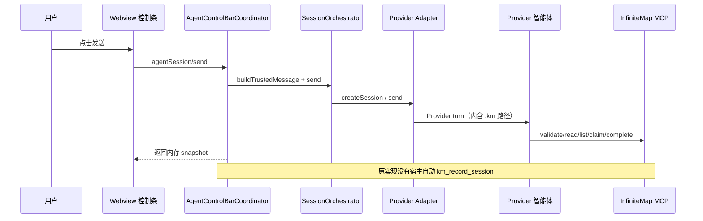
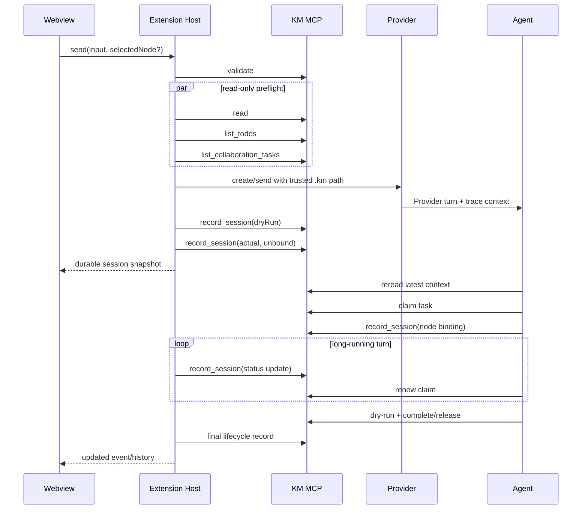

# InfiniteMap 智能体控制条调度与时序优化设计

> 状态：已实现第一阶段（宿主预检 + 会话生命周期持久化）
> 日期：2026-08-30
> 适用范围：`Workspace/openSource/InfiniteMap`
> 规则基线：`Workspace/harnessRules/brainstorm-executer/requirement-instruction-breakdown-rules.md`

## 1. 结论摘要

上一轮“隔天打开历史会话为空”的根因是：控制条创建的 Provider 会话只保存在 Extension Host 和 Webview 内存中；智能体没有主动调用 `km_record_session` 时，`<map>.sessions.json` 不会产生记录，重启后内存自然丢失。

本次第一阶段修复如下：

1. 发送和追加发送前，Extension Host 通过 InfiniteMap MCP 执行 `km_validate`，并并行执行 `km_read`、`km_list_todos`、`km_list_collaboration_tasks`。
2. 会话创建、状态变化、追加和中止由 `AgentControlBarCoordinator` 统一串行持久化；每次 `km_record_session` 都遵循 dry-run → actual。
3. 会话可先以“文件级、未绑定节点”记录进入 `<map>.sessions.json`，不伪造 `nodeId` 或 `taskKind`。智能体真正认领节点后，再用原有 `nodeId + taskKind + claimId` 绑定。
4. 宿主预检和会话记录只负责可观测性与生命周期，不改变 KM 标签，也不替代智能体对最新上下文、租约、dry-run、完成条件的业务校验。

第二阶段建议把“节点租约协调”从 Provider 自然语言调用提升为宿主协调器能力，但必须先解决 claim 上下文安全传递问题，不能仅凭控制条的选中节点猜测任务类型或直接完成节点。

## 2. 现状时序与问题定位

### 2.1 原有发送时序



缺口在 `src/sessions/agentControlBarCoordinator.ts`：`send` / `append` 只调用 `SessionOrchestrator`，而 `km_record_session` 仅作为智能体可调用的 MCP 工具存在。Webview 的 `agentSession.service.js` 通过 `listLiveAgentSessions()` 合并内存记录，所以当天可见；扩展宿主重启后只剩 MCP 侧车历史。

### 2.2 持久化链路现状

`src/mcp/services/kmSessionState.ts` 原本要求 `nodeId` 与 `taskKind`，并同时更新节点 `data.infiniteMap.latestSession` 和 `<map>.sessions.json`。这对已认领节点是正确的，但会阻止宿主在“刚创建会话、尚未知道智能体选择哪个任务”时登记生命周期。

现在的记录模型区分两个阶段：

| 阶段          | `nodeId` / `taskKind` | 写入位置                        | 允许的动作                             |
| ------------- | ------------------------- | ------------------------------- | -------------------------------------- |
| 宿主预注册    | 省略                      | `<map>.sessions.json`         | 记录 execution、Provider、status、配置 |
| 任务绑定      | 必填                      | 节点`latestSession` + sidecar | 校验节点标签、claim、revision          |
| 任务完成/释放 | 沿用已绑定记录            | 节点 + sidecar + exec sidecar   | 由完成/释放工具原子收敛                |

未绑定记录不是任务认领、不是任务完成，也不能触发 KM 标签变化。

## 3. 哪些步骤可以省略

### 3.1 规则文件读取

不能把规则文件读取变成每次 Provider turn 的模型工作。规则文件是静态的、由仓库版本控制，适合在 Extension Host / Provider system instructions 中注入一次。当前代码已经把控制规则编译进 `INFINITE_MAP_CONTROL_INSTRUCTIONS`，三类 Adapter 复用同一常量。

可优化为：

- 版本化缓存规则文本及其 hash；扩展启动或规则文件变更时刷新。
- Provider turn 只注入规则版本和执行约束，不要求模型重复读取整份 markdown。
- 若规则版本 hash 变化，下一次发送重新加载；运行中的 turn 不热切换。

仍不可省略的是：智能体必须遵守规则中的 MCP-only、最新 revision、目标上下文、租约、dry-run 和最终校验要求。缓存规则文本不能授权文件系统直读或绕过 MCP。

### 3.2 `km_validate` / `km_read` / 两类清单

这些调用可以由宿主在模型 turn 前预检，减少模型花费一个回合只做固定发现动作；本次已实现：

```text
km_validate(filePath)
  ├─ km_read(filePath)
  ├─ km_list_todos(filePath)
  └─ km_list_collaboration_tasks(filePath)
```

但它们不能从智能体流程中永久删除：宿主预检与智能体实际处理之间存在时间窗口，用户或其他执行者可能修改文件。智能体在认领、写回和最终复核前仍必须重新读取最新状态。宿主预检是快速失败门，不是业务事实快照的替代品。

### 3.3 `km_get_node` / `km_get_collaboration_context`

不能在没有目标节点的情况下由宿主盲目调用。控制条可以没有选中节点，智能体可能选择多个叶子任务；上下文读取应在任务候选确定后进行。宿主可以在未来为已选中的唯一节点提供只读上下文预览，但不能因此跳过智能体的最新上下文读取。

## 4. 第一阶段实现

### 4.1 Host preflight

`AgentControlBarCoordinator.preflightKm()` 在 `send` 和 `append` 的 Provider 调用之前执行：

1. `km_validate` 失败则阻止创建或追加 turn。
2. 其余三项只读调用并行执行，降低固定调度延迟。
3. 预检只消费 MCP 返回值，不读取 `.km` 文件系统路径。
4. 预检失败以 `MCP_UNAVAILABLE` / 可重试错误返回 Webview。

预检不修改 KM，不创建 claim，不将父节点错误地当作叶子任务。

### 4.2 Host-owned session persistence

`AgentControlBarCoordinator` 订阅 `SessionOrchestrator.onDidEvent`，从宿主内存 snapshot 获取可信的 Provider session reference，按 `executionId` 建立串行队列：

```text
event/send result
  → queue(executionId)
  → km_record_session(dryRun=true)
  → km_record_session(dryRun=false)
  → <map>.sessions.json
```

队列解决状态事件与 send 返回竞态，避免旧状态覆盖新状态。首个 send/append/interrupt 会等待持久化完成后再向 Webview 返回结果；高频 transcript/delta 不写旁车，避免 I/O 风暴，状态变更和完成事件仍会落盘。

宿主使用进程级 `workerId`，但不携带 claim；它不能冒充智能体认领者。`km_record_session` 允许 `nodeId` 与 `taskKind` 同时省略，仅在此预注册阶段生效。

### 4.3 Later binding

当智能体发现并认领任务后，仍按原规则调用：

```json
{
  "filePath": "/workspace/map.km",
  "nodeId": "task-node",
  "executionId": "host-exec-id",
  "taskKind": "breakdown",
  "claimId": "claim-id",
  "status": "running",
  "session": { "provider": "codex", "sessionId": "thread-id", "openUri": "..." },
  "workerId": "agent-worker"
}
```

服务在锁内校验节点标签、claim 绑定和 `openUri`，然后更新节点最近会话。宿主后续只提交不带节点的 lifecycle update，服务会沿用同一 `executionId` 已绑定的节点信息，不重新猜测任务类型。

## 5. 并行占用声明方案

### 5.1 当前问题

当前租约工具安全性是完整的，但触发方是智能体：模型必须先调用 `km_list_todos` / `km_list_collaboration_tasks`，再调用 `km_claim_*`。这会产生两个风险：

- 模型在 claim 前先开始分析或写文件，违反“先占用再处理”的时序要求。
- 控制条无选中节点时，宿主无法知道模型最终会处理哪个任务；宿主贸然 claim 全部任务会造成无谓阻塞。

### 5.2 推荐的二阶段 Host Lease Coordinator

新增独立的 `TaskDispatchCoordinator`（不放进 Webview，也不让 Provider Adapter 直接改 KM）：

```text
preflight
  → candidate selection
  → claim_todos / claim_collaboration_tasks
  → build signed execution context
  → create Provider turn
  → renew timer
  → agent produces output
  → agent calls complete tool with claim
  → host observes terminal result
  → release remaining claims / record failure
```

候选选择规则：

1. 有唯一选中叶子节点时，只认领该节点。
2. 无选中节点时按明确的批大小认领，不默认锁住整棵图。
3. 父级 `待拆解` 不进入 claim，等子节点完成后由协调者汇总。
4. `待协同` 使用独立 collaboration claim，不与 todo claim 混用。
5. claim 成功后必须把 `claimId`、节点 ID、revision/hash 通过受信任的 Provider application context 传递给智能体；不能只写进用户文本，也不能由模型自行猜测。

### 5.3 为什么不在本次直接自动 claim

Provider 三套接口目前只有统一的用户消息和 Provider-specific trace context，没有跨 Provider 的“受信任任务 claim envelope”。直接把 claim JSON 拼入用户消息会污染用户语义，并且无法防止模型忽略 claim。先实现统一 application context、签名/绑定和终态观测，再启用宿主 claim，才能避免“宿主锁住任务、模型却用错误 claim 完成”的死锁。

## 6. 优化后的完整时序



## 7. 状态与并发不变量

| 不变量     | 约束                                                                              |
| ---------- | --------------------------------------------------------------------------------- |
| 文件安全   | 所有`.km` 读写仍只走 MCP；宿主不得直接 `fs.readFile` / `fs.writeFile` KM    |
| 会话幂等   | `executionId` 是同一 Provider 会话的幂等键；队列内串行更新                      |
| 标签语义   | `km_record_session` 不修改任务标签；只有完成工具能完成任务                      |
| 绑定安全   | `nodeId + taskKind` 同时出现；有活动 claim 时必须匹配 `claimId + workerId`    |
| 预注册边界 | 未绑定记录只能写 sidecar，不能产生节点`latestSession` 或完成态                  |
| 版本安全   | 预检不能替代写回前最新 revision/hash；冲突必须重读重试                            |
| 终态安全   | 未绑定 execution 不能直接通过任务完成/释放工具写终态；先绑定或保留 lifecycle 记录 |
| 资源安全   | transcript/delta 不逐帧落盘，状态事件按 execution 排队落盘                        |

## 8. 兼容性与迁移

- 旧的、带 `nodeId + taskKind` 的 `km_record_session` 调用保持兼容。
- 已存在的 `.sessions.json` schemaVersion 仍为 1；新增的未绑定记录只缺少可选字段，不改变分页协议。
- `listFileSessions` 继续返回 `nodeId: null`，历史页已有文件级展示能力。
- 损坏 sidecar 的重建仍只能从节点 `latestSession` 恢复；未绑定历史无法从 `.km` 重建，因此必须优先保证原子 sidecar 写入。后续可增加 sidecar 备份或 append-only journal。
- `km_record_session` 的文档和规则地图已同步说明预注册语义。

## 9. 测试与验收

本次新增/验证：

- `km-session-state.test.cjs`：未绑定会话 dry-run 零写入、实际持久化、同 execution 更新和文件级查询。
- `agent-activity-provider-spi.test.cjs`：协调器包含宿主预检、会话队列和 `km_record_session`。
- 既有会话 UI、Provider、KM claim、终态原子写回测试继续通过。

推荐发布门禁：

1. `npm run typecheck`
2. `npm run mcp:build`
3. `npm run lint`
4. `node --test --test-concurrency=1 tests/*.test.cjs`
5. 手工 smoke：发送空输入（只发送 `.km` 路径）、发送文本、追加、中止、重载 Webview、重启 Extension Host，再从历史页查询同一 execution。

## 10. 后续落地顺序

1. 增加 `TaskDispatchCoordinator` 领域类型和受信任 claim envelope，不改现有 Provider 用户消息语义。
2. 先以 shadow mode 运行：宿主计算候选并记录决策，不真正 claim，观察模型选择与候选的一致性。
3. 对唯一选中叶子启用真实 claim；增加续租、超时释放、Provider 失败释放和窗口关闭补偿。
4. 再扩展无选中节点的批量调度，严格限制批大小并提供可见的占用状态。
5. 最后把 claim context 与 `km_record_session`、完成/释放工具的 executionId 绑定纳入端到端测试。
