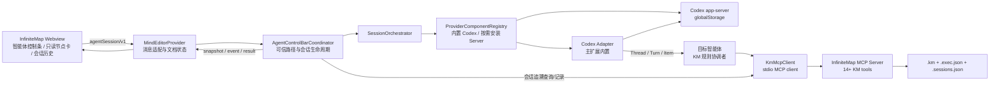
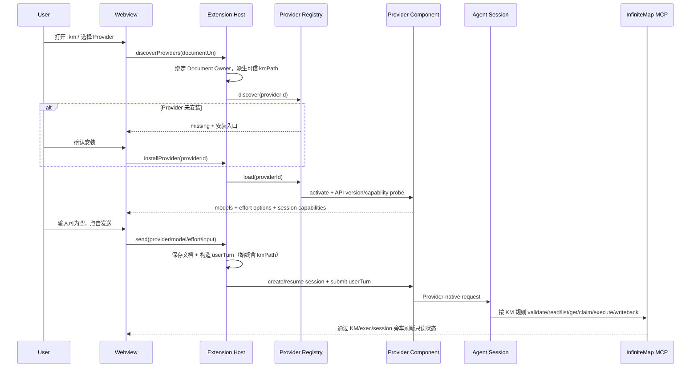
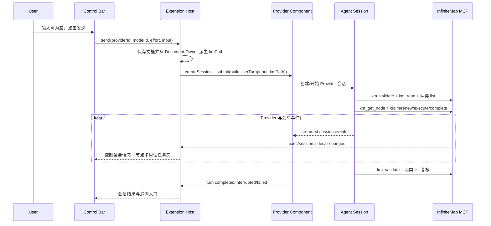
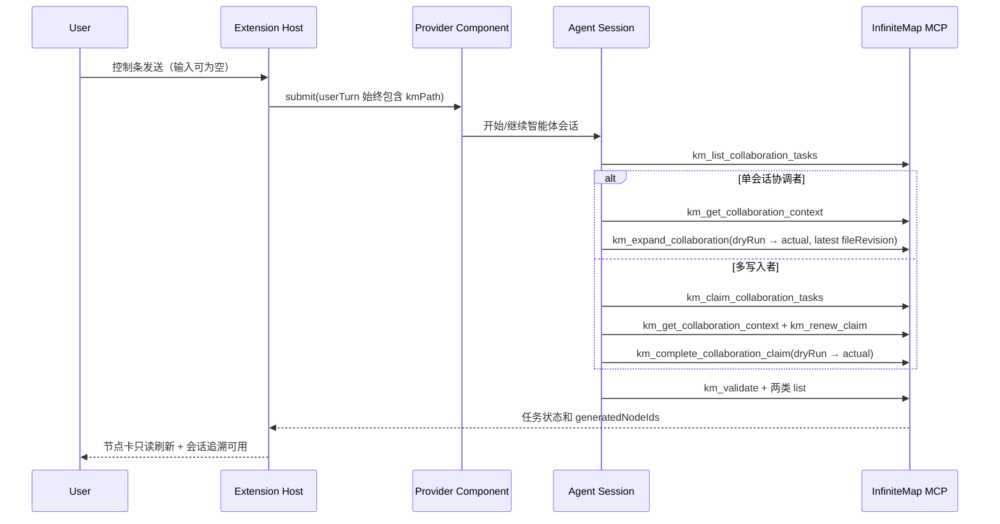
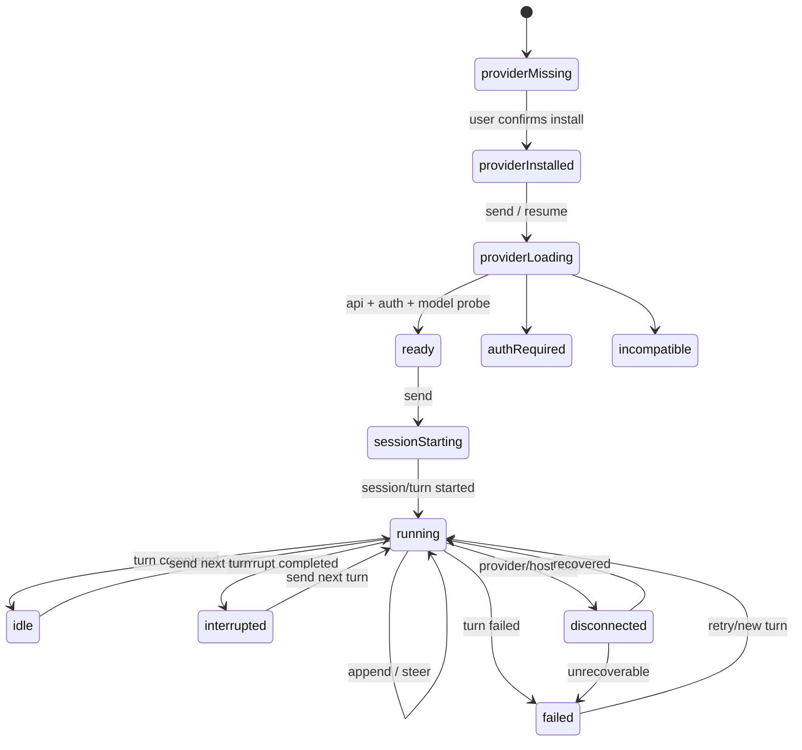

# InfiniteMap 编辑器智能体会话驱动任务执行设计

> 状态：已实施并验收
> 版本：v1.3
> 日期：2026-08-10
> 实施完成：2026-08-11
> 适用项目：`Workspace/openSource/InfiniteMap`
> 规则基线：`Workspace/harnessRules/brainstorm-executer/requirement-instruction-breakdown-rules.md`
> 本次修订：§20 以 UI 组件为牵引重新规划 7 个落地阶段（Phase 0–6）；新增 §26 架构与性能优化建议（mindEditor 拆分、revision 缓存、async 文件锁、Webview 协议版本化等）
> 验收证据：[`Workspace/validations/infinite-map-agent-tasks/validation-report.md`](../../../validations/infinite-map-agent-tasks/validation-report.md)；Provider 外部服务行为由 Fake runtime 契约测试覆盖，避免把账号或网络可用性混入发布验收。

## 1. 结论

InfiniteMap 应新增一个由编辑器扩展宿主管理的“智能体控制条与会话追溯协调器”，让用户在 `.km` 编辑器下方直接创建或继续 Codex、Claude Agent、Copilot 会话。用户消息的任务语义与在 VS Code 智能体插件中直接发送当前 `.km` 路径保持一致，由目标智能体按 `requirement-instruction-breakdown-rules.md` 自行发现、认领、执行并通过 InfiniteMap MCP 回写 `待拆解` / `待协同` 节点。

本设计采用以下边界：

1. **编辑器扩展是会话启动器与观察器**：负责可信路径注入、Provider/model/effort 选择、会话创建/追加/中止、状态展示和会话追溯，不重复实现 KM 任务协调状态机。
2. **智能体会话是 KM 执行协调者**：收到与直接发送路径等价的用户输入后，按现行 KM 规则完成最新文件读取、任务发现、上下文获取、租约、dry-run、实际回写和最终校验。
3. **所有 `.km` 读取和写入仍只通过 InfiniteMap MCP**：Webview、Extension Host 和内置 Provider Adapter 都不得为了方便直接修改 KM；编辑器只通过 MCP 查询状态或写会话追溯元数据。
4. **节点信息卡只读**：仅展示任务状态、最近会话和历史会话入口，不放置 Provider、model、effort、发送、追加发送、中止、审核或回写操作。
5. **所有会话控制统一进入编辑器下方中部控制条**：每次发送或追加发送都由 Extension Host 注入当前打开 `.km` 的可信路径；输入框允许为空，此时用户消息严格等于该路径。
6. **三套 Provider 运行时均由主扩展按需安装与加载**：InfiniteMap 主 VSIX 内置 Codex、Claude Agent、Copilot Adapter、注册表、控制条和通用会话能力；首次使用时由主扩展把经过固定版本与完整性校验的官方运行时下载到扩展 `globalStorage`，不生成或安装第二个 Provider VSIX。
7. **会话追溯与任务完成解耦**：节点保存最近一次会话最小引用，完整历史保存在 `<km>.sessions.json`；会话结束不等于任务完成，任务是否完成以智能体执行 KM 规则后的 MCP 状态为准。
8. **Codex Provider 使用官方 app-server**；Copilot Provider 优先使用公开 SDK，会话无法定向打开到原生 UI 时由 InfiniteMap 展示本地历史，不使用私有存储或未文档化命令。

该方案不改变现有 KM 业务标签语义：KM 中仍只有 `待拆解`、`待协同`、`已完成` 等用户语义标签；运行中、等待确认、冲突、失败等执行态进入执行旁车和只读节点信息卡，不污染 `resource` 标签。

## 2. 需求范围

### 2.1 建设目标

- 在编辑器画布下方中部提供统一“智能体控制条”，不在节点信息卡放置操作入口。
- 支持动态选择内置的 Codex、Claude Agent、Copilot，以及 Provider 实际返回的 model、effort 等参数。
- 支持新建会话发送、向当前会话追加发送、中止当前 turn、查询/更新会话元数据和打开历史会话。
- 每次发送与追加发送都默认带入当前编辑器打开的 `.km` 路径；输入框为空时只发送该路径。
- 发送行为与用户直接在对应 VS Code 智能体插件中输入同一路径等价，智能体按 KM 规则自行处理全部待拆解/待协同任务。
- Codex Server 缺失时按需引导安装，选择或恢复会话时才启动；主 VSIX 不预置平台二进制，而是安装到 InfiniteMap 用户级存储。
- 把最近一次会话链接写入节点信息；从节点可查询并打开历史执行会话。
- 支持 VS Code 窗口重载、Webview 重载、Extension Host 重启后的恢复和补偿。

### 2.2 非目标

- 不让 Webview 直接访问 Codex、Copilot、MCP 或本地文件系统。
- 不在节点信息卡提供发送、中止、Provider/model/effort、认领、审核或回写操作。
- 不在 InfiniteMap 主 VSIX 中预置平台相关 Codex 二进制；Codex Adapter 属于主扩展，Codex app-server 二进制由主扩展按需下载并校验后安装到 `globalStorage`。
- 不把会话正文、访问令牌、授权头或完整工具日志写入 KM。
- 不自动修改没有 `待拆解` / `待协同` 标签的普通节点。
- 不允许用 Copilot 私有数据库、内部模块、磁盘日志或未文档化 command 参数模拟原生会话 CRUD。
- 不在第一阶段支持 `.xmind` 任务执行；`.xmind` 不受 KM 执行规则约束，且转换过程可能丢失 InfiniteMap 自定义节点元数据。
- 不以“模型回复完成”作为节点完成条件。

### 2.3 本次方案调整映射

| KM 约束 | 设计落点 | 可验收结果 |
| --- | --- | --- |
| 节点信息卡支持任务状态和会话追溯 | §7、§15.1 | 显示任务旁车态、最近会话和历史入口 |
| 节点信息卡不直接支持操作 | §15.1、§21.4、§22.1 | DOM 中不存在 Provider/发送/中止/回写控件 |
| 编辑器下方中部增加智能体控制条 | §5、§14、§15.2 | 控制条下方居中且不遮挡节点卡/工具栏 |
| 支持切换 Provider | §6.2、§12.2、§15.2 | Provider 动态发现、缺失可安装、切换不污染会话 |
| 支持 Provider 对应 model/effort | §6.2、§12.1、§12.3、§15.2 | 选项来自 runtime capability，失效时阻断 |
| 支持发送/追加发送/中止 | §11.3、§14、§15.2 | 映射 create/turn/steer/interrupt，状态幂等 |
| 发送默认带入当前 KM 路径 | §11.1 | Host 注入可信路径，行为等同直接发送路径 |
| 空输入仍可发送/追加 | §11.1、§11.3 | 用户消息严格只含当前 KM 路径 |
| Codex Server 按需安装/加载，保持单 VSIX | §5.2、§12.2、§21.4、§22.1 | 只产出 InfiniteMap VSIX；Codex 二进制安装到 `globalStorage` |

## 3. 现状基线与可复用能力

| 现有能力                              | 实现位置                                 | 本方案复用方式                                                 |
| ------------------------------------- | ---------------------------------------- | -------------------------------------------------------------- |
| Custom Editor 文档和 Webview 生命周期 | `src/mindEditor.ts`                    | 在现有 Custom Editor Provider 内增加控制条消息入口，不新建第二套编辑器 |
| Webview 双向消息、握手、重连          | `webui/main.js`                        | 扩展版本化 `agentSession/v1` 协议，沿用 requestId 和显式结果确认 |
| KM 14 个 MCP 工具                     | `src/mcp/server.ts`                    | 目标智能体执行 KM 规则的唯一读写通道；编辑器只查询状态/记录会话 |
| 文件 SHA-256 版本                     | `kmFileReader.ts`                      | 待拆解使用`kmRevision`，待协同使用 `fileRevision`          |
| 待拆解/待协同租约和目标哈希           | `kmExecState.ts` / `kmCollaborationClaims.ts` | 由目标智能体按 KM 规则认领、续租、完成和释放                    |
| KM 文件锁和原子 rename                | `kmExecState.ts` / `kmFileWriter.ts` | 会话引用、任务标签和协同子节点统一进入锁内写回                 |
| `<km>.exec.json` 执行旁车           | `kmExecState.ts`                       | 节点卡只读展示 pending/claimed/done/failed、认领人和租约       |
| 节点卡执行状态                        | `nodeCard` directive                   | 只增加任务状态、最近会话和历史入口，不增加操作按钮              |
| Custom Editor 底部覆盖层               | Webview 布局容器                        | 新增下方中部智能体控制条，承载 Provider/model/effort 与会话操作 |
| 外部写入自动刷新/冲突保护             | `mindEditor.ts`                        | 发送前保存；智能体/MCP 外部写回后干净文档刷新、脏文档提示冲突   |

现有 `KmNode.data` 类型只声明 `id`、`created`、`text`、`resource` 和 `expandState`。本设计需要增加可选的 `infiniteMap` 命名空间，但不得覆盖已有 `hyperlink`。用户原有超链接只能由用户编辑；智能体会话链接使用独立字段和节点卡按钮展示。

## 4. 关键设计决策

### 4.1 为什么由智能体执行 KM 规则，而不是编辑器复制一套协调逻辑

现行规则已经把“只发送 `.km` 路径”定义成完整执行入口：智能体重新读取磁盘、同时发现两类任务、读取目标上下文、选择单写入者或租约协议、执行产出、dry-run、实际写回并最终复核。若 Extension Host 再复制一套认领、审核和回写状态机，会与直接在 VS Code 智能体中发送路径产生不同结果，还会造成编辑器和会话重复认领。

因此本设计采用薄协调边界：

- Extension Host 负责可信路径、会话生命周期、Provider 能力和追溯关系；
- 目标智能体负责严格执行 KM 规则，并直接调用 InfiniteMap MCP；
- 节点卡从 KM/执行旁车读取状态，不以 Provider 的自然语言完成消息推断任务完成；
- Provider 不具备 InfiniteMap MCP 或无法接收规则上下文时，只允许普通会话，不宣称支持 KM 任务执行。

### 4.2 为什么最近会话写入节点，完整历史放旁车

把全部历史放进节点会持续增大 KM 文件，并导致每次查询或执行记录都改变文件版本。完全只放旁车又不满足“节点信息中存在最近会话链接”的要求。

采用双层存储：

- 节点 `data.infiniteMap.latestSession`：可移植、可直接展示、保证最近会话可追溯。
- `<km>.sessions.json`：保存完整执行历史、产物、状态变化和 Provider 信息，可分页查询。

KM 节点是“最近会话入口”的事实来源；历史旁车可以由节点和 Provider 会话索引重建，不承担任务正确性。

### 4.3 为什么不复用节点原有 hyperlink

KityMinder 的 HyperLink 是单值，并且当前对 URL 有 HTTP/HTTPS/FTP 校验。复用会覆盖用户业务链接，也无法表达多个历史会话。因此新增命名空间，并由节点卡通过 Webview 消息请求 Extension Host 打开会话。

### 4.4 编辑期间的发送与写回策略

目标智能体通过 MCP 读写磁盘文件，Webview 可能同时存在未保存草稿。为保证“发送路径”对应最新内容：

1. 开始执行前必须保存当前 KM；保存失败或用户取消则不启动会话。
2. 路径由 Extension Host 根据当前 Document Owner 的 `Uri.fsPath` 生成，Webview 不得提供或覆盖。
3. 运行期间允许用户继续编辑；目标智能体和 MCP 按 revision、目标哈希与租约处理并发，编辑器不绕过冲突保护。
4. Provider 返回完成只更新会话态；节点完成态必须由 MCP 重新读取的 KM/旁车状态确认。
5. 绝对路径只进入当次 Provider 输入和 Host 内存，不写入节点最近会话、会话旁车摘要或普通日志。

## 5. 总体架构



### 5.1 进程边界

| 进程               | 允许职责                                                         | 禁止职责                                          |
| ------------------ | ---------------------------------------------------------------- | ------------------------------------------------- |
| Webview            | 展示控制条/节点状态/会话历史，收集用户输入和当前选中节点 ID       | 提供可信路径、文件读写、启动进程、保存 Token、直接调用 Provider |
| Extension Host     | 派生可信路径、安装/校验 Codex Server、管理 Adapter 与会话生命周期、Deep Link、dirty 检查 | 复制 KM 任务协调逻辑、绕过 MCP 修改 KM            |
| 内置 Codex Adapter | 把统一会话接口映射到 app-server，返回模型/effort/会话事件         | 修改 KM、读取其他扩展私有二进制、修改用户全局 PATH |
| 智能体会话         | 按 KM 规则发现/认领/执行/验证任务并调用 InfiniteMap MCP           | 使用文件系统 API 直接修改 `.km`                   |
| InfiniteMap MCP    | KM 读取、校验、认领、续租、会话引用、完成和协同扩散              | 创建或控制 Provider 会话                          |

### 5.2 模块规划

```text
src/
  sessions/
    types.ts
    agentControlBarCoordinator.ts
    sessionOrchestrator.ts
    sessionRegistry.ts
    capabilityResolver.ts
  providers/
    providerComponentApi.ts
    providerComponentRegistry.ts
    codexRuntimeInstaller.ts
    codex/
      CodexRuntimeManager.ts
      CodexAppServerClient.ts
      CodexAgentSessionAdapter.ts
  mcpClient/
    kmMcpClient.ts
    kmToolContracts.ts
  deepLinks/
    sessionUriHandler.ts

src/mcp/
  services/kmSessionState.ts
  tools/kmRecordSession.ts
  tools/kmListNodeSessions.ts

webui/
  ui/service/agentSession.service.js
  ui/directive/agentControlBar/
  ui/directive/agentSessionHistory/
  ui/directive/nodeCard/          # 只读状态与会话追溯
  less/agentSession.less
```

Codex Adapter 位于主扩展模块树并随唯一的 InfiniteMap VSIX 打包；平台相关 Codex 二进制不进入 VSIX，而是在用户确认后下载到 `globalStorage`。`mindEditor.ts` 只增加消息分派和生命周期绑定，不继续堆叠会话业务逻辑。

## 6. 统一领域模型

### 6.1 任务类型

```ts
type KmTaskKind = 'breakdown' | 'collaboration';

interface KmTaskRef {
  filePath: string;
  nodeId: string;
  kind: KmTaskKind;
  nodePath: string;
  inputRevision: string;
}
```

- `breakdown.inputRevision` 对应 `kmRevision`，完成时主要依赖 claim 内的 `baseNodeHash`。
- `collaboration.inputRevision` 对应 `fileRevision`，扩散前必须再次读取最新上下文。

### 6.2 Provider 会话引用

```ts
type ProviderId = string;

type CapabilityLevel = 'native' | 'emulated' | 'experimental' | 'unsupported';

interface ProviderModelOption {
  id: string;
  label: string;
  effortOptions: Array<{ id: string; label: string }>;
  defaultEffort?: string;
}

interface ProviderDescriptor {
  id: ProviderId;
  displayName: string;
  componentExtensionId: string;
  installState:
    | 'missing'
    | 'installed_inactive'
    | 'loading'
    | 'ready'
    | 'auth_required'
    | 'degraded'
    | 'incompatible'
    | 'failed';
  models: ProviderModelOption[];
  capabilities: SessionCapabilities;
}

interface AgentSessionRef {
  provider: ProviderId;
  sessionId: string;
  threadId?: string;
  turnId?: string;
  surface: 'app-server' | 'copilot-sdk' | 'language-model' | 'provider-pack';
  modelId?: string;
  effort?: string;
  openUri: string;
}

interface ProviderTraceContext {
  executionId: string;
  session: AgentSessionRef;
  protocolVersion: 1;
}
```

`ProviderTraceContext` 通过 Provider 的内部 control/developer channel 注入，不拼接进用户消息正文。目标智能体在实际认领节点后使用其中的 `executionId + session` 调用 `km_record_session`；Provider 不支持独立控制通道时，只保留文件级会话历史，不伪造节点级追溯。

`openUri` 使用扩展 Deep Link，不直接暴露 Provider 内部打开命令：

```text
vscode://chanterxiao.infinite-map/session/open
  ?v=1
  &executionId=<uuid>
  &map=<workspace-relative-km-path>
  &nodeId=<node-id>
```

`executionId` 是解析会话历史的主键，`map/nodeId` 只作定位提示；URI 不携带 Provider threadId、绝对路径、Token 或命令。Extension Host 根据 `executionId` 查询实际 Provider 与 sessionId，再调用对应组件。若 Provider 未安装、已禁用或没有稳定的定向打开能力，Deep Link 仍打开 InfiniteMap 会话历史详情，并提供“安装 Provider”或“复制会话 ID”；不得误跳到其他会话，也不得持久化内部 `command:` URI。

### 6.3 节点执行记录

```ts
type NodeExecutionStatus =
  | 'allocated'
  | 'starting'
  | 'running'
  | 'idle'
  | 'interrupting'
  | 'interrupted'
  | 'completed'
  | 'failed'
  | 'cancelled'
  | 'conflict'
  | 'disconnected';

interface NodeExecutionRecord {
  executionId: string;
  nodeId: string;
  taskKind: KmTaskKind;
  status: NodeExecutionStatus;
  session: AgentSessionRef;
  requestedConfig?: { modelId?: string; effort?: string };
  effectiveConfig?: { modelId?: string; effort?: string };
  degradations?: Array<{
    field: string;
    action: 'dropped' | 'substituted' | 'blocked';
    reason: string;
  }>;
  workerId: string;
  claimId?: string;
  inputRevision: string;
  resultRevision?: string;
  startedAt: string;
  updatedAt: string;
  completedAt?: string;
  summary?: string;
  artifacts?: Array<{ path: string; kind: 'file' | 'report' | 'validation' }>;
  generatedNodeIds?: string[];
  error?: { code: string; message: string; retryable: boolean };
}
```

### 6.4 会话回执

Provider 可返回统一结构化回执，用于会话摘要、产物展示和诊断，但编辑器不得仅凭回执或自然语言“已完成”修改节点任务状态。任务完成态以智能体执行 KM 规则后由 MCP 重新读取到的标签与旁车为准：

```ts
interface AgentExecutionReceipt {
  executionId: string;
  status: 'succeeded' | 'failed' | 'blocked';
  summary: string;
  artifacts: Array<{
    path: string;
    kind: 'created' | 'modified' | 'report';
  }>;
  validations: Array<{
    command?: string;
    name: string;
    passed: boolean;
    evidence?: string;
  }>;
  collaborationChildren?: string[];
  blocker?: string;
}
```

Codex `turn/start` 可使用 `outputSchema` 强制该结构。Copilot Provider 不支持结构化输出时，可要求最终响应包含带版本标识的 JSON 回执；解析失败只影响摘要展示，不得驱动或阻断已经由 KM MCP 正确完成的节点状态。

## 7. 节点和旁车数据设计

### 7.1 KM 节点中的最近会话

```json
{
  "data": {
    "id": "node-123",
    "text": "实现会话追溯",
    "resource": ["已完成"],
    "infiniteMap": {
      "schemaVersion": 1,
      "latestSession": {
        "executionId": "exec-uuid",
        "taskKind": "breakdown",
        "provider": "codex",
        "sessionId": "thr_123",
        "surface": "app-server",
        "modelId": "<app-server model id>",
        "effort": "<supported effort>",
        "openUri": "vscode://chanterxiao.infinite-map/session/open?...",
        "status": "completed",
        "startedAt": "2026-08-06T10:00:00.000Z",
        "updatedAt": "2026-08-06T10:20:00.000Z"
      },
      "sessionHistoryCount": 4
    }
  }
}
```

约束：

- 不写 Prompt、响应正文、Token、绝对用户目录或 Provider 授权信息。
- 不覆盖 `data.hyperlink`、`data.note` 或 `resource` 中的用户内容。
- `getNodeHash` 继续只计算 `{id,text,resource}`；写入 `data.infiniteMap` 不使有效 claim 失效。
- KM 的最近会话字段在成功完成、失败释放或用户取消时更新；运行中的高频状态只写旁车。

### 7.2 完整会话历史旁车

路径：`<km-file>.sessions.json`

```json
{
  "schemaVersion": 1,
  "kmRevision": "sha256",
  "executions": {
    "exec-uuid": {
      "executionId": "exec-uuid",
      "nodeId": "node-123",
      "taskKind": "breakdown",
      "status": "completed",
      "session": {
        "provider": "codex",
        "sessionId": "thr_123",
        "surface": "app-server",
        "openUri": "vscode://..."
      },
      "startedAt": "...",
      "updatedAt": "...",
      "completedAt": "...",
      "artifacts": []
    }
  },
  "nodeIndex": {
    "node-123": ["exec-uuid"]
  }
}
```

旁车规则：

- 与 `<km>.exec.json` 共用 `<km>.lock`，临时文件写入后 rename。
- `nodeIndex` 按时间倒序，查询支持 cursor/limit。
- 同一 `executionId` 幂等更新，不追加重复记录。
- 节点被删除后历史保留为 orphan，历史页可显示“原节点已不存在”。
- 旁车损坏不影响 KM 打开和任务标签；先隔离损坏文件，再从 KM 最近引用和 Provider 索引补建。
- 旁车是否提交 Git 由项目决定；默认加入 `.gitignore`，节点最近链接仍随 KM 保留。

### 7.3 写入顺序和恢复保证

成功回写时，KM 文件必须在一次内存修改中同时完成：

1. 更新目标节点 `data.infiniteMap.latestSession.status=completed`；
2. 待拆解：`待拆解` → `已完成`；
3. 待协同：追加无标签直接子节点并把父节点改为 `已完成`；
4. 协同新子节点可记录只读 `originExecutionId`，但不写 session 完整副本；
5. 原子替换 KM；
6. 更新 `.sessions.json` 和 `.exec.json`。

如果步骤 6 失败，KM 中仍有最近会话和正确标签，恢复服务可以重建旁车。禁止采用“先标记完成、再尝试写最近会话”的顺序。

## 8. 编辑器启动与任务发现流程

编辑器启动时只发现当前文档、内置 Provider 和只读任务状态；不在用户发送前预先认领任务。完整 KM 任务发现由目标智能体收到路径后按规则执行：



硬性判断：

- 当前文档必须是本地 `.km`，路径必须由 Extension Host 从当前 Custom Document 推导。
- dirty 文档必须先保存；保存失败或用户取消时不创建/不追加 Provider turn。
- Codex Server 缺失、API 版本不兼容、未登录或当前模型不可用时禁用发送并提供对应安装/登录/诊断入口，不静默切换 Provider 或模型。
- Provider 必须声明可把 InfiniteMap 规则上下文交给智能体并连接 InfiniteMap MCP，才能标记为 `kmTaskExecution=true`。
- 节点信息卡可通过 MCP/旁车查询最新状态，但不得承担发送或中止入口。

## 9. 待拆解节点执行流程

控制条不要求用户先在节点卡点击某个待拆解节点。发送当前 `.km` 路径后，目标智能体按最新规则发现全部待拆解任务；叶子任务较多时由智能体选择单会话协调者或多写入者租约协议。Extension Host 不预先 claim，也不代替智能体执行完成写回。



### 9.1 智能体执行约束

- 智能体必须重新调用 `km_validate`、`km_read`、`km_list_todos` 和 `km_list_collaboration_tasks`，不得依赖节点卡缓存。
- 待拆解必须调用 `km_get_node`；多写入者只认领叶子待办并使用 `km_claim_todos` → `km_renew_claim` → `km_complete_claim` / `km_release_claim`。
- 单会话协调者可并行产出，但 KM 写回必须按规则串行且每次使用最新 revision。
- 若 Provider 支持内部 trace context，`workerId` 应包含控制条生成的 `executionId`，并在节点认领后通过 `km_record_session` 建立节点追溯；不支持时不得伪造节点级关联。
- 用户在控制条中止当前 turn 时，Extension Host 只调用 Provider interrupt；已认领任务的释放由智能体在取消流程中完成，或由租约过期自然回收。
- Provider 会话完成、失败或中止都不直接改变节点标签；节点信息卡以 MCP 读取结果为准。

### 9.2 完成条件

目标智能体只有在产物、规则地图同步和必要验证完成后，才可执行 `km_complete_claim` 或 `km_mark_done` 的 dry-run/actual。控制条不提供第二个“确认回写”按钮，以免形成与直接发送路径不同的双重状态机。若 Provider 需要审批、文件写入确认或工具授权，审批继续在 Provider 原生会话或 InfiniteMap 会话详情中处理。

### 9.3 父节点收敛

所有子级待拆解完成后，目标智能体重新读取清单和完整子树，再按规则汇总父节点：

1. 父节点不进入叶子租约批次；
2. dry-run `km_mark_done`，携带最新 `kmRevision`；
3. 实际 `km_mark_done`；
4. 再次验证两类清单。

若同一 Provider 会话完成父级汇总，使用相同 `executionId` 为父节点记录会话追溯。

## 10. 待协同节点执行流程

待协同与待拆解使用同一个控制条发送入口。目标智能体从同一路径输入发现协同任务，并按写入者模型选择单协调者 CAS 或协同租约；控制条不在节点卡提供“发起协同”或“确认扩散”。



协同输出校验：

- `collaborationChildren` 至少一个，单项 trim 后不能为空；
- 仅包含目标节点的直接子节点文本；
- 子节点不得带 `待拆解`、`待协同`、`已完成` 或其他资源标签；
- 与目标现有直接子节点文本标准化后不得重复；
- 子节点之间不得重复；
- 内容必须自包含、具体，不能只有“继续讨论”“后续优化”等占位语；
- 展示根链路和必要同级上下文，让用户判断粒度是否一致；
- 目标子树哈希冲突时必须重新认领、读取上下文并重新生成/复核，不能沿用旧结果。

取消或失败时，目标智能体按规则调用 `km_release_claim`，节点继续保留 `待协同`；会话组件把终态写入会话旁车。若节点已通过 `km_record_session` 绑定本次 execution，则同步更新节点最近会话，但不得把失败任务标记为完成。

## 11. 会话 Prompt 设计

### 11.1 用户消息正文：始终带入当前 KM 路径

Webview 只提交输入框文本，Extension Host 从当前 Custom Document 派生可信路径。设输入框 trim 后为 `text`，当前本地 `.km` 规范化绝对路径为 `kmPath`：

```ts
function buildUserTurn(text: string, kmPath: string): string {
  const prompt = text.trim();
  return prompt.length === 0 ? kmPath : `${prompt}\n\n${kmPath}`;
}
```

强制语义：

- `发送` 和 `追加发送` 都调用同一函数，路径始终存在且只注入一次；
- 输入为空时，用户消息正文严格等于 `kmPath`，不附加“请处理”、标签、占位文案或重复路径；
- 输入非空时，用户文本在前、空一行、路径在末尾；
- Webview 传入的 `documentUri`/路径只作请求关联，不作事实来源；Host 必须使用当前 Document Owner 的 `Uri.fsPath`；
- 当前文档不是本地 `.km`、路径无法规范化、Document Owner 不匹配或保存失败时禁止发送；
- 路径只用于当次 Provider 消息和内存态，不持久化到节点、旁车摘要或普通日志。

这保证用户看到的会话输入与在 VS Code 智能体插件中直接发送同一路径一致。

### 11.2 Provider 内部控制上下文

内置 Provider Adapter 可通过独立于用户消息正文的 developer/system context 注入以下执行约束，不得改写 §11.1 的用户消息：

- 当前会话需要按 `requirement-instruction-breakdown-rules.md` 处理 `.km` 路径；
- 所有 `.km` 读取、检索、校验和回写必须使用 InfiniteMap MCP；
- 必须同时发现 `待拆解` 与 `待协同`，并使用最新 revision/租约协议；
- 完成产出和验证后先 dry-run，再实际写回，最后重新校验两类清单；
- `ProviderTraceContext` 中的 `executionId + AgentSessionRef` 仅用于会话追溯和 MCP 写工具关联，不改变任务语义；
- 无法完成时保留节点待处理状态，不得伪报完成。

Provider 若不能提供可靠控制上下文或不能连接 InfiniteMap MCP，能力探测必须返回 `kmTaskExecution=false`。控制条仍可用于普通聊天，但 UI 不显示“KM 任务执行可用”。

### 11.3 发送、追加发送和中止语义

| 控制条操作 | 会话状态 | 统一语义 | Codex 映射 |
| --- | --- | --- | --- |
| `发送` | 无会话 | 创建会话并提交首次用户消息 | `thread/start` → `turn/start` |
| `发送` | 会话 idle/completed | 在当前会话开始新 turn | `turn/start` |
| `追加发送` | turn active | 把同样含 `kmPath` 的消息追加到当前 turn | `turn/steer(expectedTurnId)` |
| `追加发送` | 会话 idle | 开始后续 turn；若 Provider 不支持则 disabled | `turn/start` |
| `中止` | turn active | 幂等请求中止当前 turn，不删除会话历史 | `turn/interrupt` |

追加发送输入也允许为空，此时只发送当前 `kmPath`，满足“再次按当前文件重新发现/继续执行”的语义。活动 turn 中 Provider、model、effort 锁定；Codex `turn/steer` 不能修改这些参数。stale `expectedTurnId` 时先查询会话对账，不得静默降级造成重复提交。

## 12. Provider 适配

### 12.1 统一接口

```ts
interface AgentSessionAdapter {
  readonly providerId: ProviderId;
  getDescriptor(): Promise<ProviderDescriptor>;
  detectCapabilities(): Promise<SessionCapabilities>;
  listModels(): Promise<ProviderModelOption[]>;
  createSession(input: CreateSessionInput): Promise<AgentSessionRef>;
  send(input: SendSessionInput): Promise<{ turnId?: string; submissionId: string }>;
  append(input: AppendSessionInput): Promise<{ turnId?: string; submissionId: string }>;
  query(input: QuerySessionInput): Promise<SessionSnapshot>;
  mutate(input: SessionMutationInput): Promise<SessionSnapshot>;
  interrupt(input: InterruptTurnInput): Promise<void>;
  open(input: OpenSessionInput): Promise<void>;
  onDidEvent(listener: (event: AgentSessionEvent) => void): Disposable;
  dispose(): void;
}
```

能力必须动态返回，UI 不根据 Provider 名字猜测：

```ts
interface SessionCapabilities {
  availability:
    | 'missing'
    | 'starting'
    | 'auth_required'
    | 'ready'
    | 'incompatible'
    | 'degraded';
  lifecycle: {
    create: CapabilityLevel;
    resume: CapabilityLevel;
    list: CapabilityLevel;
    read: CapabilityLevel;
    interrupt: CapabilityLevel;
  };
  inputMode: 'immediate-steer' | 'enqueue' | 'next-turn-only';
  mutations: {
    rename: CapabilityLevel;
    setModel: CapabilityLevel;
    archive: CapabilityLevel;
  };
  canStream: boolean;
  kmTaskExecution: boolean;
  receiptMode: 'native-json-schema' | 'schema-tool' | 'prompt-only';
  openTargets: Array<'infinite-map' | 'provider-cli' | 'provider-tui' | 'provider-ide'>;
  sessionOwnership: 'provider' | 'infinite-map';
}
```

模型和 effort 必须由当前组件、当前账号、当前 runtime 动态返回。用户显式选择的模型/effort 失效时阻止发送并要求重新选择，不得静默替换；执行记录同时保存 requested/effective 配置和降级原因。`cwd`、安全策略、工具能力等关键参数无法满足时必须阻断，不能按可选参数静默丢弃。

### 12.2 三 Provider 按需安装与生命周期

InfiniteMap 主 VSIX 内置 `ProviderComponentApiV1`、Codex/Claude Agent/Copilot Adapter、固定 catalog、Registry 和安装器。三套 Provider 都不是另一个 VS Code 扩展：安装器根据 `process.platform + process.arch` 选择官方固定版本资产，下载到 InfiniteMap 的 `globalStorage`，完成完整性校验后再原子落盘并启动。Codex 使用 OpenAI release 与 SHA-256；Claude Agent、Copilot 使用官方 npm 平台包与 SHA-512 integrity。

```ts
interface ProviderComponentApiV1 {
  apiVersion: '1';
  getDescriptor(): Promise<ProviderDescriptor>;
  createAdapter(): Promise<AgentSessionAdapter>;
}
```

生命周期：

```text
missing
→ 用户选择 Codex
→ 展示 Codex Server 安装入口并等待用户确认
→ 下载官方固定版本资产
→ SHA-256 校验
→ 安装到 globalStorage/codex/<version>/<platform-arch>/
→ installed_inactive
→ 启动 codex app-server
→ initialize + account/read + model/list
→ ready | auth_required | degraded | incompatible | failed
```

约束：

- 安装必须由用户在 Webview 确认；不得调用 `extension.open` 或依赖 Marketplace 中不存在的扩展 ID；
- Codex 只允许 `https://github.com/openai/codex/releases/` 官方资产；Claude Agent、Copilot 只允许各自官方 npm 平台包；版本、文件名/包名和完整性值固定在安装器发布清单中；
- 不运行 `npm install`、`curl | sh`、Homebrew，也不修改用户全局 PATH；
- 下载写入临时目录，校验通过后原子移动到版本目录；失败清理临时文件并保留明确重试入口；
- 主 VSIX 构建必须只产出 `infinite-map-<version>.vsix`，不得生成 `infinite-map-provider-*.vsix`；
- 任一 Provider 运行时缺失或不兼容都不影响节点卡查看本地历史和普通思维导图编辑。

### 12.3 内置 Codex Provider

Codex 使用官方 `codex app-server` stdio JSONL 协议：

| InfiniteMap 操作    | app-server 方法                                     |
| ------------------- | --------------------------------------------------- |
| 创建                | `thread/start`                                    |
| 恢复                | `thread/resume`                                   |
| 提交任务            | `turn/start`                                      |
| 运行中补充          | `turn/steer` + `expectedTurnId`                 |
| 查询单会话          | `thread/read`                                     |
| 查询列表            | `thread/list`，按 `cwd` 和 `sourceKinds` 过滤 |
| 更新名称            | `thread/name/set`                                 |
| 更新 pin/git 元数据 | `thread/metadata/update`                          |
| 中断                | `turn/interrupt`                                  |
| 归档                | `thread/archive`                                  |
| 事件                | `thread/status/changed`、`turn/*`、`item/*`   |
| 模型与 effort       | `model/list` + `modelProvider/capabilities/read` |

实施要求：

- 首次使用时由主扩展安装器把 Codex runtime 安装到 `globalStorage`，随后懒启动 app-server；主 InfiniteMap VSIX 不包含平台二进制。
- 连接后先注册通知/Server Request 处理器，再发送 `initialize` 和 `initialized`；随后执行 `account/read`、完整分页 `model/list`，必要时读取 model/provider capability。
- `clientInfo.name` 使用明确的集成标识，如 `infinite_map_vscode`，不得冒用 `codex_vscode`。
- 默认使用稳定 API，不启用 `experimentalApi`；需要分页 turns/items 时另设实验特性开关。
- 内置 Codex Adapter 通过 `codex app-server generate-json-schema` 获取与安装版本匹配的协议结构；runtime 版本变化时失效旧 schema/capability 缓存。
- `sessionId` 和 `threadId` 都使用 `thread.id`；服务返回的 `thread.sessionId` 仅作为 session tree ID，不得混作会话主键。
- `model/list` 返回的默认模型和 effort 是 UI 唯一事实来源，`includeHidden` 默认 false；账号、runtime 或 app-server 重启后重新读取。
- 使用 `outputSchema` 强制回执结构。
- App Server 断开时保留 executionId 和 threadId，恢复后 `thread/read` / `thread/resume` 查询状态。
- `turn/steer` 必须携带当前 `expectedTurnId`，不能改 model/effort；stale 时先 `thread/read` 对账，不自动创建新 turn。
- 正常完成只保留或 unsubscribe Thread；`thread/archive` 仅对应用户主动归档。
- 流程终态只认 `turn/completed` 的 completed/interrupted/failed，不以最后一个 delta、stdout EOF 或进程退出推断成功。
- Codex IDE 的 `chatgpt.openSidebar`、`chatgpt.newChat`、`chatgpt.newCodexPanel` 仅用于打开 UI；若没有公开的按 threadId 跳转能力，则 InfiniteMap 自己展示线程详情并提供复制 ID。

#### 12.3.1 Runtime、握手与 schema 管理

主扩展内的 `CodexRuntimeManager` 只使用 InfiniteMap 安装器返回的受管二进制路径（高级显式路径仅供开发诊断）。不得探测或复用 Codex VS Code 扩展的私有 bundled binary，也不得修改用户全局 `PATH`。

Ready 判定必须完成整条链路，不能只检查文件存在：

```text
codex --version
→ spawn("codex", ["app-server"])
→ 注册 response / notification / server-request handlers
→ initialize(clientInfo.name = "infinite_map_vscode")
→ initialized
→ account/read
→ model/list（分页读完，includeHidden=false）
→ 必要时 modelProvider/capabilities/read
→ ready | auth_required | degraded | incompatible
```

runtime fingerprint 至少包含 executable realpath、Codex version、binary mtime/hash 和 experimentalApi 开关。每个 fingerprint 通过当前可执行文件生成 JSON Schema，写入 InfiniteMap `globalStorage/codex-state`；多窗口用锁与临时目录 + atomic rename 防止生成半成品。版本变化立即失效旧 schema、model 和 capability 缓存。解析采用 tolerant reader：未知附加字段/通知记录后忽略；核心请求、响应或必需字段不兼容时标记 `incompatible`，禁止新建 turn，但保留本地历史。

#### 12.3.2 Thread、Turn 与提交幂等

```ts
interface CodexSubmissionState {
  submissionId: string; // Host 生成，本地幂等键
  threadId: string;     // 等于 AgentSessionRef.sessionId
  expectedTurnId?: string;
  rpcMethod: 'turn/start' | 'turn/steer';
  acceptedTurnId?: string;
  requestSentAt: string;
  firstObservedEventAt?: string;
}
```

- 创建会话用 `thread/start`；首个持久化 Turn 后再 best-effort 调 `thread/name/set`。
- 首次发送或 idle 后续发送使用 `turn/start`，把用户正文、model、effort、cwd 与 `outputSchema` 放在同一次请求中。
- 活动 Turn 的追加发送使用 `turn/steer(expectedTurnId)`；它不产生新 `turn/started`，也不能改变 model/effort/cwd/outputSchema。
- 每次发送生成 `submissionId`，同时记录 RPC response 和先到达的事件；断线/超时后先 `thread/read` 对账，确认未接受才允许重试，避免重复 Turn。
- `thread/read` 只用于查询；真正继续旧会话时才 `thread/resume`。`thread/list` 查询 InfiniteMap 创建的会话时显式包含 `sourceKinds: ["appServer"]`。
- `model/rerouted` 出现时更新 effective model，但保留 requested model/effort，供节点追溯与诊断。

#### 12.3.3 流事件、审批与恢复

通知处理器必须在发请求前注册，并至少处理/关联：`thread/status/changed`、`turn/started`、`item/started`、`item/agentMessage/delta`、`item/commandExecution/outputDelta`、`item/completed`、`turn/diff/updated`、`turn/completed` 和 `model/rerouted`。事件以 `threadId + turnId + itemId` 去重；Extension Host 生成的 Webview `sequence` 只负责重放顺序，不能替代 Provider 事件身份。

App Server 还可能向客户端发起审批、elicitation 或工具授权请求。内置 Codex Adapter 必须把这些 Server Request 映射到版本化 Provider 事件，并在 Provider 会话详情中完成用户决策；不处理会导致 turn 永久等待，因此不能把它们当未知通知丢弃。Extension Host 重启后先 `thread/read`，只有继续交互时才 `thread/resume`；无法恢复原生线程时保留 InfiniteMap 历史和复制 ID，禁止创建一个新 thread 冒充旧会话。

官方参考：

- [Codex App Server](https://learn.chatgpt.com/docs/app-server)
- [Codex IDE extension commands](https://learn.chatgpt.com/docs/developer-commands.md?surface=ide)

### 12.4 内置 Copilot Provider

经接口评估（`docs/copilot.md`），GitHub Copilot SDK 已 GA，提供 Agent Session CRUD、send/steer/abort、事件订阅和生命周期管理。当前版本已将 `CopilotSdkAdapter` 内置到单一 InfiniteMap VSIX，并把固定版本的官方平台运行时按需安装到 `globalStorage`。

1. **主实现 `CopilotSdkAdapter`**：InfiniteMap 主 VSIX 内置 `@github/copilot-sdk` 集成代码，支持 InfiniteMap 创建/恢复/列举/历史/发送/中止/事件等 Session 生命周期；平台 runtime 不进入 VSIX，而是从官方 npm 平台包按需下载并校验。
2. **VS Code LM API（工具注册路径）**：`vscode.lm.registerTool` 用于将 InfiniteMap KM 工具注册到 Copilot Agent Mode（与 MCP 并存），不用于会话管理。
3. **Proposed Chat Session UI**：`vscode.proposed.chatSessionsProvider` 只作为显式实验能力（`experimentalNativeSessionUi=true`），默认关闭，不得成为 Marketplace VSIX 依赖。

两个架构硬边界继续保留：不能 CRUD 或按 ID 打开 VS Code **内置** Copilot Chat 自身拥有的历史会话；不读取 Copilot 私有 workspaceStorage/globalStorage 的 JSON、SQLite 或调试日志。

禁止方案：

- 读取 Copilot `workspaceStorage/globalStorage` 的内部 JSON、SQLite 或 debug log；
- import Copilot 扩展私有模块；
- 使用未文档化 command 参数伪造按 sessionId 打开；
- 把 InfiniteMap 创建的 SDK session 冒充 VS Code 内置 Copilot Chat 历史；
- 在能力不可用时仍把 list/read/openNative 标为 native。

Copilot 组件通过统一 `ProviderComponentApiV1` 暴露，不需要 `github.copilot-chat` 导出私有 Bridge。SDK 登录状态与 VS Code Copilot 登录不得假定共享；认证由主扩展的内置组件处理，Webview 只能读取脱敏后的 `auth_required/ready` 状态。

#### 12.4.1 SDK 初始化与认证

主扩展内的 `CopilotRuntimeManager` 负责 SDK Client 生命周期：

```ts
import { CopilotClient } from '@github/copilot-sdk';

const client = new CopilotClient();
await client.start(); // 启动内嵌 JSON-RPC runtime（Node.js 自动捆绑，无需用户额外安装 CLI）

// Ready 判定链路：
// client.getAuthStatus()   → authenticated
// client.listModels()      → 返回可用模型列表
// → ready | auth_required | degraded | incompatible
```

认证优先级（不得读取 `~/.claude` 或复用 VS Code 内部凭证）：

1. VS Code `SecretStorage` 中存储的 GitHub Token（主扩展授权入口）
2. `COPILOT_GITHUB_TOKEN` / `GH_TOKEN` / `GITHUB_TOKEN` 环境变量
3. Copilot CLI 已保存的 OAuth 凭证（SDK Node runtime 自动探测）

`getAuthStatus()` 返回 unauthenticated 时，内置组件通过 `ProviderDescriptor.installState = 'auth_required'` 通知控制条；不得假定 Copilot SDK auth 与 `vscode.lm` Copilot auth 共享登录态。

#### 12.4.2 Session 生命周期映射

| InfiniteMap 操作 | CopilotSdkAdapter 实现 | SDK 接口 |
|---|---|---|
| createSession | 创建并存入 registry | `client.createSession({ model, workingDirectory, tools })` |
| send（首次/idle） | 提交任务 | `session.send({ prompt })` / `session.sendAndWait(...)` |
| append（活动 turn） | steer 注入 | `session.send({ prompt, mode: 'immediate' })` |
| append（idle） | 入队后续消息 | `session.send({ prompt, mode: 'enqueue' })` |
| resumeSession | 恢复旧 session | `client.resumeSession(sessionId)` |
| querySessions | 列举会话 | `client.listSessions()` 按 cwd 过滤 |
| getHistory | 读取完整事件 | `session.getEvents()` （含 40+ event types） |
| interrupt | 中止当前执行 | `session.abort()` |
| deleteSession | 删除 session | `client.deleteSession(sessionId)` |
| setModel | 切换模型 | `session.setModel(modelId)` |
| onDidChangeSession | 监听生命周期 | `session.on(event => ...)` + `client.onLifecycle(...)` |

**能力声明片段**：

```ts
const copilotCapabilities: SessionCapabilities = {
  inputMode: 'immediate-steer',     // send({mode:'immediate'}) = 官方 steer 路径
  mutations: {
    rename: 'unsupported',          // SDK 无正式 rename API
    setModel: 'native',             // session.setModel() GA
    archive: 'unsupported',
  },
  canStructuredOutput: false,       // 无等价 outputSchema server-side 强制
  receiptMode: 'schema-tool',       // 通过自定义工具收集回执
  openTargets: ['infinite-map'],    // 无 Stable VS Code 定向打开 API
  sessionOwnership: 'provider',
  canRename: false,
  canTag: false,
  canFork: false,
};
```

`updateSession` 限制：没有通用 metadata API；`rename` 和 `pin` 标记不可用，只有 `setModel` 可执行。UI 对不支持的变更返回 `CAPABILITY_UNAVAILABLE`，不显示对应入口。

#### 12.4.3 结构化回执

Copilot SDK 支持自定义工具和 JSON Schema 参数，但没有等价于 Codex `outputSchema` 的 server-side 强制结构化输出，通过工具调用实现：

```ts
// createSession 时注入 submit_execution_receipt 工具
const session = await client.createSession({
  model: selectedModel,
  workingDirectory: cwd,
  tools: [{
    name: 'submit_execution_receipt',
    description: 'Submit structured execution receipt after task completion',
    inputSchema: AgentExecutionReceiptJsonSchema,
  }],
});
```

解析失败时只影响摘要展示，不驱动或阻断已由 KM MCP 正确完成的节点状态，`receiptMode` 标记为 `schema-tool` 而非 `native-json-schema`。

#### 12.4.4 事件与流式处理

```ts
// Session 内事件流
session.on(event => {
  switch (event.type) {
    case 'content_delta':
      emitToWebview({ type: 'session.delta', delta: event.delta });
      break;
    case 'tool_use':
      emitToWebview({ type: 'session.tool.started', name: event.tool });
      break;
    case 'tool_result':
      emitToWebview({ type: 'session.tool.completed', name: event.tool });
      break;
  }
});

// Client 生命周期（session.created / deleted / updated / foreground / background）
client.onLifecycle(lc => {
  emitToWebview({ type: 'session.state.changed', lifecycle: lc });
});
```

steer 语义：`session.send({ mode: 'immediate' })` 是官方 steer 路径，不需要 abort 当前 turn；`mode: 'enqueue'` 对应 idle 后续 turn 入队。控制条"追加发送（活动 turn）"映射 `immediate`，"追加发送（idle）"映射 `enqueue`。

官方参考：[GitHub Copilot SDK](https://github.com/github/copilot-sdk) · [Node.js README](https://github.com/github/copilot-sdk/blob/main/nodejs/README.md) · [VS Code LM Tools](https://code.visualstudio.com/api/extension-guides/ai/tools)

### 12.5 内置 Claude Provider

经接口评估（`docs/claudecode.md`），Anthropic 官方 `@anthropic-ai/claude-agent-sdk` 已发布，可把 Claude Code Agent Loop 作为 library 嵌入自己的应用；TypeScript SDK 启动 Claude Code subprocess，**不监听 HTTP/WebSocket 端口**。当前版本已把 `ClaudeAgentSdkAdapter` 与 SDK JavaScript 资源内置到单一 InfiniteMap VSIX，平台 runtime 从官方 npm 平台包按需下载、校验并安装到 `globalStorage`。

Provider ID：`'claudecode'`；UI 显示名称：**Claude Agent**（对应 Agent SDK，而非 IDE 私有对象）。

`claude gateway` 是企业 SSO/policy gateway，不是 Session CRUD Server，不对应 `codex app-server`，禁止产生 `ClaudeGatewayServerAdapter` 误判。

禁止方案：

- 读取 `~/.claude/projects/**.jsonl` 内部格式（版本间会变化，官方明确不稳定）；
- 解析 Claude Code 私有 JSON entry schema；
- 逆向 Claude Code 内部 stdio 协议仿造服务器；
- 默认复用用户 claude.ai Max/Pro 登录配额（需 Anthropic 明确批准方可）。

#### 12.5.1 架构适配要点

```text
ClaudeAgentSdkAdapter
        │
@anthropic-ai/claude-agent-sdk
        │
Claude Code subprocess（内置，不暴露端口）
        │
Claude API / Bedrock / Vertex / Foundry
```

与 Codex 的关键差异：

| 维度 | Codex | Claude |
|---|---|---|
| 进程通信 | app-server stdio JSONL | SDK 内部 subprocess，无暴露端口 |
| Session 物化时机 | thread/start 即持久化 | 首次 query() 后 system:init 才出现 session_id |
| Turn ID | turnId 暴露给调用方 | 无 Provider Turn ID；executionId 为跨 Vendor 主键 |
| Steer | turn/steer + expectedTurnId | 无等价接口，streamInput 为排队（enqueue）语义 |
| 结构化输出 | outputSchema（server-side 强制） | outputFormat.json_schema（GA，ResultMessage.structured_output） |
| Rename | thread/name/set | renameSession() GA |
| Tag | 无 | tagSession() GA |
| 认证 | Codex account/read | Anthropic API Key / 官方云 Provider |

V2 Session API 已移除：`unstable_v2_createSession()` / `session.send()` 自 SDK `0.3.142` 起已删除，禁止参照旧文档实现。

#### 12.5.2 Session 状态与生命周期

Claude 无独立 createSession RPC；InfiniteMap 先分配 UUID，首次 query() 时 materialize：

```ts
// createSession = 分配本地 UUID，尚未在 Claude runtime 持久化
const sessionId = crypto.randomUUID();
registry.set(sessionId, { status: 'allocated', provider: 'claudecode' });

// send（首次）= 提交并 materialize
import { query } from '@anthropic-ai/claude-agent-sdk';
const q = query({
  prompt: buildUserTurn(input, kmPath),
  options: {
    sessionId,     // UUID v4
    cwd,
    outputFormat: { type: 'json_schema', schema: AgentExecutionReceiptSchema },
  },
});

// 收到 SystemMessage { subtype: 'init', session_id } → status: running
// 收到 ResultMessage → status: idle/completed
```

Session 状态扩展（比其他 Provider 增加 `allocated`）：

```text
allocated → starting → running → idle / completed
```

恢复已有 Session：

```ts
query({ prompt, options: { resume: sessionId } });
```

#### 12.5.3 Session 生命周期映射

| InfiniteMap 操作 | ClaudeAgentSdkAdapter 实现 | SDK 接口 |
|---|---|---|
| createSession | 分配 UUID，状态 allocated | `crypto.randomUUID()` |
| send（首次） | materialize + 提交 | `query({ sessionId, outputFormat, ... })` |
| send（resume） | 恢复并继续 | `query({ resume: sessionId, ... })` |
| append（活动） | 入队消息（enqueue） | `streamInput(prompt)` |
| querySessions | 列举目录会话 | `listSessions({ dir: cwd })` |
| getSession | 读取单会话元数据 | `getSessionInfo(sessionId)` |
| getHistory | 读取历史消息 | `getSessionMessages(sessionId)`（注意 compaction） |
| rename | 重命名 | `renameSession(sessionId, title)` |
| tag | 打标签 | `tagSession(sessionId, tag)` |
| fork | Fork 会话 | `forkSession(sessionId)` |
| interrupt | 中止当前执行 | `q.interrupt()` / AbortController |

**能力声明片段**：

```ts
const claudeCapabilities: SessionCapabilities = {
  inputMode: 'enqueue',               // streamInput = 排队，无 expectedTurnId steer
  mutations: {
    rename: 'native',                 // renameSession() GA
    setModel: 'native',               // Query.setModel() GA
    archive: 'unsupported',           // 无 archive API
  },
  canStructuredOutput: true,          // outputFormat.json_schema GA
  canStreamStructuredOutput: false,   // 结构化输出只在 ResultMessage，不可流式
  canSteer: false,
  canEnqueue: true,
  canRename: true,
  canTag: true,
  canFork: true,
  canCancel: true,
  receiptMode: 'native-json-schema',  // 与 Codex outputSchema 同等能力层级
  openTargets: ['infinite-map', 'provider-cli'], // claude --resume <id>（条件可用）
  sessionOwnership: 'provider',
};
```

#### 12.5.4 结构化回执

Claude 是三个 Provider 中结构化回执支持最完整的，直接通过 outputFormat 传入 JSON Schema：

```ts
const q = query({
  prompt: buildUserTurn(input, kmPath),
  options: {
    sessionId,
    cwd,
    outputFormat: {
      type: 'json_schema',
      schema: AgentExecutionReceiptSchema,
    },
  },
});

for await (const msg of q) {
  if (msg.type === 'result') {
    const receipt = msg.structured_output; // schema 已验证，直接为 AgentExecutionReceipt
  }
}
```

schema 不匹配时 SDK 要求 Agent 重试；重试仍失败返回 structured-output error。InfiniteMap 保留"解析失败 → awaiting_review → 禁止自动回写"降级。`receiptMode: 'native-json-schema'` 与 Codex `outputSchema` 处于同等能力层级。

注意：结构化输出**只在最终 ResultMessage 提供，不可流式输出**，故 `canStreamStructuredOutput: false`。

#### 12.5.5 Hooks 与工具生命周期

TypeScript SDK Hooks 比流消息更精确地映射工具状态：

```ts
const q = query({
  prompt, options,
  hooks: {
    PreToolUse: ({ tool }) => {
      emitToWebview({ type: 'session.tool.started', name: tool.name });
    },
    PostToolUse: ({ tool, result }) => {
      emitToWebview({ type: 'session.tool.completed', name: tool.name });
    },
    PostToolUseFailure: ({ tool, error }) => {
      emitToWebview({ type: 'session.tool.failed', name: tool.name, error });
    },
    PermissionRequest: async ({ tool }) => {
      // → AgentSessionEvent: session.input.required { kind: 'approval' }
      return await awaitUserApproval(tool);
    },
    SessionStart: () => emitToWebview({ type: 'session.state.changed', status: 'running' }),
    Stop: () => emitToWebview({ type: 'session.completed' }),
  },
});
```

`AskUserQuestion` 通过 `canUseTool` callback 处理，对应 `session.input.required { kind: 'question' }`，与 Codex 审批流程在领域层统一为同一事件类型。

MCP 完全可集成：`query({ options: { mcpServers: { infiniteMap: { ... } } } })`；继续保持 KM 状态写权限只由 Coordinator 调用，Claude Agent 只能使用只读 MCP 工具读取节点上下文。

#### 12.5.6 认证与安全边界

```ts
// 从 VS Code SecretStorage 读取 API Key（不读取 ~/.claude OAuth）
const apiKey = await context.secrets.get('infiniteMap.claudeApiKey');

const q = query({
  prompt,
  options: {
    sessionId,
    apiKey,                        // Anthropic API Key
    // 或官方云 Provider:
    // platform: { bedrock: { region: '...' } }
    // platform: { vertex: { project: '...' } }
  },
});
```

原生 CLI 打开（条件可用）：

```ts
const cliAvailable = await checkExternalClaude(); // 检测系统 PATH
if (cliAvailable) {
  vscode.window.createTerminal().sendText(`claude --resume ${sessionId}`);
  capabilities.canOpenNativeCli = true; // openTargets 包含 'provider-cli'
}
// VS Code 面板按 sessionId 定向打开：目前无 Stable API，canOpenNativeIde = false
```

#### 12.5.7 getSessionMessages 的 compaction 注意事项

`getSessionMessages(sessionId)` 返回的是 Agent resume 时看到的 **post-compaction 消息链**，不是完整审计日志（底层可能存储 500+ raw entries，compaction 后只返回压缩后的少量消息）。

InfiniteMap 如需保留完整工具 timeline，必须在运行时通过 SDK events/Hooks 保存事件摘要到 `.sessions.json`，不能事后从 `getSessionMessages()` 100% 重建。

官方参考：[Agent SDK overview](https://code.claude.com/docs/en/agent-sdk/overview) · [TypeScript reference](https://code.claude.com/docs/en/agent-sdk/typescript) · [Sessions](https://code.claude.com/docs/en/agent-sdk/sessions) · [Structured outputs](https://code.claude.com/docs/en/agent-sdk/structured-outputs) · [Hooks](https://code.claude.com/docs/en/agent-sdk/hooks) · [User input](https://code.claude.com/docs/en/agent-sdk/user-input)

## 13. MCP 工具改造

### 13.1 新增 `km_record_session`

用途：目标智能体在发现/认领具体节点后，把控制条创建的 execution/session 幂等绑定到对应节点；失败、取消、断连或恢复时更新最近会话及历史旁车，但不凭会话状态修改任务标签。

建议入参：

```ts
{
  filePath: string;
  nodeId: string;
  executionId: string;
  taskKind: 'breakdown' | 'collaboration';
  status: NodeExecutionStatus;
  session: AgentSessionRef;
  workerId: string;
  claimId?: string;
  expectedRevision?: string;
  summary?: string;
  error?: { code: string; message: string; retryable: boolean };
  dryRun?: boolean;
}
```

校验：

- 目标节点必须存在，且标签与 `taskKind` 匹配，终态记录允许节点已完成。
- 待拆解存在有效租约时，`claimId` 必须匹配；否则禁止别的执行者覆盖最近会话。
- 待协同启动记录必须携带最新 `expectedRevision`。
- 调用方必须使用 Provider 内部 trace context 提供的 `executionId`，不得从节点文本或用户输入推导。
- 同一 executionId 为更新；新 executionId 才追加历史。
- `session.openUri` 只能是本扩展 Deep Link，拒绝 `javascript:`、`command:` 和任意外部命令 URI。
- `dryRun` 先返回将修改的节点、旁车项和 revision，不写文件。

所有 `km_record_session` 实际调用前都必须执行 dry-run；预计修改节点数不是 1、executionId 命中方式不符合预期或 revision 已变化时不得写入。

### 13.2 新增 `km_list_node_sessions`

用途：按节点分页查询历史会话。

```ts
{
  filePath: string;
  nodeId: string;
  cursor?: string;
  limit?: number;       // 默认 20，最大 100
  statuses?: NodeExecutionStatus[];
  providers?: ProviderId[];
}
```

返回节点最新引用、完整历史摘要、`nextCursor` 和 orphan 标识。查询必须重新读取旁车；不得只返回 Webview 缓存。

### 13.3 扩展现有写工具

| 工具                        | 新增可选入参              | 原子行为                                                              |
| --------------------------- | ------------------------- | --------------------------------------------------------------------- |
| `km_complete_claim`       | `executionId`           | 校验 execution/claim 一致；节点变为已完成的同时把最近会话置 completed |
| `km_release_claim`        | `executionId`、终态摘要 | 释放/失败的同时更新节点最近会话，节点保留原待处理标签                 |
| `km_mark_done`            | `executionId`           | 父级汇总或单写入者完成时写入最近会话                                  |
| `km_expand_collaboration` / `km_complete_collaboration_claim` | `executionId` | 单写入者或租约模式下，追加子节点、完成父节点、记录会话和 generatedNodeIds 同一 KM 写入 |
| `km_get_node`             | 无强制变更                | 返回`data.infiniteMap`，供节点卡刷新最近会话                        |

所有新增写入仍遵循：文件锁内重读 → 校验 → 临时文件 → JSON 校验 → rename → 旁车同步。会话追溯工具实施后 MCP 工具数将在现有 14 个基础上增至 16 个，必须同步更新执行规则、三份规则地图和时间戳。

### 13.4 Extension Host 的 MCP Client

扩展打包后应自带编译产物并以 stdio 启动 MCP Server：

```text
node <extensionPath>/dist/mcp/server.js
```

`KmMcpClient` 必须完成 MCP initialize、tools/list、tools/call、超时、进程退出和重连。它只服务节点状态/会话历史查询与追溯元数据，不替目标智能体完成任务 claim/writeback。Server 不可用时：

1. 节点卡进入“状态不可用”，Provider capability 标记 `kmTaskExecution=false`；普通会话是否可发送由 Provider 自身能力决定；
2. 输出 MCP 诊断到专用 OutputChannel；
3. 提供重新构建/重启说明；
4. 不回退到内部 Service 直接操作 KM。

## 14. 编辑器消息协议

### 14.1 Webview → Extension Host

```ts
interface AgentSessionRequest {
  command: 'agentSession';
  protocolVersion: 1;
  requestId: string;
  operation:
    | 'discoverProviders'
    | 'installProvider'
    | 'loadProvider'
    | 'listModels'
    | 'send'
    | 'append'
    | 'interrupt'
    | 'querySession'
    | 'updateSession'
    | 'queryHistory'
    | 'openSession';
  documentUri: string;
  nodeId?: string;
  executionId?: string;
  providerId?: ProviderId;
  modelId?: string;
  effort?: string;
  input?: string; // 允许空字符串；不得包含可信 filePath
  idempotencyKey?: string;
}
```

### 14.2 Extension Host → Webview

```ts
interface AgentSessionResult {
  command: 'agentSessionResult';
  protocolVersion: 1;
  requestId: string;
  ok: boolean;
  result?: unknown;
  error?: {
    code:
      | 'MCP_UNAVAILABLE'
      | 'DOCUMENT_DIRTY'
      | 'PROVIDER_COMPONENT_MISSING'
      | 'PROVIDER_INSTALL_FAILED'
      | 'PROVIDER_LOAD_FAILED'
      | 'PROVIDER_INCOMPATIBLE'
      | 'AUTH_REQUIRED'
      | 'CAPABILITY_UNAVAILABLE'
      | 'MODEL_UNAVAILABLE'
      | 'EFFORT_UNAVAILABLE'
      | 'NO_ACTIVE_SESSION'
      | 'NO_ACTIVE_TURN'
      | 'STALE_TURN'
      | 'TIMEOUT'
      | 'INTERNAL_ERROR';
    message: string;
    retryable: boolean;
  };
}

interface AgentSessionEvent {
  command: 'agentSessionEvent';
  protocolVersion: 1;
  executionId: string;
  sequence: number;
  type:
    | 'provider.changed'
    | 'models.changed'
    | 'session.state.changed'
    | 'session.delta'
    | 'session.tool.started'
    | 'session.tool.completed'
    | 'session.completed'
    | 'taskState.changed'
    | 'history.changed';
  payload: unknown;
}
```

协议约束：

- 每个 requestId 只响应一次，流事件另走 sequence。
- Extension Host 对 `documentUri` 与当前 Document Owner 做绑定校验。
- Webview 可传空 `input`，但不传可信文件路径、claimId 或 revision；Host 始终从 Document Owner 派生 kmPath，并按 §11.1 构造最终用户消息。
- `send`、`append`、`interrupt` 都以 execution/session 状态做幂等校验；`interrupt` 不删除历史。
- `updateSession` 只能调用当前 Provider 明确标为 native/emulated 的 rename/setModel/archive 等能力；不支持的变更返回 `CAPABILITY_UNAVAILABLE`，不得只改本地摘要伪装远端成功。
- Provider 切换后必须清空不属于新 Provider 的 model/effort 选择并重新调用 `listModels`。
- 单条消息限制 64 KiB；大量历史分页返回。
- Webview 重载后先 `discoverProviders`，Host 推送当前 Provider、模型、活动会话和只读任务状态，不能依赖旧 DOM 状态。

## 15. UI 与交互设计

### 15.1 节点信息卡

现有右下角节点卡是只读状态与追溯面板，只增加三个区域：

1. **任务状态**：标签类型，以及旁车中的 pending/claimed/done/released/failed/lease-expired；会话 running/disconnected 作为独立附属状态展示。
2. **最近会话**：Provider、model/effort、时间、状态和会话标题；点击会话标题只打开追溯详情。
3. **历史会话**：历史数量与历史列表入口；Provider 已卸载时仍可打开 InfiniteMap 本地历史。

节点信息卡不得出现 Provider/model/effort 选择、发送、追加发送、中止、重试、认领、审核或回写按钮。选中节点只改变卡片与控制条的观察上下文，不触发会话操作。

### 15.2 编辑器下方中部智能体控制条

控制条由当前 Custom Editor 实例持有，覆盖在画布下方中部安全区，不随节点平移/缩放。推荐信息密度：

```text
┌ Provider ▾ ┬ Model ▾ ┬ Effort ▾ ┬ 输入框（允许为空） ┬ 发送 ▾ ┬ 中止 ┐
└────────────┴─────────┴──────────┴────────────────────┴────────┴──────┘
```

- **Provider**：当前 catalog 只列出主扩展内置的 Codex 及 missing/loading/ready/auth-required/degraded 状态；选择 missing 项只展示 Codex Server 安装入口，不静默安装。
- **Model**：只显示当前 Provider 组件动态返回的模型；切换 Provider 后立即清理旧模型和 effort。
- **Effort**：只显示当前 Provider + 当前 Model 支持的档位；不支持时隐藏，只有默认值时只读显示“默认”。
- **输入框**：可为空；placeholder 只描述“可补充指令”，不得暗示路径必填，因为路径由 Host 自动带入。
- **发送**：无会话时 create + first turn；当前会话 idle/completed 时开始新 turn。
- **追加发送**：放在发送的相邻动作/下拉菜单中；活动 turn 映射 steer/enqueue，idle 时按 Provider 能力开始后续 turn。输入为空仍只发送 kmPath。
- **中止**：仅活动 turn 可用；中止当前 turn，不删除 session，也不直接改 KM 标签。
- 活动 turn 中锁定 Provider、model、effort；结束后允许为下一 turn 调整。
- 画布过窄时按“输入框 → effort → model”顺序收缩/折叠，Provider 与发送/中止始终可见；不得遮挡右下角节点卡。

### 15.3 Codex Server 安装与加载交互

- Codex missing：Selector 行显示安装图标/状态；选择后打开确认 Popover，用户确认才开始下载。Webview 是唯一确认入口，Extension Host 不再重复弹模态确认。
- 用户确认后，控制条与 VS Code 原生通知同步显示“下载 Codex Server → 安装 Codex Server → 验证 Codex Server”阶段；不得打开扩展市场。
- 安装器只接受固定 OpenAI release URL 与 SHA-256，写入临时目录，校验通过后原子移动到 `globalStorage` 版本目录。
- 安装成功后立即启动 `codex app-server`，完成 initialize、account/read 和 model/list，再重跑 discovery 并恢复 model/effort；失败必须保留明确错误和重试入口。
- installed-inactive：Server 已落盘但尚未启动；首次发送或恢复会话时显示短暂 loading，完成 capability probe 后才允许发送。
- auth-required：保留选择，不自动切换 Provider；调用组件公开的登录入口。
- incompatible/failed：显示诊断和重试加载；其他 Provider 仍可用。
- Codex Server 文件缺失、损坏或升级失败后，活动会话进入 disconnected，本地历史与复制 ID 保持可用。
- 不显示“组件将在下次会话生效”等冗余说明；用状态、disabled 与明确动作表达。

### 15.4 会话历史与状态详情

- 从节点卡“历史”入口打开，按当前节点分页读取 `.sessions.json`；
- 显示 Provider、requested/effective model/effort、状态时间线、摘要、产物与错误码；
- Provider 声明支持时可更新会话名称、下一 turn 模型或归档状态；每项单独按 capability 显示，不提供“万能编辑”表单；
- `打开会话` 永远先打开 InfiniteMap 历史详情，再按 Provider 动态能力提供原生 UI/CLI 入口；
- Provider 缺失时显示安装入口和复制 session ID，不产生死链；
- 历史详情不提供 KM 认领、审核或回写按钮。

### 15.5 设计系统约束

InfiniteMap 是 AngularJS/KityMinder Webview，不能直接引入 SolidJS 组件，但新 UI 必须采用桌面设计系统的语义 token 和结构约束：

- 新增兼容 token 层，把 `--background-*`、`--surface-*`、`--text-*`、`--icon-*`、`--border-*`、`--radius-*`、`--shadow-*` 映射到 VS Code Theme CSS Variables；禁止新增硬编码 hex/rgb/任意字号和像素值。
- 组件根使用 `data-component`，子节点使用 `data-slot`。
- Dialog、Popover、Button、Input、Toast 的圆角、阴影、focus 和交互态遵循统一 token。
- 明暗主题首先跟随 VS Code Theme，同时验证 `prefers-color-scheme` light/dark fallback。
- 状态色仅用于状态点、错误、警告和 Toast，不用作大面积背景。
- 动画只使用 100/150/200ms，禁止 `transition-all`。
- 图标使用项目自研/既有图标资产，`currentColor` 着色，不引入 Lucide/Iconify 或内联硬编码 SVG。
- 禁止冗余说明文字；能力不可用通过 disabled、状态和可操作诊断表达。

当前 Webview 已有 14 种语言。新增会话功能应覆盖现有 14 种并补齐设计系统缺少的 7 种（`no`、`br`、`th`、`da`、`bs`、`tr`、`ar`），即以 21 种语言并集交付；`zh_CN/zh_TW` 分别映射设计系统 `zh/zht`。

## 16. 状态机与失败处理



节点任务状态是从 KM 标签与 `<km>.exec.json` 观察到的独立状态机，不与 Provider 状态强行合并。Provider `idle/completed` 不能直接把节点设为 completed；只有 MCP 读取到节点标签变化时节点卡才更新。

### 16.1 错误处理矩阵

| 错误 | 节点标签/租约 | 会话记录 | 控制条动作 |
| --- | --- | --- | --- |
| Codex Server 未安装 | 不变，不提前 claim | 不创建 | 用户确认后下载、校验并安装到 `globalStorage` |
| Provider 加载/API 不兼容 | 不变 | 不创建或 disconnected | 诊断、重试加载、选择其他 Provider |
| Provider 未登录 | 不变 | 不创建 | 打开组件公开登录入口 |
| model/effort 已失效 | 不变 | 不提交 | 刷新动态选项并要求重新选择，不静默替换 |
| 会话创建失败 | 不变 | failed | 重试创建 |
| 会话运行失败 | 由智能体按规则释放或等待租约过期 | failed，可打开 | 重试当前/新会话 |
| 追加 stale turn | 不变 | 保持当前状态 | 查询会话对账，不自动重复发送 |
| 中止超时 | 不变 | interrupting/disconnected | 查询 Provider 状态后重试 |
| 文档 dirty | 不变 | 不创建新 turn | 保存或取消发送 |
| Extension Host 重启 | 智能体租约独立存续/过期 | disconnected | 恢复 Provider 会话与旁车观察 |
| MCP 不可用 | 不变，不绕过 | 普通会话可保留 | 标记 KM 执行不可用并提供 MCP 诊断 |

### 16.2 超时

- Codex Server 启动/能力探测：30 秒；会话创建：30 秒；首次事件：60 秒；长任务不设总时长，但需心跳。
- MCP 只读查询：10 秒；会话追溯写工具：30 秒；超时不假定失败，必须重新读取确认结果。
- 中止请求超时后查询 Provider 状态；Extension Host 不替智能体强制释放 KM 租约。

## 17. 安全与权限

- Webview 永远拿不到 Codex/Copilot Token、MCP 进程句柄或文件系统任意访问能力。
- Provider catalog 只允许主扩展内置的 Codex、Claude Agent、Copilot Adapter；禁止扫描或执行动态下载的 JS。
- Codex 认证由受管 app-server 管理；InfiniteMap 主扩展不读取 `~/.codex/auth.json`。
- Copilot SDK 与 Language Model 的授权分别由 InfiniteMap 内置组件及 VS Code 管理；不得假定两者共享登录状态。
- 工作区不可信时只允许查询历史和打开已有会话，禁止创建会执行本地工具的任务。
- `cwd` 必须位于当前可信 workspace；跨工作区需显式确认。
- 用户消息始终包含当前 `.km` 路径；路径由 Host 推导且只存在于当次 Provider 输入，不写普通日志、节点或会话摘要。
- Provider 内部控制上下文只包含 KM 执行规则、executionId 和必要安全约束，不把节点文本提升为系统指令。
- 日志只记录 executionId、nodeId、Provider、sessionId、requested/effective model/effort、状态、耗时和错误码；默认不记录 Prompt、绝对路径和响应正文。
- 会话摘要写 KM 前限制长度并清理控制字符。
- Deep Link 必须校验 publisher/extension、workspace 路径、executionId 和 Provider 能力。
- `command:` URI 禁止持久化到节点。

## 18. 恢复与一致性

### 18.1 Webview 重载

Extension Host 的 SessionOrchestrator 保留会话状态。Webview 重新 `loaded/ready` 后，除现有 import 和 execState 外，再推送：

- Provider 安装/加载状态与当前 model/effort 选项；
- 活动 execution 快照；
- 最近会话引用；
- KM/exec 旁车观察摘要。

### 18.2 Extension Host 重启

启动后扫描当前打开 KM 对应的 `.exec.json` 和 `.sessions.json`，并按记录的 Provider ID 惰性恢复组件：

- Codex：`thread/read` 查询 thread，必要时 `thread/resume`；
- Copilot SDK：由内置组件 resume/query 自己创建的 session；Language Model fallback 只能恢复 InfiniteMap 摘要；
- Codex Server 缺失时会话保持 `disconnected`，本地历史仍可读并提供安装入口；
- KM claim 的恢复、续租或过期由目标智能体和 MCP 负责，Extension Host 只观察，不替会话重新认领或写回。

### 18.3 跨文件写入补偿

KM 与两个旁车无法形成文件系统级多文件事务，采用“KM 为正确性事实、旁车可重建”：

- 成功完成时先原子写包含标签和最近会话的 KM，再写旁车；
- 旁车失败则写恢复日志，下一次打开重建；
- 任何恢复不得反向把旁车旧状态覆盖到新 KM；
- 以 KM SHA-256 和 executionId 幂等判断是否已应用。

## 19. 配置项

建议新增：

| 配置                                            | 默认值    | 说明                                  |
| ----------------------------------------------- | --------- | ------------------------------------- |
| `infiniteMap.agentSessions.enabled`             | `true`  | 智能体控制条与会话追溯总开关                         |
| `infiniteMap.agentSessions.defaultProvider`     | `codex` | 默认 Provider；缺 Server 时不静默安装               |
| `infiniteMap.agentSessions.historyPageSize`     | `20`    | 历史页大小                                           |
| `infiniteMap.agentSessions.persistFullResponse` | `false` | 默认不持久化正文                                     |
| `infiniteMap.agentSessions.providerCatalog`     | 内置 catalog | Codex、Claude Agent、Copilot；运行时资产由固定清单管理 |

最近 model/effort 按 `workspace + providerId + modelId` 存在 Extension `workspaceState`，不把动态选项硬编码进 configuration schema。Codex 受管 executable 位于 InfiniteMap `globalStorage`。主扩展不新增 Gateway URL、API Base、Token 输入框。

## 20. 分阶段实施计划（修订版，以编辑器界面组件和功能承载为牵引）

> 本节于 2026-08-10 完整替换原计划。修订依据：以用户在每个里程碑结束时能看到、能操作的界面组件为主线排序，而非以基础设施模块完成时间为轴；每个阶段均以一个可独立演示的 UI 交付物结束。参见 §26 中的架构与性能优化建议。

### 阶段对应 UI 组件一览

| 阶段 | 主要 UI 交付物 | 用户可感知的变化 |
| --- | --- | --- |
| Phase 0 | 节点卡任务状态占位区 | 选中节点时卡片显示"任务状态"区块（初始灰色/空） |
| Phase 1 | 节点卡最近会话 + 历史入口 | 节点卡可追溯最近会话并入历史列表 |
| Phase 2 | 编辑器下方中部智能体控制条 | 控制条可见，可选 Provider/model，空输入发送路径 |
| Phase 3 | 控制条 Codex 全功能闭环 + 会话历史面板 | 追加发送、中止、会话历史 detail 可用 |
| Phase 4 | Codex 安装升级与恢复 | Server 损坏/升级时可诊断和重试 |
| Phase 5 | 后续 Provider 评估 | 经单 VSIX 分发评审后再扩展 catalog |
| Phase 6 | 多会话活动概览 | 同时运行多任务时的文件/节点活动面板 |

---

### Phase 0：工程夯基 + 节点卡任务状态占位区

**界面交付物**：选中节点后，右下角节点卡新增「任务状态」区块，展示 `待拆解`/`待协同`/`已完成` 标签类型及旁车 `pending`/`claimed`/`done`/`failed`/`lease-expired` 状态；会话追溯区域在此阶段为空白占位（灰色虚线框），不出现任何操作控件。

**工程任务**：

1. **`mindEditor.ts` 拆分**（§26.1 中的 P0 先决条件）：把文档 I/O 提取到 `MindEditorDocument.ts`，把旁车监听提取到 `ExecStateWatcher.ts`，把 import/export 提取到 `ImportExportHandler.ts`；`mindEditor.ts` 缩减到消息分派和生命周期绑定，不再增长。
2. 建立 `sessions/`、`providers/`、`mcpClient/` 目录骨架，定义 `ProviderComponentApiV1` 接口和统一错误码枚举，但不实现 Provider 具体逻辑。
3. 实现 `agentSession/v1` Webview 消息协议骨架，包括 `discoverProviders`、`send`、`interrupt` 的请求/响应/事件类型定义和版本协商握手；`buildUserTurn` 单元测试全部通过。
4. 实现 `KmMcpClient` 单例（每个 workspace 一个实例），启动 `dist/mcp/server.js` stdio 进程，完成 initialize/tools-list 握手；MCP 不可用时节点卡状态区提示"KM 执行不可用"，不影响普通编辑。
5. 节点卡扩展：在已有 exec state 区块基础上增加「任务标签类型」和「最近会话占位区」HTML 结构（含 `data-component`/`data-slot`），用 VS Code token 变量着色，内容暂为空。

**完成标准**：`mindEditor.ts` 行数不超过改造前的 60%（约 1000 行）；MCP 不可用/非 `.km`/dirty 文档时节点卡给出正确状态提示；`buildUserTurn('', kmPath) === kmPath` 单测通过；主 VSIX 解包无 Provider runtime。

---

### Phase 1：节点卡最近会话 + 历史入口

**界面交付物**：节点卡的「任务状态」区块完整可用（标签类型 + 旁车状态）；「最近会话」区块展示 Provider/model/effort/时间/状态，点击「历史」可打开历史会话列表（此阶段以 InfiniteMap 本地历史为准，Provider 未接入时显示"尚无会话"）。

**工程任务**：

1. 实现 `kmSessionState.ts`（含 `.sessions.json` 读写与锁内原子写入），扩展 `KmNode.data.infiniteMap` 类型（`latestSession` + `sessionHistoryCount`）。
2. 新增 MCP 工具 `km_record_session`（dry-run 优先）和 `km_list_node_sessions`（分页）；扩展现有写工具的 `executionId` 原子终态写回（`km_complete_claim`、`km_release_claim`、`km_mark_done`、`km_expand_collaboration`/`km_complete_collaboration_claim`）。注意：新增工具使 MCP 总数从 14 升至 16，须同步执行规则、三份规则地图和时间戳（§25）。
3. 实现 `agentSessionHistory` directive（AngularJS，只读历史列表；Provider/model/effort、状态时间线、产物）；实现 Deep Link 解析（`sessionUriHandler.ts`）。
4. 节点卡接入 `km_record_session` 查询，渲染最近会话区块；实现旁车损坏恢复路径。

**完成标准**：成功/失败/取消的会话均可从节点卡查看；历史分页、orphan 节点标注、旁车损坏恢复均验收通过；MCP 工具总数 16 且全部工具 dry-run 优先。

---

### Phase 2：编辑器下方中部智能体控制条（Codex 首发）

**界面交付物**：每个打开的 `.km` 文件的编辑器下方中部出现智能体控制条：Provider 选择器（含安装/加载状态）、Model 下拉、Effort 下拉（不支持时隐藏）、可为空的输入框、「发送」按钮、「中止」按钮（活动 turn 时才可用）。选择 Codex 并发送后，智能体按 KM 规则执行路径，节点卡只读刷新任务状态。

**工程任务**：

1. 在主扩展实现内置 Codex Adapter（`CodexRuntimeManager`、app-server 握手链路、`account/read`、完整分页 `model/list`、版本匹配 schema、`turn/start`/`turn/steer`/`turn/interrupt`）。
2. 实现 `CodexRuntimeInstaller`：按平台下载固定 OpenAI release、校验 SHA-256、安装到 `globalStorage`，不修改 PATH、不依赖第二个 VSIX。
3. 实现 `AgentControlBarCoordinator` 与 `ProviderComponentRegistry`（可信路径派生、安装确认、惰性启动、会话生命周期、dirty 文档阻断、`buildUserTurn` 注入）。
4. 实现控制条流事件推送（delta、tool started/completed、会话状态变化）到 Webview；实现 Webview 重载和 Extension Host 重启后的恢复推送。

**完成标准**：只产出一个 `infinite-map-<version>.vsix`；用户确认后 Codex Server 安装到 `globalStorage` 并通过完整握手；空输入发送路径后 Codex 智能体完成一个待拆解叶子任务；Webview reload 和 Restart Extension Host 后控制条恢复正确状态。

---

### Phase 3：控制条全功能闭环 + 会话历史面板（Codex 待协同）

**界面交付物**：控制条「追加发送」按钮（活动 turn steer，idle 时新 turn）可用；节点卡「最近会话」可点击跳转到完整会话历史面板（`agentSessionHistory` directive，含 Provider/model/effort 时间线、产物列表、Provider native UI 入口/降级）；待协同任务通过 Codex 完成。

**工程任务**：

1. Codex 待协同路径：`km_claim_collaboration_tasks` → `km_get_collaboration_context` → 生成 `childTexts` → `km_complete_collaboration_claim`（dry-run 优先）；结果校验（无标签、无重复、无占位语）。
2. 实现控制条「追加发送」语义（`turn/steer(expectedTurnId)` 映射，stale expectedTurnId 先 `thread/read` 对账）；实现 `turn/interrupt` 完整流程（中止不删除会话历史）。
3. 实现会话历史面板：Provider/requested/effective model/effort、状态时间线、产物与错误码；`打开会话` 优先 InfiniteMap 历史，再按 Provider 能力提供 CLI/IDE 入口；Provider 缺失时提供安装入口和复制 session ID。
4. 完成重启恢复：Extension Host 重启后扫描 `.exec.json`/`.sessions.json`，按 Codex Provider ID 惰性恢复 session（`thread/read`/`thread/resume`）。

**完成标准**：待协同生成节点无标签、不重复，旧 revision 写入被拒绝；追加发送和中止均不新建 session；Webview/Host 重启后历史可读；Provider 缺失时历史面板不死链。

---

### Phase 4：Claude Provider Component（ClaudeAgentSdkAdapter）

**界面交付物**：Provider 选择器新增「Claude Agent」选项；选择后控制条展示 Claude 支持的 model/effort；发送路径与 Codex 一致；历史面板可追溯结构化回执（`outputFormat.json_schema`）。

**工程任务**：

1. 将 `ClaudeAgentSdkAdapter`、固定版本 SDK JavaScript 资源和受管运行时安装器集成进主扩展；加入内置 catalog，不产出 companion VSIX。
2. 实现 `outputFormat.json_schema` 结构化回执；schema 不匹配时只影响摘要展示，不驱动或阻断节点状态。
3. 能力声明：`inputMode: 'enqueue'`（`streamInput` 为排队，无 expectedTurnId steer），`canSteer: false`；控制条「追加发送（活动 turn）」映射 enqueue，禁止显示 steer 模式。
4. 条件可用的原生 CLI 打开（`claude --resume <id>`），能力标记 `canOpenNativeCli`。

**完成标准**：主 VSIX 解包包含 Claude Adapter 与 SDK JavaScript 资源、不含 Claude 平台二进制；历史面板正确显示 requested/effective config 和降级原因；待拆解与待协同均可从 Claude 控制条完成。

---

### Phase 5：Copilot Provider Component（CopilotSdkAdapter）

**界面交付物**：Provider 选择器新增 Copilot 选项；`@github/copilot-sdk` session 生命周期可用；历史面板通过 schema-tool 收集回执；不能 CRUD 内置 Copilot Chat 历史。

**工程任务**：

1. 将 `CopilotSdkAdapter`、固定版本 SDK 集成代码和受管运行时安装器集成进主扩展；加入内置 catalog，不产出 companion VSIX。
2. 能力声明：`inputMode: 'immediate-steer'`（`send({mode:'immediate'})` 为 steer，`mode:'enqueue'` 为后续 turn）；`canSteer: true`；`canRename: false`；`receiptMode: 'schema-tool'`（`submit_execution_receipt` tool）。
3. 认证：VS Code `SecretStorage` 中 GitHub OAuth Token → 环境变量 → SDK CLI 探测；不读取 Copilot 私有 workspaceStorage；`getAuthStatus()` → `auth_required` 由控制条引导登录。
4. 明确不能 CRUD/定向打开内置 Copilot Chat 历史；`openTargets: ['infinite-map']`；Session 历史只展示 InfiniteMap 创建的会话。

**完成标准**：保持单一 InfiniteMap VSIX；解包包含 Copilot Adapter/SDK 集成代码但不含 Copilot 平台二进制，控制条可发现并安装 Copilot。

---

### Phase 6：多会话活动概览 + Provider SPI 开放

**界面交付物**：文件/节点维度活动概览面板（当前打开 `.km` 中各节点的运行中会话汇总）；Provider SPI 版本化文档和示例；不复制 KM 批量协调逻辑。

**工程任务**：

1. 增加文件/节点维度活动会话查询（复用 `km_list_node_sessions` + `exec.json`）；Webview 活动概览 directive（不替代节点卡，仅汇总视图）。
2. 保留版本化 `ProviderComponentApiV1` 作为主扩展内部 Adapter 契约；不发布示例 companion VSIX。
3. 目标智能体按规则滚动发现新增待办，节点卡活动态实时反映（去抖 50–100 ms exec state 推送）。

**完成标准**：三个已有 Provider 通过同一控制条和追溯契约工作；Provider SPI 有版本化文档；所有 `.km` 读写仍只经 InfiniteMap MCP。

## 21. 测试设计

### 21.1 单元测试

- `buildUserTurn('', kmPath)` 严格等于 kmPath；非空输入只在末尾注入一次路径；发送和追加共用同一实现。
- Webview 伪造 path/documentUri 时 Host 仍使用当前 Document Owner 的 `Uri.fsPath`。
- Provider catalog allowlist、安装确认、惰性激活、API 版本校验、升级/禁用/卸载重探测。
- Provider 切换后 model/effort 刷新并清除不兼容旧值；失效选择阻断而非静默替换。
- MCP Client 初始化、工具缺失、超时、进程退出和重连。
- 节点 session 元数据序列化不覆盖 hyperlink/note/resource。
- session history 幂等、分页、损坏恢复、orphan。
- `getNodeHash` 不受 `data.infiniteMap` 变化影响。
- executionId 与 claimId 不匹配时拒绝终态回写。
- 协同输出去空、去重、禁标签和已有子节点冲突。
- 回执 schema 错误、伪 executionId、工作区外产物路径。
- Deep Link 防篡改和会话不可用降级。

### 21.2 MCP 集成测试

新增至少覆盖：

1. `km_record_session` dry-run 不写文件；
2. 记录 running 后节点最近会话可见，claim hash 不变化；
3. 同 executionId 更新不重复追加历史；
4. 其他 claim 不能覆盖最近会话；
5. `km_complete_claim` 同时完成标签和会话终态；
6. `km_release_claim` 保留待拆解并记录失败会话；
7. `km_expand_collaboration` 同时生成子节点、完成父节点、记录会话和 generatedNodeIds；
8. 过期 revision 零写入；
9. 旁车写失败后可从 KM 重建；
10. 两 execution 并发时无静默覆盖。

### 21.3 Provider 契约测试

- Fake Codex App Server：initialize、account/read、model/list 分页、thread/start、idle turn/start、active turn/steer、stale expectedTurnId、事件先于 RPC response、审批 Server Request、delta、completed、read、resume、interrupt。
- Codex runtime fingerprint/schema 版本变化后缓存失效；`sourceKinds:["appServer"]` 查询、submissionId 对账、model/rerouted、未知通知宽容忽略和核心协议缺失时 incompatible。
- Fake Copilot SDK：create/resume/list/history/send/append/abort/events/setModel。
- Copilot Language Model fallback：只返回 InfiniteMap-managed 能力，不宣称内置 Copilot 会话 CRUD。
- requested/effective model/effort 的 applied/dropped/substituted/blocked 记录。
- Codex Server 缺失、已安装短路、下载与 SHA-256 校验、安装阶段进度、成功/失败/重试、惰性启动、API 版本不兼容、断线、认证失效、配额错误、中止超时。

### 21.4 VS Code E2E

- 打开 KM → 控制条选择 Provider/model/effort → 空输入发送路径 → 智能体按规则执行 → 节点卡刷新 → 打开历史。
- 非空发送与空输入追加发送都只注入一次当前 KM 路径。
- Webview reload、Reload Window、Restart Extension Host。
- dirty 文档阻止创建/追加 turn，保存后发送使用最新磁盘内容。
- 外部 MCP 写入后干净编辑器自动刷新。
- 节点卡 DOM 不存在 Provider/model/effort/发送/追加/中止控件。
- Codex Server 未安装 → 用户单次确认 → 下载/校验/安装到 `globalStorage` → app-server 握手 → 重新发现/加载；失败时显示原因和重试，本地历史仍可打开。
- 构建只产生一个 InfiniteMap VSIX；解包确认包含 Codex、Claude Agent、Copilot 三套内置 Adapter 和所需 SDK JavaScript 资源，但不包含平台二进制或额外 Provider VSIX。

### 21.5 UI 验收

截图保存到：

```text
Workspace/validations/infinite-map-agent-tasks/
  node-card-light-1440x900.png
  node-card-dark-1440x900.png
  agent-control-bar-light-1440x900.png
  agent-control-bar-dark-1440x900.png
  agent-control-bar-narrow-720x900.png
  provider-install-state-1440x900.png
  session-history-1280x820.png
```

必须执行 DOM `getBoundingClientRect()` 核验：Dialog/Popover 不溢出、控制条位于画布下方中部且不与节点卡/工具栏重叠，左右预期留白差不超过 2px。明暗主题均检查文字对比度和状态色。

工程命令：

```bash
npm --prefix webui run build
npm test
npm run mcp:build
npm run package
npm run build
```

## 22. 验收标准

### 22.1 功能验收

- [x] 节点信息卡只展示任务状态、最近会话和历史会话追溯，不存在任何会话控制或 KM 回写操作。
- [x] Provider/model/effort、发送、追加发送和中止只位于编辑器下方中部控制条。
- [x] 空输入发送/追加的用户消息严格等于当前 `.km` 规范化路径；非空输入只注入一次该路径。
- [x] 路径由 Extension Host 从当前 Document Owner 推导，Webview 无法覆盖。
- [x] 目标智能体收到路径后按规则调用 `km_validate`、`km_read`、两类 list 和对应 get/claim/writeback 工具。
- [x] 所有 KM 实际完成前都有 dry-run，成功后重新执行校验和两类清单。
- [x] 中止只终止当前 Provider turn，不删除会话，不由 Extension Host直接修改 KM 标签。
- [x] Provider/model/effort 来自当前组件动态能力；失效时阻断并要求重新选择，不静默替换。
- [x] Codex Server 按需发现、用户确认安装、按需启动；缺失/不兼容不影响历史查看和普通编辑。
- [x] 只产出 InfiniteMap 主 VSIX；Codex、Claude Agent、Copilot Adapter 均内置，平台二进制按需安装到 `globalStorage`，不产生 Provider VSIX。
- [x] 会话开始、失败、取消等 `km_record_session` 写入遵循 dry-run → actual，并由实际 claim/execution 绑定节点。
- [x] 最近会话写入节点信息，完整历史可按节点分页查询。
- [x] 节点可打开最近和历史会话；不可用时显示明确降级。
- [x] 用户原有 hyperlink、note、resource 不被覆盖。

### 22.2 并发与一致性验收

- [x] 同一待拆解叶子不能被两个活动会话同时认领。
- [x] 记录会话引用不会使原 claim 的节点哈希失效。
- [x] 不同节点的会话并行执行、按 KM 规则串行/租约回写互不覆盖。
- [x] 待协同 revision 或目标子树哈希冲突时零写入。
- [x] KM 已完成但会话旁车缺失时可恢复。
- [x] Extension Host 崩溃后租约可过期回收。
- [x] dirty Webview 不被外部写回静默覆盖。
- [x] stale active turn 不会因追加发送自动降级而重复创建 turn。

### 22.3 安全与 UI 验收

- [x] KM、旁车和日志中无 Token、授权头或完整 Prompt。
- [x] 不读取 Copilot 私有存储。
- [x] catalog 只允许三套内置 Adapter；Codex 下载固定 OpenAI release 并校验 SHA-256，Claude Agent/Copilot 下载固定官方 npm tarball 并校验 SHA-512，不在 `globalStorage` 运行 npm。
- [x] 不允许工作区外 cwd 和产物路径静默通过。
- [x] 新 UI 无硬编码颜色、字号、任意圆角和阴影。
- [x] light/dark 与 21 语言资源完整。
- [x] 控制条下方居中、不遮挡节点卡；节点卡 DOM 无发送/中止/Provider/model/effort 控件。
- [x] typecheck、lint、测试、MCP build、Webpack/VSIX build 全绿。
- [x] 截图和 DOM 数值证据已保存。

## 23. 风险与取舍

| 风险                            | 等级 | 应对                                                                  |
| ------------------------------- | ---- | --------------------------------------------------------------------- |
| Codex 下载资产被替换            | 高   | 固定官方 release URL、版本和 SHA-256；校验失败零安装                    |
| Codex app-server 协议随版本变化 | 中   | 主扩展生成版本匹配 schema、能力探测、只用稳定 API                       |
| Codex 安装中断/多窗口竞争       | 高   | 临时目录、原子 rename、版本隔离和失败清理                               |
| Provider/model/effort 动态变化  | 中   | 每次能力探测，记录 requested/effective，失效时阻断而非静默替换         |
| 用户运行期间编辑 KM             | 高   | 发送前保存；运行中依赖 revision/租约冲突保护，编辑器按外部变更规则刷新 |
| 会话自然语言误报完成            | 高   | 节点状态只认 MCP 读取结果，结构化回执仅作摘要                          |
| KM 与旁车非跨文件事务           | 中   | KM 原子写含最近会话；旁车可重建                                       |
| 历史数据膨胀                    | 中   | 节点只存最新；旁车分页并可配置保留策略                                |
| 多窗口重复协同                  | 中   | `km_claim_collaboration_tasks` 去重认领 + 目标子树哈希冲突保护         |
| AngularJS 旧 UI 难复用新组件    | 中   | 使用隔离 directive/service 和统一 token 兼容层，不在`main.js` 堆 UI |

## 24. 推荐首个可交付切片

第一期优先实现“按需 Codex Provider + 控制条路径直发 + 只读追溯”完整闭环：

1. 内置 Codex Adapter、单项 catalog、Server 发现/安装入口/惰性启动；
2. 下方中部控制条与只读节点卡；
3. Host 派生可信 kmPath，空输入用户消息严格只含路径；
4. 主扩展 Codex Adapter 的 initialize/account/model/effort/thread/turn/steer/interrupt；
5. Codex 智能体按现行规则通过 MCP 执行一个待拆解叶子任务；
6. 节点最近会话与历史旁车；
7. Codex Server/Host/Webview 重启恢复和 E2E；
8. 单 VSIX 解包审计：含 Adapter、不含平台二进制、不含额外 VSIX。

该切片能验证最难的五个边界：路径直发语义、Codex Server 按需安装、动态 model/effort、MCP 强制读写和会话链接追溯。验证通过后再增加待协同和多会话观察，可显著降低一次性改造风险。

## 25. 实施时必须同步的文档

新增或改变 MCP 工具、适用场景和触发关键词后，实施 PR 必须同步：

- `Workspace/harnessRules/brainstorm-executer/requirement-instruction-breakdown-rules.md`
- `.claude/CLAUDE.ZH.md`
- `CLAUDE.md`
- `AGENTS.md`
- `.claude/.rules-map-timestamp`
- `docs/km-parallel-execution-design.md`
- `README.md` / `README.zh-CN.md`

本设计稿本身不改变现行规则；只有代码和 MCP 工具正式落地时才更新规则地图。

## 26. 架构与性能优化建议

> 本节于 2026-08-10 新增，基于对现有工程代码（`src/mindEditor.ts`、`src/mcp/services/`、`webui/main.js`、`webui/ui/directive/`）的结合分析。在需求实现和业务功能不妥协的前提下，列出可落地的优化项，分优先级排列。

### 26.1 架构优化

#### P0 — `mindEditor.ts` 拆分（所有后续阶段的先决条件）

**现状**：`mindEditor.ts` 当前 1670 行，混合了：Custom Editor Provider 注册、文档状态管理、文件 I/O（保存/备份/draft）、Webview 生命周期、import/export（xmind/svg/png）、ExecState 旁车监听与推送、nodeSplit 委托、所有 Webview 消息路由。

**问题**：若会话模块（`AgentControlBarCoordinator`、Provider lifecycle、会话事件推送）直接叠加在当前文件上，该文件将超过 3000 行，成为不可测试的上帝对象，且会话与编辑器生命周期耦合难以隔离。

**优化方案**：在 Phase 0 改造前按职责拆分为四个模块：

| 模块 | 职责 | 预估行数 |
| --- | --- | --- |
| `MindEditorDocument.ts` | 文档状态（dirty/conflict）、文件 I/O、draft 管理 | ~300 |
| `ExecStateWatcher.ts` | `<km>.exec.json` FileSystemWatcher、去抖推送、初始状态快照 | ~100 |
| `ImportExportHandler.ts` | xmind/svg/png 导入导出、parser/resvg 懒加载单例 | ~400 |
| `mindEditor.ts`（保留） | Provider 注册、消息分派、生命周期绑定、委托给以上模块 | ~400 |

拆分不改变外部行为，只改内部边界；每个模块对应独立单元测试文件。

#### P0 — Webview 消息协议全面版本化

**现状**：消息使用 `command: string` 裸字符串，无版本字段，无结构化错误对象。例如 `command: 'execState'`、`command: 'draft'`、`command: 'import'` 等均为无版本约定。

**问题**：设计稿 §14 已为 `agentSession` 引入 `protocolVersion: 1`，但如果存量消息不版本化，Webview 重载协商逻辑仍需处理新旧两套规则，增加维护成本。

**优化方案**：在 Phase 0 将所有 Extension Host ↔ Webview 消息统一增加 `protocolVersion: number` 字段；Webview 在 `ready` 握手时声明支持的最高版本，Extension Host 降级匹配。执行消息可分批版本化（优先 `agentSession/v1`，其余消息在同一次 PR 增加版本字段），不要求一次性重写所有消息处理逻辑。

#### P1 — `KmMcpClient` 单例 + 惰性重连

**现状**：设计 §13.4 规定 Extension Host 持有 `KmMcpClient`，但未明确是否按文档实例化。

**优化方案**：`KmMcpClient` 应为 per-workspace 单例（通过 `ExtensionContext.workspaceState` 作用域），首次打开 `.km` 文件时才启动 `dist/mcp/server.js` stdio 进程，多个打开的 `.km` 编辑器共享同一连接。进程退出时自动重连（指数退避，最多 3 次），重连后重新 `tools/list` 验证工具集。若无 `.km` 文件打开，不启动 MCP 进程。

**收益**：避免每个文档独立启动 MCP 进程带来的 startup 开销和文件锁竞争；减少内存占用。

#### P1 — Provider catalog 不硬编码进主 VSIX 包体

**现状**：设计 §12.2 提到 catalog allowlist，但未明确载体。

**优化方案**：catalog 以 JSON 文件（`catalog.json`）打入主 VSIX，包含 `extensionId`、`publisher`、`apiVersion` 范围和显示名称，不包含任何可执行代码。若需要运营侧更新 catalog 而不发布新版 VSIX，可在 workspace settings 中覆盖，但默认使用内置版本以保证安全边界。

#### P2 — `agentControlBar` 作为独立 AngularJS directive 模块

**现状**：Webview 的 `main.js`（301 行）已是 AngularJS `MainController` 的入口，存量消息处理混在其中。

**优化方案**：控制条、历史面板完全封装在独立 directive 目录（`webui/ui/directive/agentControlBar/`、`webui/ui/directive/agentSessionHistory/`），通过 AngularJS service（`agentSession.service.js`）与 `main.js` 的消息总线解耦。`main.js` 的 `MainController` 只负责 `window.vscode.postMessage` 路由分发，不直接包含会话 UI 逻辑。

---

### 26.2 性能优化

#### P1 — KM 文件 revision 缓存（减少重复哈希计算）

**现状**：`getKmFileRevision(filePath)` 每次调用都完整读取文件并计算 SHA-256。在一次 KM 执行流程中（`km_validate` → `km_list_todos` → `km_get_node` × N → `km_mark_done`），同一文件可能被读取 4–8 次。

**优化方案**：在 MCP Server 进程内维护 `Map<filePath, {mtime: number, revision: string}>` 缓存。每次 `getKmFileRevision` 先查缓存，若 `fs.statSync(filePath).mtimeMs` 与缓存一致则直接返回缓存值，否则重新读取并更新缓存。写操作（`km_mark_done`、`km_expand_collaboration` 等）完成后主动清除该文件的缓存条目，确保下一次读取取到最新值。

**约束**：缓存只在 MCP Server 单进程内有效，不跨进程共享；Extension Host 侧的 `KmMcpClient` 不感知此缓存，每次工具调用仍传 `filePath`。

#### P1 — ExecState 推送去抖（避免 batch 完成时 Webview 闪烁）

**现状**：`mindEditor.ts` 中 `execStateWatcher` 的 `onDidChange` 直接触发 `postMessage`。在批量完成（`km_complete_claim` 一次完成多个节点）时，旁车文件被写一次，只触发一次事件，不存在抖动问题。但若某些路径下多次小写入连续触发（例如协同批次逐节点完成），可能在 50ms 内触发多次 Webview 推送。

**优化方案**：在 `ExecStateWatcher.ts` 中为每个文档的推送增加 60ms debounce（使用 `setTimeout` + 取消前一个 timer），最多等待 300ms 后强制推送（leading edge 立即推一次，trailing edge 取消中间推送）。这与 VS Code 自身的 FileSystemWatcher 去抖语义一致，不引入额外依赖。

#### P2 — MCP 文件锁自旋等待改为 async（消除 `Atomics.wait` 阻塞）

**现状**：`kmExecState.ts` 中 `sleepSync` 使用 `Atomics.wait(new Int32Array(new SharedArrayBuffer(4)), 0, 0, ms)` 实现同步睡眠，在 Node.js 主线程阻塞事件循环 50ms × 40 次（约 2 秒最大等待）。

**问题**：虽然 MCP Server 是独立进程，阻塞仅影响该进程，但在极端锁竞争下（如两个智能体会话同时写同一 KM），MCP Server 在等待期间无法处理任何其他工具请求，所有并发工具调用均被串行阻塞。`SharedArrayBuffer` 在部分受限环境下也可能不可用。

**优化方案**：将 `withKmFileLock` 改为异步签名 `async function withKmFileLock<T>(kmPath, fn: () => Promise<T>): Promise<T>`，自旋等待改用 `await new Promise(r => setTimeout(r, LOCK_RETRY_INTERVAL_MS))`。由于 MCP Server 是 stdio 单连接，工具调用本身已经是串行（MCP 协议不并发调用同一工具），锁竞争来源实际上只有跨进程的多 MCP 实例场景，这时 async 等待与 sync 等待效果相同，但不再阻塞事件循环。此项改动需同步修改所有调用 `withKmFileLock` 的工具函数签名（约 8 处），改动范围可控。

**约束**：改动前需确认 `@modelcontextprotocol/sdk` 的工具 handler 支持返回 `Promise`（当前实现已支持）。

#### P2 — Webview 内容哈希跳过冗余刷新

**现状**：外部 MCP 写回触发 VS Code FileSystemWatcher，编辑器对"干净"（non-dirty）文档自动刷新（`refresh-flow`）。若连续多次小写入（协同批次），每次都触发完整的 Webview reimport。

**优化方案**：在 `MindEditorDocument.ts` 维护最后一次成功渲染的内容哈希（文件内容 SHA-256）。收到外部变更通知时，先读取磁盘内容计算哈希，若与上次渲染哈希一致则跳过 Webview reload；不一致才触发。与上述 ExecState 去抖配合，可将协同批次场景的 Webview 刷新从 N 次降至 1–2 次。

---

### 26.3 不建议优化的项目

以下方向经评估认为优化收益低或风险过高，不列入规划：

| 项目 | 原因 |
| --- | --- |
| KM 文件格式迁移（JSON → 二进制） | InfiniteMap 是开放格式，改格式破坏兼容性，超出本设计范围 |
| MCP Server HTTP 化（替代 stdio） | stdio 更安全（无端口暴露），多进程多连接的场景靠文件锁解决 |
| AngularJS 升级到 Angular/Vue/React | 风险极高，所有现有 directive 需重写，不在本次设计范围内 |
| 节点渲染引擎（KityMinder）内部优化 | 属于上游库范畴，本项目通过 dist 引用，不应直接修改 |
