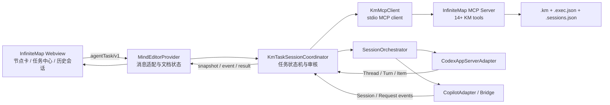
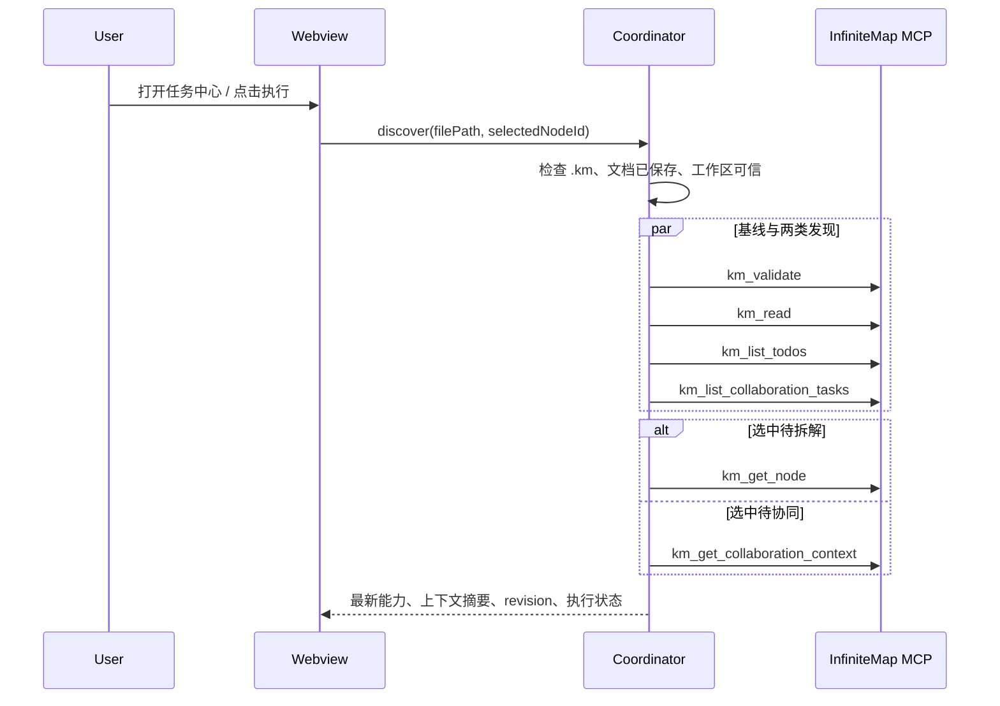
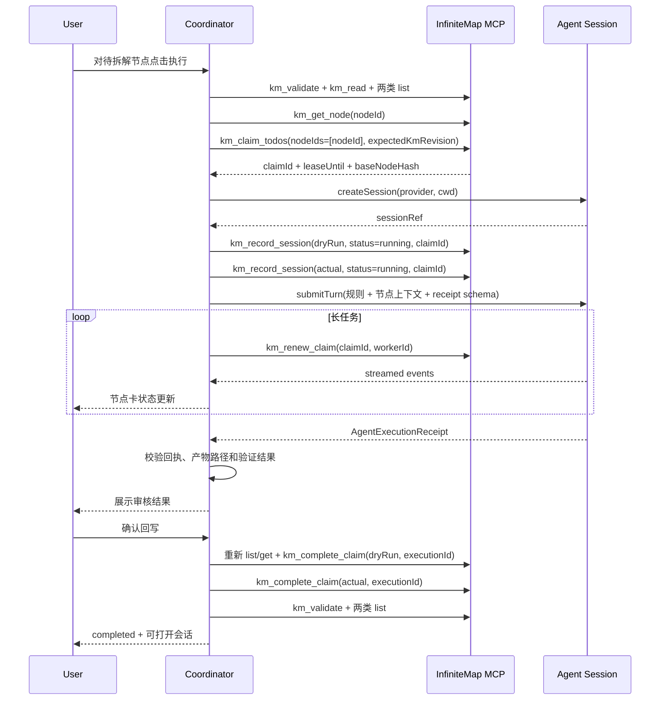
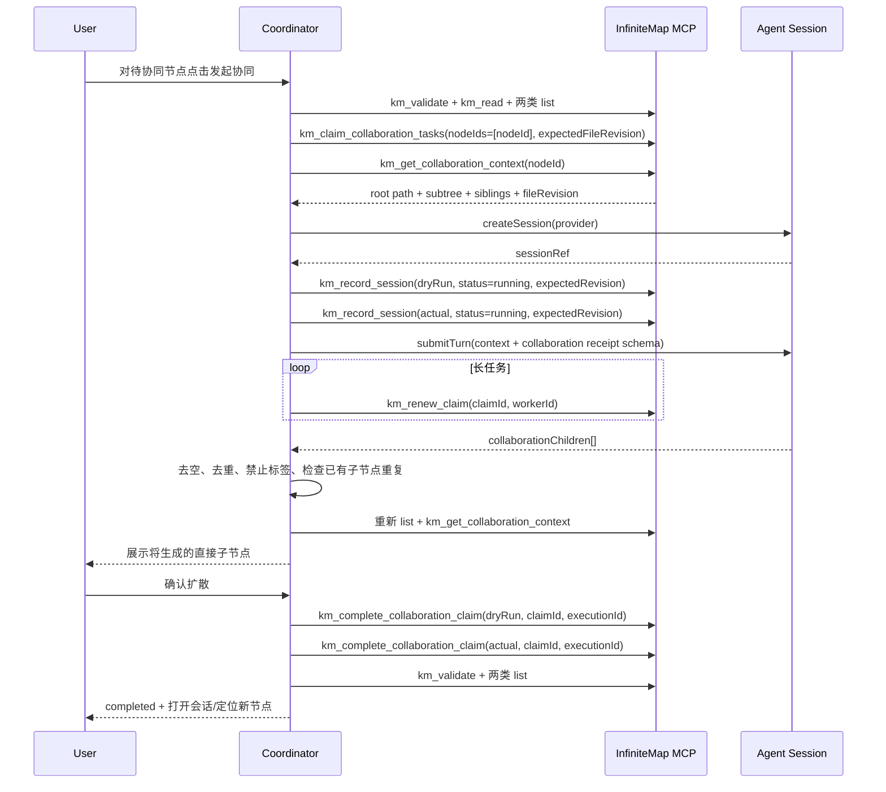
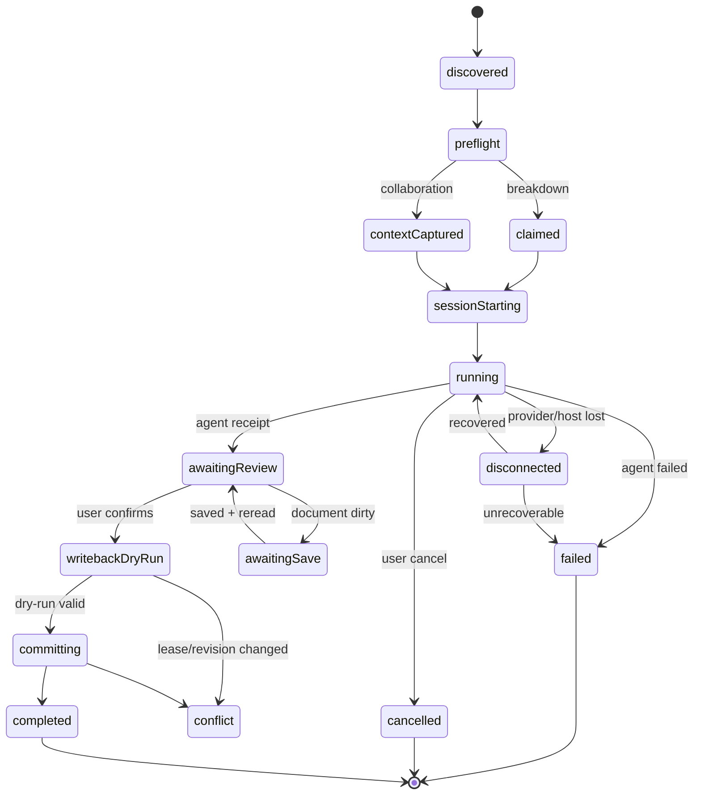

# InfiniteMap 编辑器智能体会话驱动任务执行设计

> 状态：可实施设计稿
> 版本：v1.0
> 日期：2026-08-06
> 适用项目：`Workspace/openSource/InfiniteMap`
> 规则基线：`Workspace/harnessRules/brainstorm-executer/requirement-instruction-breakdown-rules.md`

## 1. 结论

InfiniteMap 应新增一个由编辑器扩展宿主统一控制的“节点任务执行协调器”，让用户在 `.km` 编辑器内直接对 `待拆解`、`待协同` 节点创建 Codex 或 Copilot 会话、提交任务、观察进度、审核输出并完成规则要求的状态回写。

本设计采用以下边界：

1. **编辑器扩展是唯一协调者**：负责读取最新 KM、认领任务、构造上下文、创建会话、续租、审核回执和最终回写。
2. **智能体会话是执行者**：负责生成文件、运行验证或产出协同子节点文本；默认禁止智能体直接调用 KM 写工具，避免与编辑器重复回写。
3. **所有 `.km` 读取和写入仍通过 InfiniteMap MCP**：扩展不得为了方便直接 `fs.readFile` / `fs.writeFile` 修改 KM。
4. **两类任务都支持租约**：待拆解使用叶子任务 claim；待协同使用协同 claim 和目标子树哈希。单写入者场景仍保留最新版本 CAS，完整继承现有 14 个 KM 工具及规则中的并发约束。
5. **会话创建后立即建立节点追溯关系**：节点保存最近一次会话的最小引用；完整历史保存在 `<km>.sessions.json` 旁车中。
6. **成功回写必须可审核**：会话结束不等于节点完成；只有输出、验证和 dry-run 均通过后，才允许实际完成或协同扩散。
7. **Codex 使用官方 app-server**；Copilot 原生会话能力只在 Bridge 可用时启用，未提供 Bridge 时明确降级为 InfiniteMap 自有会话。

该方案不改变现有 KM 业务标签语义：KM 中仍只有 `待拆解`、`待协同`、`已完成` 等用户语义标签；运行中、等待审核、冲突、失败等执行态进入旁车状态和节点信息卡，不污染 `resource` 标签。

## 2. 需求范围

### 2.1 建设目标

- 在节点信息卡中直接触发 `待拆解` 或 `待协同` 节点执行。
- 支持选择 Codex 或 Copilot 作为执行 Provider。
- 支持新建会话、向会话提交任务、更新会话元数据、查询会话和打开历史会话。
- 自动把当前节点、根链路、子树、必要同级上下文和规则约束组织成会话输入。
- 待拆解长任务自动续租；失败或取消时释放租约，节点保持待处理。
- 待协同输出只能形成具体、无标签的直接子节点文本。
- 会话成功后按规则执行 dry-run、实际回写和最终校验。
- 把最近一次会话链接写入节点信息；从节点可查询并打开历史执行会话。
- 支持 VS Code 窗口重载、Webview 重载、Extension Host 重启后的恢复和补偿。

### 2.2 非目标

- 不让 Webview 直接访问 Codex、Copilot、MCP 或本地文件系统。
- 不把会话正文、访问令牌、授权头或完整工具日志写入 KM。
- 不自动修改没有 `待拆解` / `待协同` 标签的普通节点。
- 不允许用 Copilot 私有数据库、内部模块或磁盘日志模拟原生会话 CRUD。
- 不在第一阶段支持 `.xmind` 任务执行；`.xmind` 不受 KM 执行规则约束，且转换过程可能丢失 InfiniteMap 自定义节点元数据。
- 不以“模型回复完成”作为节点完成条件。

## 3. 现状基线与可复用能力

| 现有能力                              | 实现位置                                 | 本方案复用方式                                                 |
| ------------------------------------- | ---------------------------------------- | -------------------------------------------------------------- |
| Custom Editor 文档和 Webview 生命周期 | `src/mindEditor.ts`                    | 在现有 Provider 内增加任务协调消息入口，不新建第二套编辑器     |
| Webview 双向消息、握手、重连          | `webui/main.js`                        | 扩展版本化`agentTask/v1` 协议，沿用 requestId 和显式结果确认 |
| KM 14 个 MCP 工具                     | `src/mcp/server.ts`                    | 作为编辑器协调器唯一 KM 读写通道                               |
| 文件 SHA-256 版本                     | `kmFileReader.ts`                      | 待拆解使用`kmRevision`，待协同使用 `fileRevision`          |
| 待拆解租约和节点哈希                  | `kmExecState.ts`                       | 编辑器启动会话前认领，长任务续租，完成时校验快照               |
| KM 文件锁和原子 rename                | `kmExecState.ts` / `kmFileWriter.ts` | 会话引用、任务标签和协同子节点统一进入锁内写回                 |
| `<km>.exec.json` 执行旁车           | `kmExecState.ts`                       | 扩展活动会话、等待审核、冲突等执行观测字段                     |
| 节点卡执行状态                        | `nodeCard` directive                   | 增加执行按钮、最近会话和历史入口                               |
| 外部写入自动刷新/冲突保护             | `mindEditor.ts`                        | MCP 写回前检查编辑器 dirty；干净时刷新，脏时阻止写回           |

现有 `KmNode.data` 类型只声明 `id`、`created`、`text`、`resource` 和 `expandState`。本设计需要增加可选的 `infiniteMap` 命名空间，但不得覆盖已有 `hyperlink`。用户原有超链接只能由用户编辑；智能体会话链接使用独立字段和节点卡按钮展示。

## 4. 关键设计决策

### 4.1 为什么由编辑器协调，而不是让会话自行回写

规则同时规定了最新磁盘读取、两类任务发现、上下文读取、dry-run、版本校验、租约、最终校验和失败隔离。若把这些动作完全交给不同 Provider 的会话：

- Provider 能力不一致，Copilot 与 Codex 的工具环境可能不同；
- 同一任务容易发生“编辑器认领一次、会话再次认领”或重复完成；
- Extension Host 无法可靠判断外部会话是否按规则完成了最终验证；
- 会话链接、租约和节点状态无法形成统一事务。

因此会话只作为执行者。编辑器协调器掌握任务状态机并负责全部 KM 工具调用。会话 Prompt 明确禁止读取或写入 `.km`，所需 KM 上下文由协调器提供。

### 4.2 为什么最近会话写入节点，完整历史放旁车

把全部历史放进节点会持续增大 KM 文件，并导致每次查询或执行记录都改变文件版本。完全只放旁车又不满足“节点信息中存在最近会话链接”的要求。

采用双层存储：

- 节点 `data.infiniteMap.latestSession`：可移植、可直接展示、保证最近会话可追溯。
- `<km>.sessions.json`：保存完整执行历史、产物、状态变化和 Provider 信息，可分页查询。

KM 节点是“最近会话入口”的事实来源；历史旁车可以由节点和 Provider 会话索引重建，不承担任务正确性。

### 4.3 为什么不复用节点原有 hyperlink

KityMinder 的 HyperLink 是单值，并且当前对 URL 有 HTTP/HTTPS/FTP 校验。复用会覆盖用户业务链接，也无法表达多个历史会话。因此新增命名空间，并由节点卡通过 Webview 消息请求 Extension Host 打开会话。

### 4.4 编辑期间的写回策略

MCP 写回发生在磁盘文件，Webview 可能同时存在未保存草稿。为避免触发当前实现的外部冲突：

1. 开始执行前必须保存当前 KM；保存失败或用户取消则不启动会话。
2. 运行期间允许用户继续编辑，但不持续写 KM，只更新旁车。
3. 进入“确认回写”时如果文档 dirty，则先要求保存并重新读取最新清单/上下文。
4. 待拆解完成依赖节点哈希，目标节点文本或标签被改动时进入冲突态。
5. 待协同依赖完整 `fileRevision`，任何文件变化都必须重新读取上下文并让用户复核生成内容。

## 5. 总体架构



### 5.1 进程边界

| 进程               | 允许职责                                                         | 禁止职责                                          |
| ------------------ | ---------------------------------------------------------------- | ------------------------------------------------- |
| Webview            | 展示、收集用户操作、获取当前选中节点 ID                          | 文件读写、启动进程、保存 Token、直接调用 Provider |
| Extension Host     | 状态机、MCP Client、Provider Adapter、Deep Link、文档 dirty 检查 | 绕过 MCP 直接修改 KM                              |
| InfiniteMap MCP    | KM 读取、校验、认领、续租、会话引用、完成和协同扩散              | 创建 Codex/Copilot 会话                           |
| Codex/Copilot 会话 | 执行任务、产生输出、返回结构化回执                               | 默认不得修改 KM 标签或调用 KM 写工具              |

### 5.2 模块规划

```text
src/
  tasks/
    kmTaskSessionCoordinator.ts
    kmTaskStateMachine.ts
    taskContextBuilder.ts
    executionReceiptValidator.ts
    taskRecoveryService.ts
  sessions/
    types.ts
    sessionOrchestrator.ts
    sessionRegistry.ts
    capabilityResolver.ts
    codex/
      codexAppServerClient.ts
      codexSessionAdapter.ts
    copilot/
      copilotPublicAdapter.ts
      copilotBridgeAdapter.ts
  mcpClient/
    kmMcpClient.ts
    kmToolContracts.ts
  deepLinks/
    sessionUriHandler.ts

src/mcp/
  services/kmSessionState.ts
  tools/kmRecordSession.ts
  tools/kmListNodeSessions.ts

webui/
  ui/service/agentTask.service.js
  ui/directive/agentTaskCenter/
  ui/directive/nodeCard/          # 增量扩展
  less/agentTask.less
```

`mindEditor.ts` 只增加消息分派和生命周期绑定，不继续堆叠会话业务逻辑。

## 6. 统一领域模型

### 6.1 任务类型

```ts
type KmTaskKind = 'breakdown' | 'collaboration';

interface KmTaskRef {
  filePath: string;
  nodeId: string;
  kind: KmTaskKind;
  nodePath: string;
  inputRevision: string;
}
```

- `breakdown.inputRevision` 对应 `kmRevision`，完成时主要依赖 claim 内的 `baseNodeHash`。
- `collaboration.inputRevision` 对应 `fileRevision`，扩散前必须再次读取最新上下文。

### 6.2 Provider 会话引用

```ts
type AgentProvider = 'codex' | 'copilot';

interface AgentSessionRef {
  provider: AgentProvider;
  sessionId: string;
  threadId?: string;
  turnId?: string;
  surface: 'app-server' | 'native-bridge' | 'infinite-map-managed';
  openUri: string;
}
```

`openUri` 使用扩展 Deep Link，不直接暴露 Provider 内部打开命令：

```text
vscode://chanterxiao.infinite-map/session/open
  ?map=<workspace-relative-km-path>
  &executionId=<uuid>
```

Extension Host 根据 `executionId` 查询实际 Provider 与 sessionId，再调用对应 Adapter。若目标会话在当前机器不可用，则展示会话元数据和“复制会话 ID”，不得误跳到其他会话。

### 6.3 节点执行记录

```ts
type NodeExecutionStatus =
  | 'starting'
  | 'running'
  | 'waiting_for_agent'
  | 'awaiting_review'
  | 'awaiting_save'
  | 'writeback_dry_run'
  | 'committing'
  | 'completed'
  | 'failed'
  | 'cancelled'
  | 'conflict'
  | 'disconnected';

interface NodeExecutionRecord {
  executionId: string;
  nodeId: string;
  taskKind: KmTaskKind;
  status: NodeExecutionStatus;
  session: AgentSessionRef;
  workerId: string;
  claimId?: string;
  inputRevision: string;
  resultRevision?: string;
  startedAt: string;
  updatedAt: string;
  completedAt?: string;
  summary?: string;
  artifacts?: Array<{ path: string; kind: 'file' | 'report' | 'validation' }>;
  generatedNodeIds?: string[];
  error?: { code: string; message: string; retryable: boolean };
}
```

### 6.4 会话回执

会话必须返回统一结构，协调器不能只匹配自然语言“已完成”：

```ts
interface AgentExecutionReceipt {
  executionId: string;
  status: 'succeeded' | 'failed' | 'blocked';
  summary: string;
  artifacts: Array<{
    path: string;
    kind: 'created' | 'modified' | 'report';
  }>;
  validations: Array<{
    command?: string;
    name: string;
    passed: boolean;
    evidence?: string;
  }>;
  collaborationChildren?: string[];
  blocker?: string;
}
```

Codex `turn/start` 使用 `outputSchema` 强制该结构。Copilot Adapter 不支持结构化输出时，要求在最终响应中提供带版本标识的 JSON 回执；解析失败直接进入 `awaiting_review`，禁止自动回写。

## 7. 节点和旁车数据设计

### 7.1 KM 节点中的最近会话

```json
{
  "data": {
    "id": "node-123",
    "text": "实现会话追溯",
    "resource": ["已完成"],
    "infiniteMap": {
      "schemaVersion": 1,
      "latestSession": {
        "executionId": "exec-uuid",
        "taskKind": "breakdown",
        "provider": "codex",
        "sessionId": "thr_123",
        "surface": "app-server",
        "openUri": "vscode://chanterxiao.infinite-map/session/open?...",
        "status": "completed",
        "startedAt": "2026-08-06T10:00:00.000Z",
        "updatedAt": "2026-08-06T10:20:00.000Z"
      },
      "sessionHistoryCount": 4
    }
  }
}
```

约束：

- 不写 Prompt、响应正文、Token、绝对用户目录或 Provider 授权信息。
- 不覆盖 `data.hyperlink`、`data.note` 或 `resource` 中的用户内容。
- `getNodeHash` 继续只计算 `{id,text,resource}`；写入 `data.infiniteMap` 不使有效 claim 失效。
- KM 的最近会话字段在成功完成、失败释放或用户取消时更新；运行中的高频状态只写旁车。

### 7.2 完整会话历史旁车

路径：`<km-file>.sessions.json`

```json
{
  "schemaVersion": 1,
  "kmRevision": "sha256",
  "executions": {
    "exec-uuid": {
      "executionId": "exec-uuid",
      "nodeId": "node-123",
      "taskKind": "breakdown",
      "status": "completed",
      "session": {
        "provider": "codex",
        "sessionId": "thr_123",
        "surface": "app-server",
        "openUri": "vscode://..."
      },
      "startedAt": "...",
      "updatedAt": "...",
      "completedAt": "...",
      "artifacts": []
    }
  },
  "nodeIndex": {
    "node-123": ["exec-uuid"]
  }
}
```

旁车规则：

- 与 `<km>.exec.json` 共用 `<km>.lock`，临时文件写入后 rename。
- `nodeIndex` 按时间倒序，查询支持 cursor/limit。
- 同一 `executionId` 幂等更新，不追加重复记录。
- 节点被删除后历史保留为 orphan，历史页可显示“原节点已不存在”。
- 旁车损坏不影响 KM 打开和任务标签；先隔离损坏文件，再从 KM 最近引用和 Provider 索引补建。
- 旁车是否提交 Git 由项目决定；默认加入 `.gitignore`，节点最近链接仍随 KM 保留。

### 7.3 写入顺序和恢复保证

成功回写时，KM 文件必须在一次内存修改中同时完成：

1. 更新目标节点 `data.infiniteMap.latestSession.status=completed`；
2. 待拆解：`待拆解` → `已完成`；
3. 待协同：追加无标签直接子节点并把父节点改为 `已完成`；
4. 协同新子节点可记录只读 `originExecutionId`，但不写 session 完整副本；
5. 原子替换 KM；
6. 更新 `.sessions.json` 和 `.exec.json`。

如果步骤 6 失败，KM 中仍有最近会话和正确标签，恢复服务可以重建旁车。禁止采用“先标记完成、再尝试写最近会话”的顺序。

## 8. 编辑器启动与任务发现流程

每次打开任务中心、点击节点执行或手动刷新时，必须重新执行完整发现，不使用历史 Webview 缓存：



硬性判断：

- `km_validate` 的错误涉及目标节点、可读性或标签一致性时禁止执行。
- 两类列表必须都调用，不能因选中一种而跳过另一种发现。
- 当前节点不在最新列表中时刷新 UI，不使用旧标签继续执行。
- MCP 连接或任一必需工具不可用时，执行按钮 disabled，并提供“打开 MCP 诊断”；不得降级到直接读写文件。

## 9. 待拆解节点执行流程

编辑器发起的会话是独立执行单元，默认使用多写入者租约模式。即使当前只有一个 VS Code 窗口，也应使用 claim，以防 CLI、其他窗口或自动任务同时处理同一 KM。



### 9.1 认领规则

- 只允许 `isLeaf=true` 的待拆解节点进入直接执行。
- 父级待拆解节点显示“等待子任务完成”，不能由普通执行按钮直接 claim。
- `workerId` 格式建议：`infinite-map:<machineIdHash>:<windowId>:<executionId>`。
- 默认租约 600 秒，在剩余 40% 时续租；连续两次续租失败进入 `conflict`，不再自动提交回写。
- 用户取消、Provider 失败、回执失败或 Extension Host 正常关闭时，先 dry-run、再调用实际 `km_release_claim`，附 `failReason` 和 executionId。
- Extension Host 崩溃时由租约过期自然回收；恢复服务把会话标记为 `disconnected`，用户可选择重新认领并继续原会话或新建会话。

### 9.2 完成条件

只有同时满足以下条件才开放“确认回写”：

- 回执 `status=succeeded`；
- 回执 `executionId` 与当前执行一致；
- 所有声明产物都位于允许的工作区范围内；
- 必需验证项全部 `passed=true`；
- 当前目标仍是有效待拆解叶子节点；
- claim 有效且目标节点哈希未变化；
- 文档无未保存改动；
- `km_complete_claim` dry-run 的完成数量为 1。

自动回写作为后续可选设置，默认关闭。即使开启，也必须满足上述机器可验证条件。

### 9.3 父节点收敛

所有子级待拆解完成后，任务中心把父节点标为 `ready_for_summary`。父节点不能进入租约批次，由协调者重新读取完整子树后：

1. 可创建一个汇总会话，或由用户直接确认；
2. dry-run `km_mark_done`，携带最新 `kmRevision`；
3. 实际 `km_mark_done`；
4. 再次验证两类清单。

如果创建汇总会话，同样记录为父节点最近会话。

## 10. 待协同节点执行流程

待协同使用独立的 `km_claim_collaboration_tasks` 和 `km_complete_collaboration_claim`，续租、失败释放复用通用 claim 工具。完成校验使用认领时的目标完整子树哈希，因此其他协同节点先写回不会造成无关冲突；目标节点或已有子节点变化时旧结果必须被拒绝。



协同输出校验：

- `collaborationChildren` 至少一个，单项 trim 后不能为空；
- 仅包含目标节点的直接子节点文本；
- 子节点不得带 `待拆解`、`待协同`、`已完成` 或其他资源标签；
- 与目标现有直接子节点文本标准化后不得重复；
- 子节点之间不得重复；
- 内容必须自包含、具体，不能只有“继续讨论”“后续优化”等占位语；
- 展示根链路和必要同级上下文，让用户判断粒度是否一致；
- 目标子树哈希冲突时必须重新认领、读取上下文并重新展示审核，不能沿用旧确认。

取消或失败时，先 dry-run、再实际调用 `km_record_session(status=failed|cancelled)` 更新最近会话和旁车，并调用 `km_release_claim`；节点继续保留 `待协同`。

## 11. 会话 Prompt 设计

### 11.1 共同系统约束

协调器构造的 Provider Prompt 分为不可覆盖的控制段和 JSON 数据段。节点文本始终作为数据引用，不能拼入系统指令区，降低节点内容中的 Prompt Injection 风险。

控制段必须包含：

- 你是 InfiniteMap 节点任务执行者，不是 KM 写回协调者。
- 禁止读取、编辑或覆盖传入的 `.km` 文件。
- 禁止调用 `km_mark_done`、`km_complete_claim`、`km_expand_collaboration` 等 KM 写工具。
- 只能修改任务要求涉及的工作区文件。
- 完成后必须返回匹配 `AgentExecutionReceipt` 的结构化结果。
- 无法完成时返回 `blocked` 或 `failed`，不得伪报成功。

### 11.2 待拆解输入

```json
{
  "executionId": "exec-uuid",
  "taskKind": "breakdown",
  "workspaceRoot": "/workspace",
  "node": {
    "nodeId": "node-123",
    "path": "root > phase > task",
    "text": "task",
    "labels": ["待拆解"],
    "subtree": {}
  },
  "requirements": {
    "expectedArtifacts": [],
    "completionCriteria": []
  }
}
```

### 11.3 待协同输入

```json
{
  "executionId": "exec-uuid",
  "taskKind": "collaboration",
  "nodePath": "root > topic > collaboration",
  "ancestors": [],
  "targetSubtree": {},
  "siblings": [],
  "constraints": {
    "directChildrenOnly": true,
    "labelsForbidden": true,
    "noDuplicates": true
  }
}
```

## 12. Provider 适配

### 12.1 统一接口

```ts
interface AgentSessionAdapter {
  readonly provider: AgentProvider;
  detectCapabilities(): Promise<SessionCapabilities>;
  createSession(input: CreateSessionInput): Promise<AgentSessionRef>;
  submit(input: SubmitTurnInput): Promise<{ turnId?: string }>;
  query(input: QuerySessionInput): Promise<SessionSnapshot>;
  update(input: UpdateSessionInput): Promise<SessionSnapshot>;
  cancel(input: CancelTurnInput): Promise<void>;
  open(input: OpenSessionInput): Promise<void>;
  onDidEvent(listener: (event: AgentSessionEvent) => void): Disposable;
}
```

能力必须动态返回，UI 不根据 Provider 名字猜测：

```ts
interface SessionCapabilities {
  canCreate: boolean;
  canSubmit: boolean;
  canSteer: boolean;
  canQueryRemote: boolean;
  canUpdateRemote: boolean;
  canCancel: boolean;
  canStream: boolean;
  canOpenNative: boolean;
  sessionOwnership: 'native' | 'infinite-map';
}
```

### 12.2 Codex

Codex 使用官方 `codex app-server` stdio JSONL 协议：

| InfiniteMap 操作    | app-server 方法                                     |
| ------------------- | --------------------------------------------------- |
| 创建                | `thread/start`                                    |
| 恢复                | `thread/resume`                                   |
| 提交任务            | `turn/start`                                      |
| 运行中补充          | `turn/steer` + `expectedTurnId`                 |
| 查询单会话          | `thread/read`                                     |
| 查询列表            | `thread/list`，按 `cwd` 和 `sourceKinds` 过滤 |
| 更新名称            | `thread/name/set`                                 |
| 更新 pin/git 元数据 | `thread/metadata/update`                          |
| 中断                | `turn/interrupt`                                  |
| 归档                | `thread/archive`                                  |
| 事件                | `thread/status/changed`、`turn/*`、`item/*`   |

实施要求：

- 首次使用懒启动 app-server，先 `initialize`，再发送 `initialized`。
- `clientInfo.name` 使用明确的集成标识，如 `infinite_map_vscode`，不得冒用 `codex_vscode`。
- 默认使用稳定 API，不启用 `experimentalApi`；需要分页 turns/items 时另设实验特性开关。
- 构建或运行时通过 `codex app-server generate-ts` / `generate-json-schema` 获取与安装版本匹配的协议类型。
- 记录 `thread.id` 和服务返回的 `thread.sessionId`，不得自行推导 session tree root。
- 使用 `outputSchema` 强制回执结构。
- App Server 断开时保留 executionId 和 threadId，恢复后 `thread/read` / `thread/resume` 查询状态。
- Codex IDE 的 `chatgpt.openSidebar`、`chatgpt.newChat`、`chatgpt.newCodexPanel` 仅用于打开 UI；若没有公开的按 threadId 跳转能力，则 InfiniteMap 自己展示线程详情并提供复制 ID。

官方参考：

- [Codex App Server](https://learn.chatgpt.com/docs/app-server.md)
- [Codex IDE extension commands](https://learn.chatgpt.com/docs/developer-commands.md?surface=ide)

### 12.3 Copilot

公开的 VS Code Chat/Language Model API 可以注册 Participant、选择模型和发送请求，但不保证可以列出、读取或更新任意 Copilot Chat 原生会话。因此分两级：

1. `CopilotBridgeAdapter`：只有 `github.copilot-chat` 或伴随扩展显式导出版本化 Bridge 时，启用原生会话 CRUD。
2. `CopilotPublicAdapter`：无 Bridge 时使用可用 Language Model 建立 InfiniteMap 自有会话；历史由 InfiniteMap 管理，UI 标记“非 Copilot 原生历史”。

禁止方案：

- 读取 Copilot `workspaceStorage/globalStorage` 的内部 JSON、SQLite 或 debug log；
- import Copilot 扩展私有模块；
- 使用未文档化 command 参数伪造按 sessionId 打开；
- 在能力不可用时仍把 `canQueryRemote` 标为 true。

Bridge 接口建议：

```ts
interface InfiniteMapSessionBridgeV1 {
  apiVersion: '1';
  provider: 'copilot';
  getCapabilities(): Promise<SessionCapabilities>;
  createSession(input: CreateSessionInput): Promise<AgentSessionRef>;
  submitTurn(input: SubmitTurnInput): Promise<{ turnId?: string }>;
  querySessions(input: QuerySessionInput): Promise<SessionPage>;
  updateSession(input: UpdateSessionInput): Promise<SessionSnapshot>;
  cancelTurn(input: CancelTurnInput): Promise<void>;
  openSession(input: OpenSessionInput): Promise<void>;
  onDidChangeSession(listener: (event: AgentSessionEvent) => void): Disposable;
}
```

## 13. MCP 工具改造

### 13.1 新增 `km_record_session`

用途：在会话创建、失败、取消、断连或人工恢复时，幂等记录节点最近会话及历史旁车；不修改任务标签。

建议入参：

```ts
{
  filePath: string;
  nodeId: string;
  executionId: string;
  taskKind: 'breakdown' | 'collaboration';
  status: NodeExecutionStatus;
  session: AgentSessionRef;
  workerId: string;
  claimId?: string;
  expectedRevision?: string;
  summary?: string;
  error?: { code: string; message: string; retryable: boolean };
  dryRun?: boolean;
}
```

校验：

- 目标节点必须存在，且标签与 `taskKind` 匹配，终态记录允许节点已完成。
- 待拆解存在有效租约时，`claimId` 必须匹配；否则禁止别的执行者覆盖最近会话。
- 待协同启动记录必须携带最新 `expectedRevision`。
- 同一 executionId 为更新；新 executionId 才追加历史。
- `session.openUri` 只能是本扩展 Deep Link，拒绝 `javascript:`、`command:` 和任意外部命令 URI。
- `dryRun` 先返回将修改的节点、旁车项和 revision，不写文件。

所有 `km_record_session` 实际调用前都必须执行 dry-run；预计修改节点数不是 1、executionId 命中方式不符合预期或 revision 已变化时不得写入。

### 13.2 新增 `km_list_node_sessions`

用途：按节点分页查询历史会话。

```ts
{
  filePath: string;
  nodeId: string;
  cursor?: string;
  limit?: number;       // 默认 20，最大 100
  statuses?: NodeExecutionStatus[];
  providers?: AgentProvider[];
}
```

返回节点最新引用、完整历史摘要、`nextCursor` 和 orphan 标识。查询必须重新读取旁车；不得只返回 Webview 缓存。

### 13.3 扩展现有写工具

| 工具                        | 新增可选入参              | 原子行为                                                              |
| --------------------------- | ------------------------- | --------------------------------------------------------------------- |
| `km_complete_claim`       | `executionId`           | 校验 execution/claim 一致；节点变为已完成的同时把最近会话置 completed |
| `km_release_claim`        | `executionId`、终态摘要 | 释放/失败的同时更新节点最近会话，节点保留原待处理标签                 |
| `km_mark_done`            | `executionId`           | 父级汇总或单写入者完成时写入最近会话                                  |
| `km_expand_collaboration` / `km_complete_collaboration_claim` | `executionId` | 单写入者或租约模式下，追加子节点、完成父节点、记录会话和 generatedNodeIds 同一 KM 写入 |
| `km_get_node`             | 无强制变更                | 返回`data.infiniteMap`，供节点卡刷新最近会话                        |

所有新增写入仍遵循：文件锁内重读 → 校验 → 临时文件 → JSON 校验 → rename → 旁车同步。会话追溯工具实施后 MCP 工具数将在现有 14 个基础上增至 16 个，必须同步更新执行规则、三份规则地图和时间戳。

### 13.4 Extension Host 的 MCP Client

扩展打包后应自带编译产物并以 stdio 启动 MCP Server：

```text
node <extensionPath>/dist/mcp/server.js
```

`KmMcpClient` 必须完成 MCP initialize、tools/list、tools/call、超时、进程退出和重连。Server 不可用时：

1. 禁用执行入口；
2. 输出 MCP 诊断到专用 OutputChannel；
3. 提供重新构建/重启说明；
4. 不回退到内部 Service 直接操作 KM。

## 14. 编辑器消息协议

### 14.1 Webview → Extension Host

```ts
interface AgentTaskRequest {
  command: 'agentTask';
  protocolVersion: 1;
  requestId: string;
  operation:
    | 'discover'
    | 'capabilities'
    | 'start'
    | 'submit'
    | 'steer'
    | 'cancel'
    | 'review'
    | 'commit'
    | 'retry'
    | 'queryHistory'
    | 'openSession';
  documentUri: string;
  nodeId?: string;
  executionId?: string;
  provider?: AgentProvider;
  payload?: unknown;
  idempotencyKey?: string;
}
```

### 14.2 Extension Host → Webview

```ts
interface AgentTaskResult {
  command: 'agentTaskResult';
  protocolVersion: 1;
  requestId: string;
  ok: boolean;
  result?: unknown;
  error?: {
    code:
      | 'MCP_UNAVAILABLE'
      | 'INVALID_NODE_STATE'
      | 'DOCUMENT_DIRTY'
      | 'PROVIDER_UNAVAILABLE'
      | 'AUTH_REQUIRED'
      | 'CAPABILITY_UNAVAILABLE'
      | 'LEASE_CONFLICT'
      | 'REVISION_CONFLICT'
      | 'RECEIPT_INVALID'
      | 'VALIDATION_FAILED'
      | 'TIMEOUT'
      | 'INTERNAL_ERROR';
    message: string;
    retryable: boolean;
  };
}

interface AgentTaskEvent {
  command: 'agentTaskEvent';
  protocolVersion: 1;
  executionId: string;
  sequence: number;
  type:
    | 'state.changed'
    | 'session.delta'
    | 'session.tool.started'
    | 'session.tool.completed'
    | 'lease.renewed'
    | 'review.available'
    | 'writeback.completed';
  payload: unknown;
}
```

协议约束：

- 每个 requestId 只响应一次，流事件另走 sequence。
- Extension Host 对 `documentUri` 与当前 Document Owner 做绑定校验。
- Webview 只传 nodeId，不传可信文件路径、claimId 或 revision；这些由 Host 快照管理。
- 单条消息限制 64 KiB；大量历史分页返回。
- Webview 重载后先 `discover`，Host 推送活动执行快照，不能依赖旧 DOM 状态。

## 15. UI 与交互设计

### 15.1 节点信息卡

现有右下角节点卡增加三个区域：

1. **任务状态**：标签类型、pending/claimed/running/awaiting review/conflict/completed。
2. **主操作**：
   - `待拆解` 叶子：`执行拆解`；
   - `待拆解` 父级：`查看子任务`；
   - `待协同`：`发起协同`；
   - 活动执行：`打开会话`、`取消`；
   - 待审核：`审核并回写`。
3. **会话追溯**：最近会话标题、Provider、时间、状态、`打开`、`历史`。

Provider 选择放在主按钮的 Popover 中，默认使用用户最近选择；不要在卡片中长期堆叠两个 Provider 按钮。

### 15.2 任务中心

工具栏增加一个 `brain`/`mcp` 语义图标入口，打开任务中心 Dialog：

- `待执行`：两类最新任务清单，显示路径、标签、叶子状态和是否可执行；
- `执行中`：会话、认领人、租约、当前阶段；
- `待审核`：产物、验证、协同子节点预览和回写按钮；
- `历史`：按当前文件/节点查询 `.sessions.json`，支持打开、复制 ID、查看摘要。

列表自带搜索和空状态，不再额外创建搜索 Input 或空态 Card。历史详情使用 Dialog body，不做 card-in-card。

### 15.3 协同审核

协同审核显示：

- 目标节点根链路；
- 现有直接子节点；
- 即将新增的子节点列表；
- 去重/禁标签/版本状态；
- `重新生成`、`确认扩散` 两个动作。

版本已变化时，“确认扩散”立即 disabled，协调器重新取上下文后显示差异；用户必须再次确认。

### 15.4 设计系统约束

InfiniteMap 是 AngularJS/KityMinder Webview，不能直接引入 SolidJS 组件，但新 UI 必须采用桌面设计系统的语义 token 和结构约束：

- 新增兼容 token 层，把 `--background-*`、`--surface-*`、`--text-*`、`--icon-*`、`--border-*`、`--radius-*`、`--shadow-*` 映射到 VS Code Theme CSS Variables；禁止新增硬编码 hex/rgb/任意字号和像素值。
- 组件根使用 `data-component`，子节点使用 `data-slot`。
- Dialog、Popover、Button、Input、Toast 的圆角、阴影、focus 和交互态遵循统一 token。
- 明暗主题首先跟随 VS Code Theme，同时验证 `prefers-color-scheme` light/dark fallback。
- 状态色仅用于状态点、错误、警告和 Toast，不用作大面积背景。
- 动画只使用 100/150/200ms，禁止 `transition-all`。
- 图标使用项目自研/既有图标资产，`currentColor` 着色，不引入 Lucide/Iconify 或内联硬编码 SVG。
- 禁止冗余说明文字；能力不可用通过 disabled、状态和可操作诊断表达。

当前 Webview 已有 14 种语言。新增会话功能应覆盖现有 14 种并补齐设计系统缺少的 7 种（`no`、`br`、`th`、`da`、`bs`、`tr`、`ar`），即以 21 种语言并集交付；`zh_CN/zh_TW` 分别映射设计系统 `zh/zht`。

## 16. 状态机与失败处理



### 16.1 错误处理矩阵

| 错误                   | 节点标签 | 租约                          | 会话记录                  | 用户动作           |
| ---------------------- | -------- | ----------------------------- | ------------------------- | ------------------ |
| Provider 未安装/未登录 | 不变     | 不创建                        | 不创建或 starting→failed | 打开安装/登录入口  |
| 会话创建失败           | 不变     | 待拆解已 claim 时立即 release | failed                    | 重试               |
| 会话运行失败           | 不变     | release + failReason          | failed，可打开            | 重试原会话或新建   |
| 租约续租失败           | 不变     | 不强制覆盖                    | conflict                  | 重新读取并重新认领 |
| 协同 revision 冲突     | 不变     | 不适用                        | conflict                  | 重新取上下文并审核 |
| 回执无法解析           | 不变     | 保持续租直到审核超时          | awaitingReview            | 人工审核/标失败    |
| 文档 dirty             | 不变     | 继续续租                      | awaitingSave              | 保存或取消回写     |
| Extension Host 重启    | 不变     | 租约可能继续或过期            | disconnected              | 恢复/重新认领      |
| MCP 不可用             | 不变     | 不新建写入                    | 保留现状                  | MCP 诊断后重试     |

### 16.2 超时

- MCP 普通读：10 秒；写工具：30 秒；超时不假定失败，必须重新读取确认结果。
- Provider 创建：30 秒；首次事件：60 秒；长任务不设总时长，但需心跳。
- 待审核默认保留 claim 10 分钟并持续续租；超过用户配置的审核窗口后提示释放，不自动完成。
- 取消请求超时后查询 Provider 状态；只有确认终止或失联后才释放任务。

## 17. 安全与权限

- Webview 永远拿不到 Codex/Copilot Token、MCP 进程句柄或文件系统任意访问能力。
- Codex 复用自己的登录缓存；InfiniteMap 不读取 `~/.codex/auth.json`。
- Copilot 授权由 Copilot/VS Code 管理。
- 工作区不可信时只允许查询历史和打开已有会话，禁止创建会执行本地工具的任务。
- `cwd` 必须位于当前可信 workspace；跨工作区需显式确认。
- Prompt 只发送规则要求的最小节点上下文，不默认发送完整 KM。
- 日志只记录 executionId、nodeId、Provider、sessionId、状态、耗时和错误码；默认不记录 Prompt 和响应正文。
- 会话摘要写 KM 前限制长度并清理控制字符。
- Deep Link 必须校验 publisher/extension、workspace 路径、executionId 和 Provider 能力。
- `command:` URI 禁止持久化到节点。

## 18. 恢复与一致性

### 18.1 Webview 重载

Provider 保留协调器状态。Webview 重新 `loaded/ready` 后，除现有 import 和 execState 外，再推送：

- 当前文件任务发现摘要；
- 活动 execution 快照；
- 最近会话引用；
- 待审核回执摘要。

### 18.2 Extension Host 重启

启动后扫描当前打开 KM 对应的 `.exec.json` 和 `.sessions.json`：

- Codex：`thread/read` 查询 thread，必要时 `thread/resume`；
- Copilot Bridge：调用 `querySession`；
- Copilot Public：只能恢复 InfiniteMap 已持久化的摘要，不能伪造远程状态；
- claim 仍有效且会话在运行时恢复续租；
- claim 已过期时 execution 标记 conflict，用户重新认领后才能继续回写。

### 18.3 跨文件写入补偿

KM 与两个旁车无法形成文件系统级多文件事务，采用“KM 为正确性事实、旁车可重建”：

- 成功完成时先原子写包含标签和最近会话的 KM，再写旁车；
- 旁车失败则写恢复日志，下一次打开重建；
- 任何恢复不得反向把旁车旧状态覆盖到新 KM；
- 以 KM SHA-256 和 executionId 幂等判断是否已应用。

## 19. 配置项

建议新增：

| 配置                                            | 默认值    | 说明                                  |
| ----------------------------------------------- | --------- | ------------------------------------- |
| `infiniteMap.agentTasks.enabled`              | `true`  | 总开关                                |
| `infiniteMap.agentTasks.defaultProvider`      | `codex` | 默认 Provider，能力不可用时不静默切换 |
| `infiniteMap.agentTasks.autoWriteback`        | `false` | 自动回写，需满足全部机器校验          |
| `infiniteMap.agentTasks.reviewLeaseSeconds`   | `600`   | 待拆解租约/审核窗口                   |
| `infiniteMap.agentTasks.historyPageSize`      | `20`    | 历史页大小                            |
| `infiniteMap.agentTasks.persistFullResponse`  | `false` | 默认不持久化正文                      |
| `infiniteMap.agentTasks.codexExecutable`      | 自动发现  | 仅高级设置显示，不在主流程要求填写    |
| `infiniteMap.agentTasks.experimentalCodexApi` | `false` | 是否启用实验 app-server 方法          |

不新增 Gateway URL、API Base、Token 输入框。

## 20. 分阶段实施计划

### Phase 0：契约与可用性探测

- 建立 `tasks/`、`sessions/`、`mcpClient/` 模块。
- 实现 `agentTask/v1`、统一错误码、Provider capability。
- 实现 MCP stdio Client 与 12 工具健康检查。
- 节点卡只展示能力，不执行写入。

完成标准：缺 MCP、缺 Provider、未登录、非 `.km`、dirty 文档都能给出正确可操作状态。

### Phase 1：会话追溯数据层

- 实现 `kmSessionState.ts`、`.sessions.json`、`km_record_session`、`km_list_node_sessions`。
- 扩展 `KmNode.data.infiniteMap` 类型。
- 实现 Deep Link 和历史查询。
- 扩展现有写工具的 executionId 原子终态写回。

完成标准：成功、失败、取消会话都能从节点打开最近会话；历史分页和损坏恢复可用。

### Phase 2：Codex 待拆解闭环

- 实现 app-server Client 和稳定方法能力。
- 待拆解 claim、续租、结构化回执、审核、complete dry-run/actual。
- 实现重启恢复。

完成标准：真实 `.km` 叶子任务可从节点一键执行，输出审核后正确完成，失败任务可重新认领。

### Phase 3：Codex 待协同闭环

- 协同上下文构造、结构化 childTexts、审核和版本冲突复核。
- 原子扩散与父节点完成。

完成标准：生成节点无标签、不重复；任何旧 revision 都无法写入。

### Phase 4：Copilot

- Public Adapter 的 InfiniteMap 自有会话。
- 可用时接入 Copilot Bridge 原生会话。
- 能力差异和 UI 文案明确。

完成标准：无 Bridge 时不宣称原生 CRUD；有 Bridge 时通过统一契约测试。

### Phase 5：任务中心与批量协调

- 待执行/执行中/待审核/历史四视图。
- 同一协调器批量启动独立叶子任务，会话并行、KM 回写串行。
- 每批完成后滚动重新发现新增待办。

完成标准：符合规则 §4.1 的协调者-执行者协议，任何执行会话都不直接写 KM。

## 21. 测试设计

### 21.1 单元测试

- MCP Client 初始化、工具缺失、超时、进程退出和重连。
- 节点 session 元数据序列化不覆盖 hyperlink/note/resource。
- session history 幂等、分页、损坏恢复、orphan。
- `getNodeHash` 不受 `data.infiniteMap` 变化影响。
- executionId 与 claimId 不匹配时拒绝终态回写。
- 协同输出去空、去重、禁标签和已有子节点冲突。
- 回执 schema 错误、伪 executionId、工作区外产物路径。
- Deep Link 防篡改和会话不可用降级。

### 21.2 MCP 集成测试

新增至少覆盖：

1. `km_record_session` dry-run 不写文件；
2. 记录 running 后节点最近会话可见，claim hash 不变化；
3. 同 executionId 更新不重复追加历史；
4. 其他 claim 不能覆盖最近会话；
5. `km_complete_claim` 同时完成标签和会话终态；
6. `km_release_claim` 保留待拆解并记录失败会话；
7. `km_expand_collaboration` 同时生成子节点、完成父节点、记录会话和 generatedNodeIds；
8. 过期 revision 零写入；
9. 旁车写失败后可从 KM 重建；
10. 两 execution 并发时无静默覆盖。

### 21.3 Provider 契约测试

- Fake Codex App Server：initialize、thread/start、turn/start、delta、completed、read、resume、interrupt。
- schema 与运行中 Codex 版本不匹配时能力降级。
- Fake Copilot Bridge：原生能力全开。
- 无 Bridge：只返回 InfiniteMap-managed 能力。
- 断线、认证失效、配额错误、取消超时。

### 21.4 VS Code E2E

- 打开 KM → 选中两类节点 → 创建会话 → 审核 → 回写 → 打开历史。
- Webview reload、Reload Window、Restart Extension Host。
- dirty 文档阻止 MCP 写回。
- 外部 MCP 写入后干净编辑器自动刷新。
- 两个 VS Code 窗口同时执行同一待拆解节点，只有一个认领成功。
- 两个窗口同时协同，只有最新 revision 可扩散。

### 21.5 UI 验收

截图保存到：

```text
Workspace/validations/infinite-map-agent-tasks/
  node-card-light-1440x900.png
  node-card-dark-1440x900.png
  task-center-light-1440x900.png
  task-center-dark-1440x900.png
  collaboration-review-1280x820.png
  narrow-editor-720x900.png
```

必须执行 DOM `getBoundingClientRect()` 核验：Dialog/Popover 不溢出、节点卡不遮挡关键画布操作、左右和上下预期留白差不超过 2px。明暗主题均检查文字对比度和状态色。

工程命令：

```bash
npm --prefix webui run build
npm test
npm run mcp:build
npm run package
npm run build
```

## 22. 验收标准

### 22.1 功能验收

- [ ] 每次执行前调用 `km_validate`、`km_read`、`km_list_todos`、`km_list_collaboration_tasks`。
- [ ] 待拆解调用 `km_get_node`，待协同调用 `km_get_collaboration_context`。
- [ ] 待拆解叶子成功认领后才创建执行会话；失败和取消释放租约。
- [ ] 长任务按时续租，过期 claim 不能完成。
- [ ] 待协同扩散前重新读取最新上下文。
- [ ] 所有实际完成前都有 dry-run。
- [ ] 会话开始、失败、取消等 `km_record_session` 写入也遵循 dry-run → actual。
- [ ] 成功回写后再次执行校验和两类清单。
- [ ] 会话输出失败、验证失败或回执无效时节点不完成。
- [ ] 最近会话写入节点信息，完整历史可按节点分页查询。
- [ ] 节点可打开最近和历史会话；不可用时显示明确降级。
- [ ] 用户原有 hyperlink、note、resource 不被覆盖。

### 22.2 并发与一致性验收

- [ ] 同一待拆解叶子不能被两个活动会话同时认领。
- [ ] 记录会话引用不会使原 claim 的节点哈希失效。
- [ ] 不同节点的会话并行执行、串行回写互不覆盖。
- [ ] 待协同旧 revision 零写入。
- [ ] KM 已完成但会话旁车缺失时可恢复。
- [ ] Extension Host 崩溃后租约可过期回收。
- [ ] dirty Webview 不被外部写回静默覆盖。

### 22.3 安全与 UI 验收

- [ ] KM、旁车和日志中无 Token、授权头或完整 Prompt。
- [ ] 不读取 Copilot 私有存储。
- [ ] 不允许工作区外 cwd 和产物路径静默通过。
- [ ] 新 UI 无硬编码颜色、字号、任意圆角和阴影。
- [ ] light/dark 与 21 语言资源完整。
- [ ] typecheck、lint、测试、MCP build、Webpack/VSIX build 全绿。
- [ ] 截图和 DOM 数值证据已保存。

## 23. 风险与取舍

| 风险                            | 等级 | 应对                                                                  |
| ------------------------------- | ---- | --------------------------------------------------------------------- |
| Copilot 无原生会话公共 API      | 高   | Bridge 才启用原生 CRUD；否则明确 InfiniteMap-managed                  |
| Codex app-server 协议随版本变化 | 中   | 生成版本匹配 schema、能力探测、只用稳定 API                           |
| 用户运行期间编辑 KM             | 高   | 运行阶段旁车更新；回写前保存、重读、重新审核                          |
| 会话自然语言误报完成            | 高   | 强制结构化回执 + 产物/验证检查 + 人工确认                             |
| KM 与旁车非跨文件事务           | 中   | KM 原子写含最近会话；旁车可重建                                       |
| 历史数据膨胀                    | 中   | 节点只存最新；旁车分页并可配置保留策略                                |
| 多窗口重复协同                  | 中   | `km_claim_collaboration_tasks` 去重认领 + 目标子树哈希冲突保护         |
| AngularJS 旧 UI 难复用新组件    | 中   | 使用隔离 directive/service 和统一 token 兼容层，不在`main.js` 堆 UI |

## 24. 推荐首个可交付切片

第一期优先实现“Codex + 单个待拆解叶子节点”完整闭环：

1. MCP Client 健康检查；
2. 节点卡执行入口；
3. claim/renew/release；
4. Codex app-server thread/turn；
5. 结构化回执和人工审核；
6. 节点最近会话与历史旁车；
7. complete dry-run/actual；
8. 重启恢复和 E2E。

该切片能验证最难的四个边界：Provider 会话、MCP 强制读写、长任务租约和会话链接原子追溯。验证通过后再增加待协同、Copilot 和批量并行，可显著降低一次性改造风险。

## 25. 实施时必须同步的文档

新增或改变 MCP 工具、适用场景和触发关键词后，实施 PR 必须同步：

- `Workspace/harnessRules/brainstorm-executer/requirement-instruction-breakdown-rules.md`
- `.claude/CLAUDE.ZH.md`
- `CLAUDE.md`
- `AGENTS.md`
- `.claude/.rules-map-timestamp`
- `docs/km-parallel-execution-design.md`
- `README.md` / `README.zh-CN.md`

本设计稿本身不改变现行规则；只有代码和 MCP 工具正式落地时才更新规则地图。
