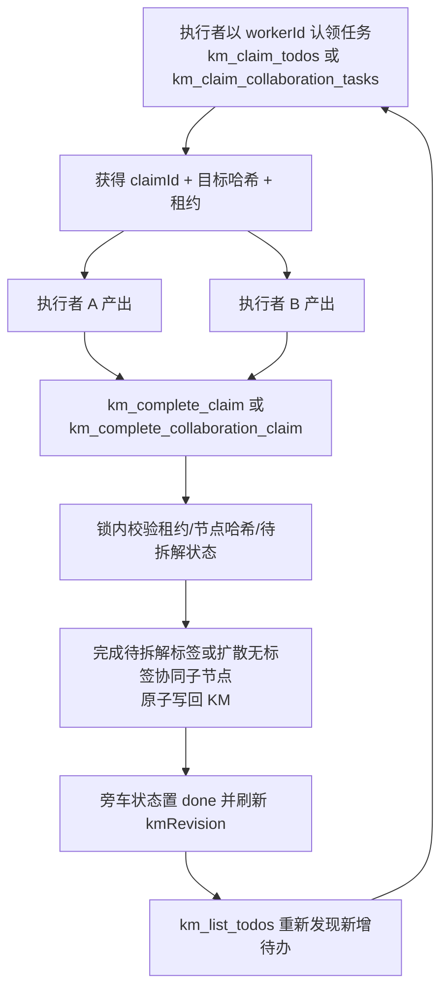

# KM 并行任务拆解设计（已落地）

> 修订历史：
>
> - 2026-07-18 初版：仅 5 个 MCP 工具基线上的方案评估，只产出设计不改造。
> - 2026-07-26 第一次修订：基线更新为 8 个工具，协同链路已具备 `fileRevision` / `expectedRevision` 乐观校验；Phase 0（规则协调）与 Phase 0.5（revision 推广）落地。
> - 2026-07-26 第二次修订：Phase 1（锁与租约）与简化版 Phase 2（节点卡片执行状态展示）落地，全文按**最终实现**回写；MCP 工具总数 8 → 12。
> - 2026-08-10 第三次修订（当前版本）：Phase 3 将租约协议扩展到 `待协同`，新增协同认领与原子完成工具；MCP 工具总数 12 → 14。

## 1. 结论

针对“评估通过插件功能优化，还是执行规则流程调整实现并行互不干扰的拆解、执行跟踪与状态回写”，结论是**两条路线分层组合，规则先行、插件兜底**，目前已全部落地：

- **执行规则流程调整（Phase 0，已落地）**：单会话内由一个协调者负责读取、分批分派和最终回写，多个执行者只处理自己领取的任务，不直接写 KM 文件。执行并行、写入串行收敛，天然无冲突。协议见 `Workspace/harnessRules/brainstorm-executer/requirement-instruction-breakdown-rules.md` §4.1。
- **revision 推广（Phase 0.5，已落地）**：把协同链路验证过的 `getKmFileRevision`（文件内容 SHA-256）机制推广到待拆解链路——`km_list_todos` 返回 `kmRevision`，`km_mark_done` 支持可选 `expectedRevision`，并发冲突从“静默覆盖”变为“显式失败 + 重读重试”。
- **MCP 事务能力（Phase 1，已落地）**：多个**独立写入者**通过旁车状态文件、跨进程文件锁与租约工具链（claim/renew/complete/release）实现真正互不干扰的认领、执行跟踪与状态回写。
- **观测（Phase 2，按简化口径落地）**：不做独立观测界面，改为在 Webview 右下角节点卡片中展示选中节点的旁车执行状态。
- **待协同分批并行（Phase 3，已落地）**：多个独立执行者使用 `km_claim_collaboration_tasks` 认领互不重叠的协同节点，复用续租/释放工具，并通过 `km_complete_collaboration_claim` 基于目标完整子树哈希原子扩散。无关节点先写回不会制造冲突，目标子树变化则显式拒绝。

## 2. 改造前基线（历史记录）

改造前 MCP 共 8 个工具，两条链路的并发保护水平不一致，这是本设计的出发点：

| 能力 | 改造前行为 | 并行风险 |
| --- | --- | --- |
| 待办发现 | `km_list_todos` 每次扫描全部 `待拆解` 节点 | 没有批次、“已领取”状态，也不返回文件版本 |
| 协同任务发现 | `km_list_collaboration_tasks` / `km_get_collaboration_context` 返回文件内容 SHA-256 作为 `fileRevision` | 已具备版本快照，但仅协同链路可用 |
| 待拆解回写 | `km_mark_done` 读取整文件后重写整文件，无版本校验 | 两个进程同时读写时，后写入者覆盖前者 |
| 协同回写 | `km_expand_collaboration` 强制 `expectedRevision`，不匹配即拒绝写入 | 有 CAS，但“校验版本→写入”之间无锁，仍有毫秒级 TOCTOU 竞态窗口 |
| 写入保护 | `safeWriteFile` 备份 + 写后 JSON 校验，失败回滚 | 直接 `writeFileSync` 覆盖而非临时文件 + rename，没有文件锁和原子临界区 |
| Webview 外部编辑 | 外部文件监听、干净状态自动刷新、脏状态阻止保存 | 只保护 VS Code 编辑器，不保护多个 MCP 写入进程 |

## 3. 架构（与实现一致）

“规则协调 + MCP 事务”混合方案：



实现位置：

- 服务层：`src/mcp/services/kmExecState.ts`（旁车、锁、原子写、租约全部逻辑）
- 工具层：`src/mcp/tools/kmClaimTodos.ts` / `kmClaimCollaborationTasks.ts` / `kmRenewClaim.ts` / `kmCompleteClaim.ts` / `kmCompleteCollaborationClaim.ts` / `kmReleaseClaim.ts`
- 存量改造：`kmFileWriter.ts`（`markNodesDone` / `expandCollaborationTask` 接入锁）、`kmListTodos.ts`（版本与租约标注）
- 观测：`src/mindEditor.ts`（旁车监听推送）+ `webui/ui/directive/nodeCard/`（卡片展示）

### 3.1 旁车状态文件（实际结构）

执行状态不写入 KM 节点的 `resource` 标签（避免触发 Webview 刷新、污染用户可见标签），存放在旁车文件 `<filePath>.exec.json`：

```json
{
    "schemaVersion": 1,
    "kmRevision": "<KM 文件内容 SHA-256>",
    "tasks": {
        "<nodeId>": {
            "state": "claimed | done | released | failed",
            "taskKind": "todo | collaboration",
            "claimId": "<uuid>",
            "workerId": "agent-a",
            "claimedAt": "2026-07-26T10:00:00.000Z",
            "leaseUntil": "2026-07-26T10:10:00.000Z",
            "baseNodeHash": "<认领时节点内容 SHA-256>",
            "doneAt": "（state=done 时）",
            "completedBy": "claim | legacy（state=done 时）",
            "releasedAt": "（state=released 时）",
            "failedAt": "（state=failed 时）",
            "failReason": "（state=failed 时）"
        }
    }
}
```

- KM 本身只保留用户语义标签：`待拆解` / `待协同` / `已完成`。
- 旁车文件丢失或损坏时按空状态处理，全部任务视为 `pending`，可从 KM 重建，不影响正确性。
- 待拆解 `baseNodeHash` 为节点自身规范化内容（`{id, text, resource 排序}`）的 SHA-256；待协同则为目标完整子树的规范化 SHA-256。两者都由服务端在认领时写入，完成时从旁车读取，调用方无需回传哈希。

### 3.2 任务状态机（实际实现）

```text
pending ──claim──> claimed ──complete──> done
             ▲        │
             │        ├─ release ──> released ─┐
             │        ├─ fail ─────> failed  ──┤（均可重新认领）
             │        └─ 租约过期（隐式回到 pending）
             └─────────────────────────────────┘
```

- `pending`：节点带 `待拆解` 且没有有效租约（旁车无条目，或条目为 released/failed/租约过期）。
- `claimed`：被某执行者认领且租约未过期；其他执行者不能认领，`km_mark_done` 也被拒绝。
- `done`：节点标签已改为 `已完成`；`completedBy` 区分经由 `km_complete_claim`（claim）还是 `km_mark_done`（legacy）。
- `released` / `failed`：主动放弃或记录失败原因，KM 节点保持 `待拆解`，等价于回到 `pending`。
- 租约过期不需要清理动作：认领判定只看 `leaseUntil`，过期任务自动可被重新认领；续租与完成则被拒绝。
- 只有**叶子待办**（子树中不再包含其他 `待拆解`）可被认领；父级待办由发起方在子任务全部完成后单独汇总回写。
- `待协同` 节点不受叶子限制，每个带有效 `待协同` 且无 `已完成` 的节点都可独立认领；完成时追加无标签直接子节点并原子完成父节点。

## 4. MCP 工具（最终实现）

### 4.1 `km_list_todos`（增强）

```text
入参：filePath
返回：{ filePath, kmRevision, todoCount, todos[] }
todos[] 每项额外携带：
  isLeaf: boolean          — 是否叶子待办（可认领）
  execState: 'pending' | 'claimed'
  claimedBy / leaseUntil   — 仅 execState=claimed 时返回
```

与提案的差异：未引入 `limit` / `cursor` 分页和 `includeClaimed` 过滤——现返回全部待办（含父级），由 `isLeaf` 与 `execState` 标注代替服务端过滤，调用方自行筛选，接口保持无状态。

### 4.2 `km_claim_todos`

```text
入参：filePath, workerId（必填）
     limit?（默认 5，未指定 nodeIds 时生效）
     nodeIds?（显式指定；任一节点不可认领则整体失败，不产生部分认领）
     leaseSeconds?（默认 600）
     expectedKmRevision?（版本不符拒绝认领）
返回：{ filePath, kmRevision, claimId, workerId, leaseUntil, claimedCount,
       tasks: [{ nodeId, text, path, baseNodeHash }] }
```

在一次锁临界区内完成：读取当前 KM → 计算叶子待办 → 跳过有效租约节点 → 写入旁车租约。无可认领节点时返回 `claimId: null` 的空结果而不报错。认领不修改 KM 本身。

### 4.3 `km_renew_claim`

```text
入参：filePath, claimId, workerId（必须与认领时一致）, leaseSeconds?（默认 600）
返回：{ filePath, renewedCount, leaseUntil }
```

只能由原 `workerId` 续租；租约已过期、已完成或已释放的任务续租失败（过期即视为回到待认领状态）。

### 4.4 `km_complete_claim`

```text
入参：filePath, claimId
     nodeIds?（只完成该 claim 的部分节点，默认全部）
     dryRun?（只校验不写入）
返回：{ filePath, dryRun, completedCount, nodeIds, revisionBefore, revisionAfter, verified }
```

在锁内重新读取 KM 并逐项验证：

1. `claimId` 下的目标任务处于 `claimed` 且租约未过期；
2. 目标节点仍存在，且当前节点哈希与旁车记录的 `baseNodeHash` 一致（认领后被人工/并发修改即冲突拒绝）；
3. 节点仍为 `待拆解` 且无 `已完成` 冲突。

全部通过后仅修改这些节点标签、原子写回 KM，再把旁车条目置 `done` 并刷新 `kmRevision`。任何一项校验失败则整体拒绝、零写入，其他执行者已完成的节点不会被旧快照覆盖。

与提案的差异：不要求调用方传 `expectedNodeHashes`——认领时服务端已把 `baseNodeHash` 写入旁车，完成时以旁车记录为准，更可靠且减小 API 面。

### 4.5 `km_release_claim`（合并 release 与 fail）

```text
入参：filePath, claimId, nodeIds?, failReason?
返回：{ filePath, releasedCount, state: 'released' | 'failed' }
```

不带 `failReason` 记为 `released`，带 `failReason` 记为 `failed`（保留审计信息）；两种情况下 KM 节点都保持 `待拆解`，可被重新认领。失败永远不会把节点标成 `已完成`。

与提案的差异：`km_release_claim` 与 `km_fail_claim` 合并为一个工具。

### 4.6 存量工具改造

- `km_mark_done`：整个读-改-写在同一把文件锁内执行；支持可选 `expectedRevision`（来自 `km_list_todos` 的 `kmRevision`）；目标节点存在**有效租约**时直接拒绝，提示改用 `km_complete_claim` 或先 `km_release_claim`；写回成功后同步旁车条目为 `done`（`completedBy: 'legacy'`）并刷新旁车 `kmRevision`。定位为无租约冲突的单写入者场景。
- `km_expand_collaboration`：版本校验与写入纳入同一把锁，消除原“校验通过后被并发写入”的 TOCTOU 竞态窗口；活动协同租约存在时拒绝 legacy 写回；成功后同步旁车任务为 done 并刷新 `kmRevision`。
- `safeWriteFile`：由“备份-覆盖-回滚”升级为“临时文件写入 + JSON 校验 + rename 原子替换”。

### 4.7 `km_claim_collaboration_tasks`

```text
入参：filePath, workerId（必填）
     limit?（默认 5，未指定 nodeIds 时生效）
     nodeIds?（显式指定；任一节点不可认领则整体失败）
     leaseSeconds?（默认 600）
     expectedFileRevision?（版本不符拒绝认领）
返回：{ filePath, fileRevision, claimId, workerId, leaseUntil, claimedCount,
       tasks: [{ nodeId, text, path, baseSubtreeHash }] }
```

认领在文件锁内重新读取 KM 和旁车；只写 `<km>.exec.json`，不修改 KM。`km_list_collaboration_tasks` 同步标注 `execState`、`claimedBy`、`leaseUntil` 和 `claimKind`。

### 4.8 `km_complete_collaboration_claim`

```text
入参：filePath, claimId,
     tasks: [{ nodeId, childTexts }]
     dryRun?（默认 false）
返回：{ filePath, dryRun, completedCount, appendedCount,
       revisionBefore, revisionAfter, tasks[], verified }
```

工具在同一锁内对全部目标先完成以下校验：

1. 节点属于该协同 claim 且租约有效；
2. 节点仍存在并带 `待协同`、不带 `已完成`；
3. 目标完整子树哈希与认领时一致；
4. 每个 `childTexts` 非空、trim 后无空值且无重复文本。

全部通过后为每个目标追加无标签直接子节点、把父节点原子改为 `已完成`，再把旁车置为 `done` 并记录 `generatedNodeIds`。任一目标失败则整批零写入。因为校验的是目标子树而非全文件 revision，不同协同节点可以并行产出并先后安全提交。

## 5. 并发与写入协议（实现参数）

1. 每个 KM 文件使用旁车锁 `<filePath>.lock`：`fs.openSync(…, 'wx')` 原子创建获得，锁文件记录 `pid` / `acquiredAt` / `expiresAt`。
2. 锁有效期 10 秒（`LOCK_EXPIRE_MS`）；等待方按 50ms 间隔自旋重试，最多 40 次（约 2 秒）后报“获取文件锁超时”；发现过期残留锁直接抢占清理。
3. 待拆解/待协同的 claim、renew、complete、release、legacy mark-done 与协同扩散全部在锁内**重新读取**文件，不复用调用方之前的内存快照。
4. KM 与旁车写入均采用临时文件（`<file>.tmp-<pid>-<随机>`）写入、JSON 解析校验、同目录 rename 替换，读取方不会读到半文件；失败时清理临时文件。
5. 文件版本 = KM 内容 SHA-256；待拆解节点版本 = 节点规范化 JSON（`{id, text, resource 排序}`）的 SHA-256；待协同版本 = 目标完整子树规范化 JSON 的 SHA-256。文件发生无关节点变化时允许完成互不相交的 claim；目标自身或目标子树变化时返回冲突。
6. 进程崩溃不需要回滚：未完成任务保持 `待拆解`，租约过期后可重新认领；锁过期后可被抢占。
7. 旁车锁、旁车状态与临时文件均生成在 KM 文件旁，属于运行时状态，不作为源码或 VSIX 内置资源分发；`dist` 虽被 `.gitignore` 忽略，但其中的扩展与 MCP 编译产物会由 `vsce` 打入 VSIX。

## 6. 规则层执行流程（已写入执行规则 §4.1）

规则文件 `requirement-instruction-breakdown-rules.md` §4.1 定义了两种模式：

**单会话协调者模式（Phase 0）**：协调者按叶子分批分派（唯一批次标识 + 节点 ID 清单），执行者只产出不写 KM；协调者验证输出后携带最新 `kmRevision` 作为 `expectedRevision` 串行回写，父节点最后单独回写；每轮回写后重新 `km_list_todos` 滚动纳入新增待办；失败批次只保留其节点为 `待拆解`。

**多写入者租约模式（Phase 1）**：跨会话/进程的执行者各自以唯一 `workerId` 认领（`km_claim_todos`）→ 长任务续租（`km_renew_claim`）→ 完成（`km_complete_claim`，先 dry-run）→ 放弃或失败时释放（`km_release_claim` + `failReason`）。被有效租约认领的节点禁止经 `km_mark_done` 回写。

**待协同分批并行（Phase 3）**：单会话中协调者可并行分派多个协同节点，执行者只返回 `childTexts`，协调者逐节点重读并串行 `km_expand_collaboration`。多个独立写入者改用 `km_claim_collaboration_tasks` → `km_renew_claim` → `km_complete_collaboration_claim`（先 dry-run）/ `km_release_claim`；活动协同租约禁止经 `km_expand_collaboration` 绕过。

## 7. 验收场景与测试覆盖

设计验收场景由 `tests/km-exec-claims.test.cjs`、`tests/km-file-writer.test.cjs` 和新增的 `tests/km-collaboration-claims.test.cjs` 覆盖，当前全量 55 个测试通过：

| 验收场景 | 覆盖用例 |
| --- | --- |
| 只认领叶子、父级排除，认领结果可追踪 | claim only targets leaf todos and skips parents |
| 两执行者认领集合不重叠；显式抢占被拒 | second worker cannot claim nodes under an active lease |
| A、B 各自完成互不覆盖；旁车同步 done | complete claim marks nodes done atomically and updates sidecar |
| 节点在认领后被人工修改，完成时版本冲突且零写入 | complete claim rejects when node was modified after claiming |
| 执行者崩溃，租约过期后任务可被重新认领；过期不可完成/续租 | expired lease returns task to pending and blocks completion |
| 仅原认领者可续租 | renew extends lease for the original worker only |
| 释放/失败后回到待认领，失败原因留档 | release and fail return tasks to pending for re-claiming |
| 活跃租约保护 legacy 回写；释放后恢复并同步旁车 | legacy mark done is blocked for actively claimed nodes |
| 残留锁抢占、临界区后锁清理、有效锁阻塞 | stale lock file is preempted and lock is cleaned after critical section |
| 过期版本拒绝认领 | claim with stale expectedKmRevision is rejected |
| mark_done 版本冲突拒绝且零写入 | mark done with stale expectedRevision is rejected without writing |
| Webview 脏状态下外部写入提示冲突、阻止普通保存 | 既有外部编辑冲突机制（refresh-flow） |
| 两个执行者认领不同协同节点并先后完成 | different workers complete independent collaboration nodes after unrelated writes |
| 协同目标子树变更后旧结果被拒绝且零写入 | rejects completion when the claimed collaboration subtree changed |
| 协同批次任一目标冲突时整批零写入 | batch completion is all-or-nothing when one target conflicts |
| 协同认领复用续租/释放并可重新认领 | collaboration claims reuse renew and release, then can be reclaimed |
| 活动协同租约保护 legacy 扩散与错误完成工具 | legacy completion tools cannot bypass an active collaboration lease |

## 8. 分阶段落地记录

| 阶段 | 内容 | 状态 |
| --- | --- | --- |
| Phase 0 规则协调 | 分批并行执行协议写入执行规则 §4.1，单协调者串行回写 | ✅ 2026-07-26 |
| Phase 0.5 revision 推广 | `km_list_todos` 返回 `kmRevision`；`km_mark_done` 可选 `expectedRevision` | ✅ 2026-07-26 |
| Phase 1 MCP 事务能力 | 旁车状态、文件锁、原子写、claim/renew/complete/release 四工具，存量工具加锁与租约保护 | ✅ 2026-07-26 |
| Phase 2 观测（简化） | 不做独立观测界面：扩展端监听 `<km>.exec.json` 推送 Webview，右下角节点卡片展示执行状态/认领人/租约到期/失败原因（含“租约过期”态） | ✅ 2026-07-26 |
| Phase 3 待协同分批并行 | 新增协同 claim/complete 工具，复用 renew/release，以目标子树哈希支持独立协同节点并行产出和安全串行写回 | ✅ 2026-08-10 |

Phase 2 简化实现链路：`mindEditor.ts` 为每个打开的 KM 文档额外创建 `<km>.exec.json` 的 FileSystemWatcher（创建/变化/删除均触发），读取旁车 `tasks` 后以 `execState` 消息推送 Webview，编辑器握手（ready/loaded）时推送一次初始状态；`webui/main.js` 收到消息后写入 `window.kmExecState` 并派发 `km-exec-state` 事件；`nodeCard` 指令据此渲染执行状态区块，卡片可见时实时刷新。原设计中的批次状态查询与审计日志（完整 Phase 2）未实现，如后续需要可基于旁车文件直接扩展。

## 9. 最终结论

“执行规则流程调整”满足单会话内的分批并行拆解、执行跟踪与回写（Phase 0）；“插件功能优化”是多个独立智能体真正互不干扰并发写入的必要条件（Phase 0.5 + Phase 1），两者是递进关系而非二选一。当前实现下：

- 单会话并行 → 协调者模式，零额外成本；
- 跨会话/跨进程并行 → 租约模式，冲突全部显式失败、零静默覆盖；
- 待协同并行 → 单协调者可并行生成、串行 CAS 写回；多写入者以协同租约和目标子树哈希互不干扰地完成；
- 执行可观测 → 节点卡片直读旁车状态，无需额外查询工具。
