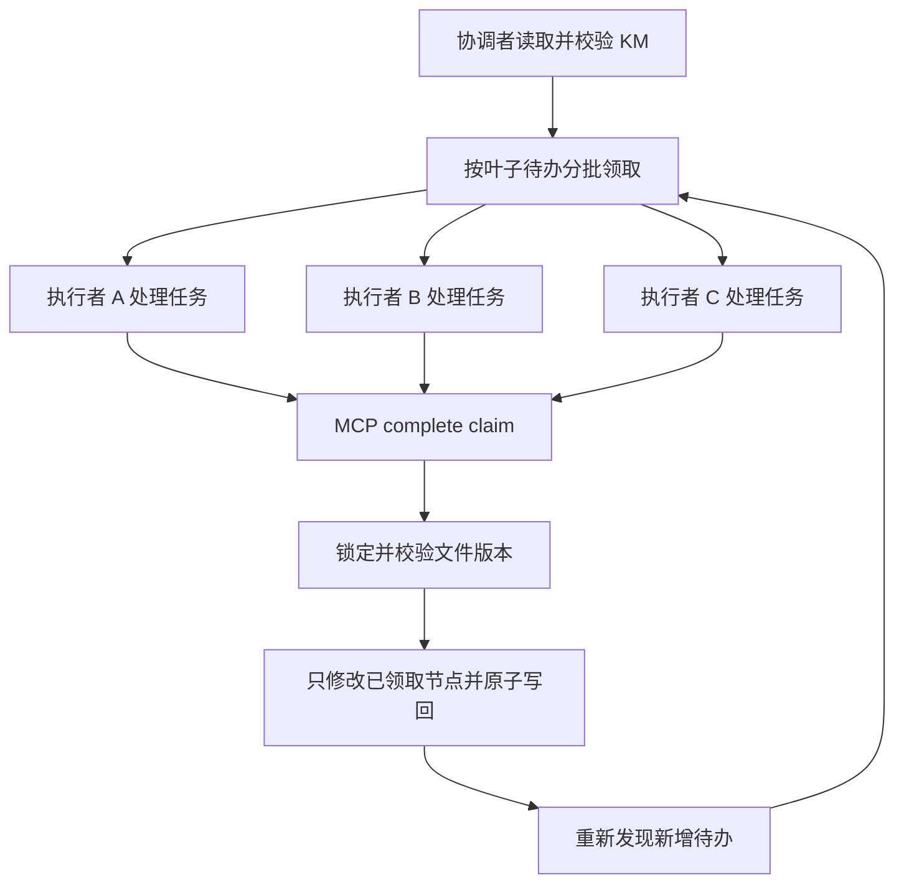

# KM 并行任务拆解设计

## 1. 结论

这组需求分为两个层次：

- 执行规则可以立即支持“分批执行”和“执行期间继续发现新待办”。由一个协调者负责读取、分批分派和最终回写，多个执行者只处理自己领取的任务，不直接写 KM 文件。
- 要实现多个独立智能体之间真正的“互不干扰”，仅改规则不够。`km_list_todos` 和 `km_mark_done` 目前没有任务认领、租约、版本校验或跨进程锁，需要在 InfiniteMap MCP 层增加事务化任务状态管理。

本轮按节点要求只产出方案，不直接修改插件、MCP 工具或规则地图。

## 2. 当前基线

| 能力 | 当前行为 | 并行风险 |
| --- | --- | --- |
| 待办发现 | `km_list_todos` 每次扫描全部 `待拆解` 节点 | 没有游标、批次或“已领取”状态 |
| 节点上下文 | `km_get_node` 返回节点完整子树 | 可读取，但没有任务快照版本 |
| 状态回写 | `km_mark_done` 读取整文件后重写整文件 | 两个进程同时读写时，后写入者可能覆盖前者 |
| 写入保护 | 有备份和 JSON 校验 | 没有文件锁、CAS 或原子临界区 |
| 层级节点 | 父节点命中后不会继续遍历其子树 | 父子节点混合批量回写会少改子节点 |
| Webview 外部编辑 | 已支持外部文件监听、干净状态自动刷新、脏状态阻止保存 | 只保护 VS Code 编辑器，不保护多个 MCP 写入进程 |

## 3. 推荐架构

采用“规则协调 + MCP 事务”的混合方案：



### 3.1 临时状态放在旁车文件

不要把 `处理中`、租约和执行者信息写进 KM 节点的 `resource` 标签。这样会触发 Webview 刷新，也会让执行状态污染用户可见标签。

建议使用旁车文件：`<filePath>.exec.json`。示例：

```json
{
    "schemaVersion": 1,
    "kmRevision": "sha256:...",
    "tasks": {
        "node-id": {
            "state": "claimed",
            "claimId": "claim-uuid",
            "workerId": "agent-a",
            "claimedAt": "2026-07-19T10:00:00.000Z",
            "leaseUntil": "2026-07-19T10:10:00.000Z",
            "baseNodeHash": "sha256:..."
        }
    }
}
```

KM 本身只保留用户语义状态：`待拆解` 和 `已完成`。旁车文件丢失时，可以从 KM 重新构建全部 `pending` 任务。

### 3.2 任务状态机

```text
pending -> claimed -> done
             |          |
             v          v
          released    archived
             ^
             |
        lease expired
```

- `pending`：节点有 `待拆解`，没有有效租约。
- `claimed`：某个执行者暂时拥有任务，其他执行者不能领取。
- `done`：MCP 已验证输出物并将 KM 标签改为 `已完成`。
- `released`：执行者主动放弃，回到 `pending`。
- 租约过期后自动回到 `pending`，避免执行者崩溃造成永久阻塞。
- 只有叶子待办进入 `claimed`。父节点在所有子节点完成后，由协调者单独汇总完成，避免父子节点批处理遍历冲突。

## 4. MCP 工具设计

### 4.1 `km_list_todos`

向后兼容现有参数，增加可选参数：

```text
filePath: string
limit?: number
cursor?: string
includeClaimed?: boolean
workerId?: string
```

返回 `kmRevision`、下一页游标、节点状态和租约摘要。默认只返回 `pending` 叶子节点，保证一个批次不会重复领取父子节点。

### 4.2 `km_claim_todos`

```text
filePath: string
workerId: string
limit: number
nodeIds?: string[]
leaseSeconds?: number
expectedKmRevision?: string
```

在一次临界区内完成：读取当前 KM、校验节点仍为 `pending`、写入旁车租约、返回 `claimId`、节点快照哈希和新的 revision。领取失败时不修改任何节点。

### 4.3 `km_renew_claim`

使用 `claimId` 延长租约。只能由原 `workerId` 续租，已完成或已释放的任务不可续租。

### 4.4 `km_complete_claim`

```text
filePath: string
claimId: string
nodeIds: string[]
expectedNodeHashes: Record<string, string>
```

在锁内重新读取 KM，验证：

1. `claimId` 属于当前执行者且租约未过期。
2. 所有目标节点仍存在，且节点哈希与领取时一致。
3. 节点仍包含 `待拆解`，没有 `已完成` 冲突。

验证通过后，只修改这些节点的标签，原子写回 KM，再更新旁车状态为 `done`。其他执行者已经完成的节点不得被旧快照覆盖。

### 4.5 `km_release_claim` / `km_fail_claim`

释放或记录失败原因，并让任务重新进入 `pending`。失败不能自动把 KM 节点标成 `已完成`。

### 4.6 兼容现有 `km_mark_done`

保留现有工具，但内部必须经过同一套文件锁和版本校验。传入父子节点时，要么拆成叶子优先的独立操作，要么明确返回“父节点命中后跳过子树”的结果，不能静默少改节点。

## 5. 并发与写入协议

1. 对每个 KM 文件使用 `<filePath>.lock` 旁车锁，使用原子创建（`wx`）获取锁，并记录持有者和过期时间。
2. 所有 claim、complete、release 和 legacy mark-done 都必须在锁内重新读取文件，不能复用调用方之前的内存快照。
3. KM 写入采用临时文件写入、JSON 解析校验、同目录 rename 替换，避免读到半文件。
4. 版本使用 KM 内容 SHA-256；节点使用规范化 JSON 的 SHA-256。文件发生无关节点变化时，允许完成互不相交的 claim；目标节点自身变化时返回冲突。
5. 进程崩溃不需要回滚 KM：未完成的任务仍保持 `待拆解`，租约过期后可重新领取。
6. 旁车锁、旁车执行状态和临时文件都必须在成功写回后清理或更新，不能进入 VSIX 包。

## 6. 规则层执行流程

在 MCP 增强完成前，规则可以先采用以下无代码方案：

1. 协调者只读取一次基线，按叶子节点划分批次，并为每批生成唯一 `batchId` 和节点 ID 清单。
2. 执行者只接收自己的批次上下文，不读取或修改其他执行者的任务状态。
3. 执行者把输出物写入指定目标，但不直接调用 `km_mark_done`。
4. 协调者验证输出物后，按叶子节点分批 dry-run 和回写；父节点最后单独回写。
5. 执行期间每轮重新调用 `km_list_todos`，发现新增 `待拆解` 节点后加入下一批，不必等待当前批次全部结束。
6. 任何批次失败只保留其节点为 `待拆解`，已完成批次可以独立回写。

这个规则层方案能实现执行并行，但仍只有协调者写文件，因此不能称为多个独立写入者的完全并发。它适合作为第一阶段的低风险过渡。

## 7. 验收场景

- 两个执行者同时领取 10 个叶子节点，节点集合不重叠，领取结果可追踪。
- 执行者 A 完成节点 1，执行者 B 完成节点 2；两次回写后节点 1 和 2 都是 `已完成`，互不覆盖。
- A 领取期间新增节点 3；下一次列表查询可以领取节点 3，不影响 A 的租约。
- A 崩溃，租约过期后节点 1 可被 C 重新领取。
- 节点文本在领取后被人工修改，A 完成时返回版本冲突，不能覆盖人工修改。
- Webview 有未保存草稿时，外部 agent 写入 KM，界面提示冲突，普通保存被阻止。
- 父节点和子节点同时出现在候选集合时，只领取叶子；父节点在子任务全部完成后再单独汇总。
- 重复节点 ID、损坏 JSON、锁文件残留和进程中断均有可验证的失败路径。

## 8. 分阶段落地建议

### Phase 0：规则协调

只调整执行流程和批次协议，保留现有 5 个 MCP 工具。目标是让多个执行者并行产出，但由单一协调者串行回写。

### Phase 1：MCP 事务能力

增加旁车状态、文件锁、revision、claim/renew/complete/release 工具，并为现有 `km_mark_done` 加锁和父子节点保护。

### Phase 2：观测与界面

增加批次状态查询、租约剩余时间、失败原因和审计日志。只有在用户确实需要时，再在插件界面展示“处理中”等临时状态。

## 9. 本轮决策

推荐先落地 Phase 0 验证执行协议，再实现 Phase 1。原因是并行任务的边界、叶子优先和父节点汇总规则可以先在不改变文件格式的情况下验证；确认协议稳定后，再引入锁和租约，降低 MCP schema 变更风险。
