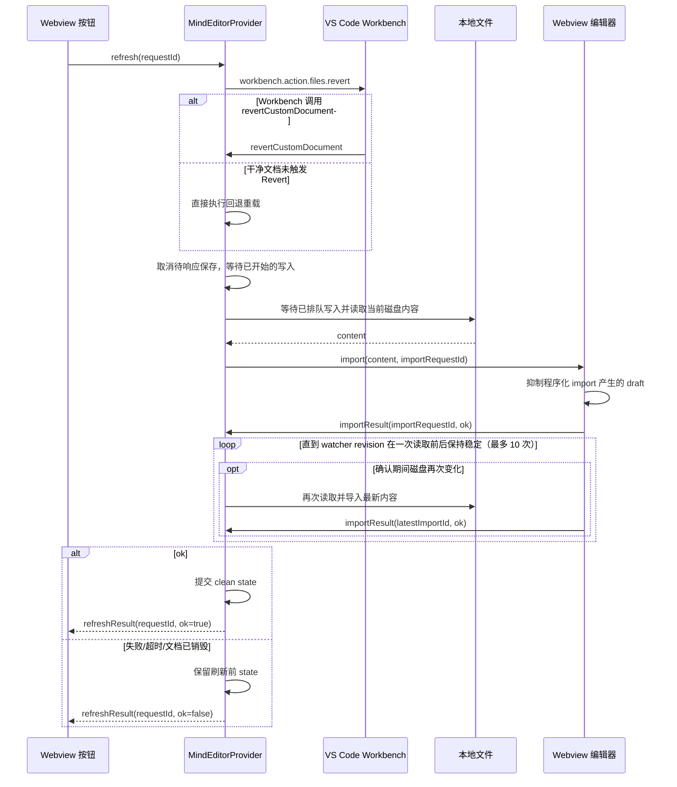

# 刷新按钮调用时序与校验逻辑

## 目标

刷新按钮始终以当前 `.km`/`.svg`/`.xmind` 文件的磁盘内容为准。点击刷新会丢弃当前 Webview 中未保存的草稿，不以内部 `dirty` 或 `externalConflict` 状态作为阻断条件。

## 调用时序

## 校验点

| 阶段 | 校验 | 失败行为 |
| --- | --- | --- |
| 按钮 | 点击即持有 draft 抑制 token；同一 `requestId` 在途时忽略重复点击；等待 `refreshResult`，不依赖 `postMessage()` 返回值 | 成功、失败或 15 秒客户端超时都会释放 token 并解锁 |
| 文档实例 | 异步读取、导入、回调前确认 URI 仍归属于同一个 `CustomDocument` 实例 | 中止旧操作，不触碰同 URI 新文档 |
| 保存竞态 | 刷新开始时拒绝尚未收到 Webview 响应的保存；已开始的写盘与其他保存按文档 I/O 队列串行完成 | 迟到的旧 `saveRequestId` 被忽略 |
| 脏状态 | 不检查 `dirty`/`externalConflict`，磁盘内容直接胜出；脏文档优先经 Workbench Revert 清除 VS Code 脏标记 | Revert 未触发时使用直接回退 |
| 磁盘读取 | 使用当前文档 URI 读取，读取完成后再次检查文档实例 | 保留原内存状态并返回失败 |
| watcher 竞态 | 刷新期间记录文件 watcher revision；每次导入确认后重新读取，直到 revision 在读取前后稳定 | 连续变化超过 10 次则失败并保留刷新前状态 |
| Webview 导入 | 通过 `importRequestId` 等待实际 JSON/SVG 导入完成 | 不提交 clean state，释放抑制 token |
| 状态提交 | 仅在导入确认成功后更新 `content`、`lastDiskContent`、`dirty` 和冲突标记 | 保留刷新前状态 |

## 兼容性

- Webview 启动仍发送旧版 `loaded`，Provider 同时接受 `loaded` 和 `ready`。
- 保存请求和响应都必须带精确匹配的 `requestId`；缺失或过期的响应会被忽略，避免旧 Webview 消息完成新保存。
- 刷新按钮沿用 `oorzc.mind-map@1.0.6` 的双箭头 SVG 几何：24×24 viewBox、2px 描边、16×16 显示尺寸和 2px 外边距。
